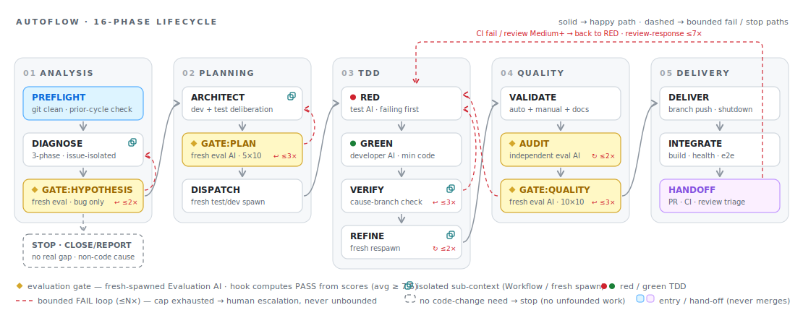

# Claude AutoFlow Template

A reusable template for structured, evaluation-gated AI-assisted software development with [Claude Code](https://docs.anthropic.com/en/docs/claude-code).

AutoFlow is a 16-phase development lifecycle (PREFLIGHT → HANDOFF) that ensures
quality through multi-agent role separation, independent analysis, and
quantified evaluation gates. This template is the **generalized form** of the
methodology originally implemented in `ontology-platform` — a multi-sub-repo
deployment orchestrator. The only changes from upstream are:

1. **Name generalization** — numeric `STEP 0~9` (and `5a/5b/5c/5d/5.5/5.7`) identifiers replaced by semantic phase names.
2. **Identifier placeholders** — service-specific names (`ontology-api`, `saiso`, etc.) replaced by `{{REPO_*}}`/`{{GITHUB_ORG}}` placeholders.
3. **Terminal scope** — AutoFlow ends at PR creation (`HANDOFF`) instead of upstream's merge-and-close terminal step; an external review process performs the merge. **AutoFlow never merges.**

Aside from this terminal divergence, every rule, retry cap, evaluation category, and pass
threshold is preserved from upstream. Single-repo projects are supported as the degenerate case
(DELIVER pushes one branch, INTEGRATE / HANDOFF collapse to a single PR flow).

---

## What Is AutoFlow?

AutoFlow structures every code change through a defined lifecycle:

```
PREFLIGHT       Pre-Work          — Git clean check, branch creation
DIAGNOSE        3-Phase Analysis  — Independent bias-free analysis
GATE:HYPOTHESIS Hypothesis Eval   — Scored hypothesis assessment (gate, bug issues only)
ARCHITECT       Plan Synthesis    — Feature design + verification design
GATE:PLAN       Plan Evaluation   — Scored plan assessment (gate)
DISPATCH        Task Assignment   — Delegate to Test AI and Developer AI
RED             Test Writing      — Tests from acceptance criteria (Red)
GREEN           Implementation    — Minimum code to pass tests
VERIFY          Test Run + Check  — All tests pass + minimal-implementation check
REFINE          Refactor          — Code cleanup, Green re-confirmation
VALIDATE        Verification Done — automated + manual + maintained-docs check
AUDIT           Security Audit    — Independent project-specific security audit
GATE:QUALITY    Completion Eval   — Scored quality assessment (gate)
DELIVER         Sub-Repo Push     — each Submodule AI pushes its fork branch; Teammate shutdown
INTEGRATE       Integration Test  — system build, health check, functional test
HANDOFF         PR + Hand-off     — sub-repo PRs → host PR (`Closes #N`) → CI green; external review merges out of band (AutoFlow does not merge)
```

The happy-path flow at a glance (regression edges and human-escalation paths
are omitted; see [`docs/autoflow-guide.md`](docs/autoflow-guide.md) for the
full diagram):

<picture>
  <source media="(prefers-color-scheme: dark)" srcset="docs/assets/autoflow-lifecycle-dark.svg">
  
</picture>

<details>
<summary>Text source (Mermaid)</summary>


</details>

> The SVG pair above is generated by
> [`docs/assets/render-lifecycle-svg.py`](docs/assets/render-lifecycle-svg.py)
> — edit the script and re-run it; never edit the SVGs by hand.

### Key Features

- **Multi-Agent Roles** — Orchestrator, Submodule AI (Developer), Test AI, Evaluation AI with separated responsibilities.
- **3-Phase Independent Analysis** — Structure / Issue / Cross-Verification analyses to prevent tunnel-vision bias.
- **Evaluation Gates** — 10-point scoring system with a defined PASS threshold (≥ 7.5, each ≥ 7, security ≤ 3 → block).
- **Hook Enforcement** — A shell hook validates AutoFlow state before allowing Agent spawns, `git push`, or `gh pr create`.
- **Multi-Sub-Repo Support** — orchestrator pattern for coordinating work across submodules; single-repo is the degenerate case.

---

## Quick Start

AutoFlow installs as a **versioned tool your own dev project consumes** — your
project is the repo root (host) and AutoFlow is a bundle it pulls in. The
authoritative, step-by-step source is
[`setup/SETUP-GUIDE.md`](setup/SETUP-GUIDE.md) > "Install as a consumed tool".

Onboarding is **3 commands**, run from a Claude Code session rooted in your
project:

```
1. /plugin marketplace add Munsik-Park/autoflow
2. /plugin install autoflow@autoflow
3. /autoflow:install        # detects → confirms → stamps → drift-checks
```

Step 3 runs the `/autoflow:install` skill: it detects root-layer absence or
drift and reports the derived org/repo/branch/topology (read-only), asks for a
**single** confirmation, then stamps the thin-root bundle from the marketplace
cache (via `init.sh` under the hood) and runs the drift detector automatically.
No file is written to your project before you confirm, and it never commits for
you — you own your version record. Maintenance is just
`/plugin marketplace update` → `/autoflow:install` (re-stamp).

A non-zero drift-check result is a **PREFLIGHT stop condition** — resolve the
reported drift before starting a new AutoFlow cycle.

### Advanced / manual install

The `/autoflow:install` skill wraps the manifest-driven installer; you can also
run it by hand (e.g. in CI, or before the plugin is enabled):

```bash
# From a checkout of claude-autoflow, install the bundle into your project root:
setup/init.sh --target /path/to/your-project

# Re-run any time to upgrade / re-stamp (idempotent):
setup/init.sh --target /path/to/your-project --force

# Target-local, network-free self-check (reads .claude/autoflow/manifest.json):
sh .claude/autoflow/drift-check.sh
```

The install is **manifest-driven**: `setup/manifest.json` is the exhaustive list
of every artifact the installer writes; nothing is hardcoded in `init.sh`.

---

## Repository Structure

```
claude-autoflow/
│
├── README.md
├── CLAUDE.md                          # Core operating manual
├── CLAUDE.local.md.example            # Local override example
│
├── .claude/
│   ├── agents/                        # AutoFlow role subagent definitions (.claude/agents/)
│   ├── hooks/
│   │   └── check-autoflow-gate.sh     # AutoFlow gate hook
│   └── workflows/                     # Deliberation workflow scripts (.claude/workflows/)
│
├── .github/
│   └── workflows/                     # Advisory CI guards (.github/workflows/)
│
├── docs/
│   ├── design-rationale.md            # Why every rule exists — read first
│   ├── autoflow-guide.md              # Phase-by-phase AutoFlow guide
│   ├── evaluation-system.md           # Evaluation scoring details
│   ├── git-workflow.md                # Git procedures
│   ├── repo-boundary-rules.md         # Cross-repo coordination rules
│   ├── submodule-common-rules.md      # Sub-repo shared rules + Discussion Protocol
│   ├── teammate-common-rules.md       # Shared teammate behavior rules
│   ├── security-checklist.md          # Project-specific security checklist
│   ├── maintained-docs.md             # Document registry
│   ├── adr/                           # Architecture Decision Records (docs/adr/)
│   └── phases/                        # Per-phase playbooks (docs/phases/)
│
├── plugin/                            # Packaged plugin distribution surface (plugin/)
├── scripts/                           # Helper / handoff scripts (scripts/)
├── tests/                             # Guard & regression suites (tests/)
│
└── setup/
    ├── init.sh                        # Consumed-tool installer (`init.sh --target`)
    ├── SETUP-GUIDE.md                 # Consumed-tool install guide
    ├── manifest.json                  # Manifest of installed artifacts (setup/manifest.json)
    └── thin-root-layer/              # Thin-root residue templates (setup/thin-root-layer/)
```

---

## How It Works

### 1. CLAUDE.md Drives AI Behavior

`CLAUDE.md` is the operating manual for Claude Code. It defines the AutoFlow
lifecycle and rules, agent roles and permissions, evaluation criteria, and the
Git workflow.

### 2. Multi-Agent Separation

| Agent | Role | Can Write To |
|-------|------|--------------|
| **Orchestrator** | Coordinates, delegates | Host repo (rules, config, infra, bulk docs) |
| **Submodule AI (Developer)** | Implements features per sub-repo | Files within the assigned sub-repo |
| **Test AI** | Writes and runs tests | Test files within the assigned sub-repo |
| **Evaluation AI** | Scores quality | Nothing (read-only) |

### 3. Evaluation Gates

At GATE:HYPOTHESIS, GATE:PLAN, AUDIT, and GATE:QUALITY, a freshly spawned
Evaluation AI scores the work. PASS = average ≥ 7.5, each item ≥ 7, security
score ≤ 3 → automatic rework. Categories and weights are customisable per
project.

### 4. Hook Enforcement

`check-autoflow-gate.sh` reads `.autoflow/issue-{N}.json` to prevent Agent
spawns, `git push`, and `gh pr create` from running before the corresponding
gate has passed. The hook computes verdicts directly from raw `scores` — it
never trusts an AI-supplied `pass` field.

---

## Customization

### Single-Repo vs. Multi-Repo

Topology is classified by **submodule count** (see `CLAUDE.md` > Deployment
Topology), re-evaluated per project at PREFLIGHT and re-confirmed at HANDOFF:

- **Single-repo** = the host repository contains **zero submodules**. The
  Developer AI works directly in the host repo, and the DELIVER / INTEGRATE /
  HANDOFF phases collapse to a single-PR flow. `claude-autoflow` itself is
  single-repo.
- **Multi-repo** = the host repository contains **one or more submodules**. Each
  sub-repo carries its own `CLAUDE.md`, sub-repo AIs own their directories, and
  the orchestrator coordinates and opens the split PRs.

### Evaluation Tuning

- Adjust category **weights** to match your priorities.
- Adjust the **PASS threshold** in both `CLAUDE.md` and `check-autoflow-gate.sh`.
- Add **custom categories** as needed.

---

## Documentation

| Document | Description |
|----------|-------------|
| [**Design Rationale**](docs/design-rationale.md) | **Read first** — why every design decision was made |
| [AutoFlow Guide](docs/autoflow-guide.md) | Detailed phase-by-phase lifecycle |
| [Evaluation System](docs/evaluation-system.md) | Scoring, PASS criteria, output format |
| [Git Workflow](docs/git-workflow.md) | Branch naming, commits, PR process |
| [Repo Boundary Rules](docs/repo-boundary-rules.md) | Cross-repo coordination |
| [Sub-Repo Common Rules](docs/submodule-common-rules.md) | Discussion Protocol, sub-repo rules |
| [Security Checklist](docs/security-checklist.md) | Project-specific security items |
| [Setup Guide](setup/SETUP-GUIDE.md) | Manual setup instructions |

---

## Post-Setup Checklist

After running `setup/init.sh --target <path>`:

- [ ] Your project `CLAUDE.md` carries the managed `AUTOFLOW-IMPORT` shim block.
- [ ] `sh .claude/autoflow/drift-check.sh` exits zero (installed artifacts match the manifest).
- [ ] `.claude/settings.json` pins the AutoFlow marketplace + `enabledPlugins`.
- [ ] `CLAUDE.local.md` holds your target identity (never overwritten by `--force`).
- [ ] `.gitignore` includes `.autoflow/issue-*.json` and `CLAUDE.local.md`.
- [ ] Each sub-repo carries its own `CLAUDE.md` (multi-repo instances only).

---

## Contributing

1. Fork this repository.
2. Create a feature branch (`feature/your-change`).
3. Follow the existing documentation style.
4. Submit a PR with a clear description.

Note: this repository is the **generalized form** of `ontology-platform`'s
AutoFlow methodology. New methodology changes belong in the upstream project
first; this repository tracks rather than diverges.

---

## License

This project is licensed under the **Elastic License 2.0** — see
[`LICENSE`](LICENSE) and [`LICENSES/Elastic-2.0.txt`](LICENSES/Elastic-2.0.txt).

Summary (the license text governs; this synopsis is informational only):

- **Allowed** — use, copy, distribute (including bundling AutoFlow into your own
  distributions), modify, and create derivative works, for personal or internal use.
- **Not allowed** — providing AutoFlow to third parties as a **hosted or managed
  service** that gives users access to a substantial set of its features or functionality.
- **As-is** — the software comes with no warranty or condition, to the extent the law allows.

**Commercial exception** — to offer AutoFlow as a hosted or managed service you need a
separate **commercial license**; contact the repository owner (Munsik-Park) to arrange one.

Licensing metadata follows the [REUSE 3.3](https://reuse.software) specification:
every tracked file carries an SPDX header or is covered by [`REUSE.toml`](REUSE.toml),
and `reuse lint` is enforced in CI.
