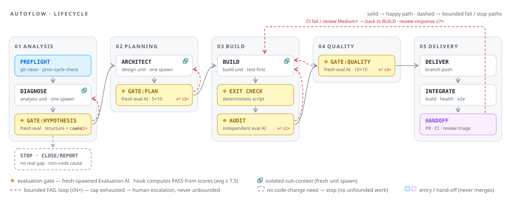

# Claude AutoFlow Template

A reusable template for structured, evaluation-gated AI-assisted software development with [Claude Code](https://docs.anthropic.com/en/docs/claude-code).

AutoFlow is a 16-phase development lifecycle (PREFLIGHT → HANDOFF) built on
multi-agent role separation, independent analysis, and quantified evaluation
gates. This template is the **generalized form** of the
methodology originally implemented in `ontology-platform` — a multi-sub-repo
deployment orchestrator. The only changes from upstream are:

1. **Name generalization** — numeric `STEP 0~9` (and `5a/5b/5c/5d/5.5/5.7`) identifiers replaced by semantic phase names.
2. **Identifier placeholders** — service-specific names (`ontology-api`, `saiso`, etc.) replaced by `{{REPO_*}}`/`{{GITHUB_ORG}}` placeholders.
3. **Terminal scope** — AutoFlow ends at PR creation (`HANDOFF`) instead of upstream's merge-and-close terminal step; an external review process performs the merge. **AutoFlow never merges.**
4. **Late-gate re-entry** — a late-gate FAIL (GATE:QUALITY, INTEGRATE, HANDOFF CI) re-enters the cycle at the point its cause names (`remedy_class`: doc commit / BUILD / ARCHITECT) instead of upstream's unconditional return to RED.
5. **Functional units** — ARCHITECT and the build span (upstream's DISPATCH..VALIDATE) each run as one unit agent prescribed by its goal, artifacts and verification (ADR-0025); the VERIFY round-trip and REFINE retry caps are retired with the phases.

Aside from these divergences, every rule, retry cap, evaluation category, and pass
threshold is preserved from upstream. A project without sub-repos is the plain case (DELIVER
pushes one branch, HANDOFF opens one PR).

---

## What Is AutoFlow?

AutoFlow structures every code change through a defined lifecycle:

```
PREFLIGHT       Preparation (U1)  — prior-cycle resolution, Git clean check, sync, branch and state creation
DIAGNOSE        Analysis unit (U2) — Current structure, gap, necessity, cause hypotheses
GATE:HYPOTHESIS Analysis Eval     — Scored analysis assessment (gate: structure form; cause form for bug issues)
ARCHITECT       Design unit (U3)  — Feature design + verification design
GATE:PLAN       Plan Evaluation   — Scored plan assessment (gate)
BUILD           Build unit (U4)   — Test-first implementation and verification + deterministic exit check
AUDIT           Security Audit    — Independent project-specific security audit
GATE:QUALITY    Completion Eval   — Scored quality assessment (gate)
DELIVER         Push              — the orchestrator's own `git push` (a changed sub-repo's branch too)
INTEGRATE       Integration Test  — the change shown working above its own tests: the system build, health check and functional test, or the project's integration suite
HANDOFF         PR + Hand-off     — push and PR creation by the orchestrator's own commands → CI green → reviewer review → review triage; external review merges out of band (AutoFlow does not merge)
```

The happy-path flow at a glance (regression edges and human-escalation paths
are omitted; see [`docs/autoflow-guide.md`](docs/autoflow-guide.md) for the
full diagram):

<picture>
  <source media="(prefers-color-scheme: dark)" srcset="docs/assets/autoflow-lifecycle-dark.svg">
  
</picture>

<details>
<summary>Text source (Mermaid)</summary>


```mermaid
flowchart LR
    PRE([PREFLIGHT]) --> DIA[DIAGNOSE]
    DIA --> HYP{{GATE:HYPOTHESIS}}
    HYP --> ARC[ARCHITECT]
    ARC --> PLAN{{GATE:PLAN}}
    PLAN --> BLD[BUILD]
    BLD --> AUD{{AUDIT}}
    AUD --> QUAL{{GATE:QUALITY}}
    QUAL --> DEL[DELIVER]
    DEL --> INT[INTEGRATE]
    INT --> HAND([HANDOFF])

    classDef gate fill:#fff8e1,stroke:#f57f17,color:#bf360c
    class HYP,PLAN,AUD,QUAL gate
```

</details>

> The SVG pair above is generated by
> [`docs/assets/render-lifecycle-svg.py`](docs/assets/render-lifecycle-svg.py)
> — edit the script and re-run it; never edit the SVGs by hand.

### Key Features

- **Multi-Agent Roles** — Orchestrator, functional-unit agents (analysis, design, build), Evaluation AI and advisor with separated responsibilities.
- **Analysis unit** — one analysis spawn states the current structure as fact, the gap to the request and whether code is the lever, heeding stated bias cautions; a fresh evaluator scores it.
- **Evaluation Gates** — 10-point scoring system with a defined PASS threshold (≥ 7.5, each ≥ 7, security ≤ 3 → block).
- **Hook Enforcement** — A shell hook validates AutoFlow state before allowing Agent spawns, `git push`, or `gh pr create`.
- **Sub-Repo Support** — a changed sub-repo is delivered on its own PR and the host follows it by its pointer; the project's structure is read from its own information, not classified.

---

## Quick Start

AutoFlow installs as a **versioned tool your own dev project consumes** — your
project is the repo root (host) and AutoFlow is a bundle it pulls in. The
authoritative, step-by-step source is
[`setup/SETUP-GUIDE.md`](setup/SETUP-GUIDE.md) > "Install as a consumed tool".

Onboarding is **3 commands**, run from a Claude Code session rooted in your
project:

```
1. /plugin marketplace add Munsik-Park/autoflow
2. /plugin install autoflow@autoflow
3. /autoflow:install        # detects → confirms → stamps → drift-checks
```

Steps 1–2 and step 3 do different jobs. **Steps 1–2 enable the plugin once, at
user scope** (`/plugin install` writes the enablement into
`~/.claude/settings.json`, which turns AutoFlow on in every project you open) —
once per machine, not once per repository. **Step 3 stamps one repository**: it
delivers the thin root layer, declares the marketplace in that repo's
`.claude/settings.json`, and writes the target's version record
(`.claude/autoflow/manifest.json` `.version`). A stamp does **not** enable the
plugin, and it writes no `enabledPlugins` key (see `setup/SETUP-GUIDE.md` > *A
stamped repository declares no enablement*, which also documents the per-repo
`false` opt-out).

Step 3 runs the `/autoflow:install` skill: it detects root-layer absence or
drift and reports it (read-only), asks for a
**single** confirmation, then stamps the thin-root bundle from the marketplace
cache (via `init.sh` under the hood) and runs the drift detector automatically.
No file is written to your project before you confirm, and it never commits for
you — you own your version record. Maintenance is both, in order: update the
plugin at user scope (`/plugin marketplace update` →
`/plugin update autoflow@autoflow`), then re-stamp each target
(`/autoflow:install`). A re-stamp also
removes the `copy` artifacts the previous version delivered and the new one no
longer ships, when their content is still what AutoFlow shipped; anything you
modified, and every target-owned scaffold, is kept and named (see
`setup/SETUP-GUIDE.md` > *Manual / CI-scripted install*).

A non-zero drift-check result is a **PREFLIGHT stop condition** — resolve the
reported drift before starting a new AutoFlow cycle. The detector checks the
installed files against the installed manifest, and the installed bundle and
plugin against the marketplace clone (per-artifact hashes) — see `setup/SETUP-GUIDE.md` >
*Self-verify with the drift detector*.

### Advanced / manual install

The `/autoflow:install` skill wraps the manifest-driven installer; you can also
run it by hand (e.g. in CI, or before the plugin is enabled):

```bash
# From a checkout of claude-autoflow, install the bundle into your project root:
setup/init.sh --target /path/to/your-project

# Re-run any time to upgrade / re-stamp (idempotent):
setup/init.sh --target /path/to/your-project --force

# Target-local, network-free self-check (reads .claude/autoflow/manifest.json):
sh .claude/autoflow/drift-check.sh
```

The install is **manifest-driven**: `setup/manifest.json` is the exhaustive list
of every artifact the installer writes; nothing is hardcoded in `init.sh`.

---

## Repository Structure

```
claude-autoflow/
│
├── README.md
├── CLAUDE.md                          # Core operating manual
│
├── .claude/
│   ├── agents/                        # AutoFlow role subagent definitions (.claude/agents/)
│   └── hooks/
│       └── check-autoflow-gate.sh     # AutoFlow gate hook
│
├── .github/
│   └── workflows/                     # Advisory CI guards (.github/workflows/)
│
├── docs/                              # Usage documents — stamped to targets
│   ├── INDEX.md                       # Router: usage documents vs records
│   ├── autoflow-guide.md              # Lifecycle overview + index of the phase playbooks
│   ├── evaluation-system.md           # Evaluation scoring details
│   ├── git-workflow.md                # Git procedures
│   ├── repo-boundary-rules.md         # Cross-repo coordination rules
│   ├── submodule-common-rules.md      # Sub-repo shared rules
│   ├── role-common-rules.md       # Shared role-spawn behavior rules
│   ├── security-checklist.md          # This repository's own security checklist (declared in .claude/autoflow.local.json; not stamped to targets)
│   ├── phases/                        # Per-phase playbooks (docs/phases/)
│   └── records/                       # Design & decision records — not stamped to targets
│       ├── design-rationale.md        # Why every rule exists — read for a decision's grounds, routed per role
│       ├── adr/                       # Architecture Decision Records
│       └── design-reviews/            # Design reviews behind the ADRs
│
├── plugin/                            # Packaged plugin distribution surface (plugin/)
├── scripts/                           # Helper / handoff scripts (scripts/)
├── tests/                             # Guard & regression suites (tests/)
│
└── setup/
    ├── init.sh                        # Consumed-tool installer (`init.sh --target`)
    ├── SETUP-GUIDE.md                 # Consumed-tool install guide
    ├── manifest.json                  # Manifest of installed artifacts (setup/manifest.json)
    └── thin-root-layer/              # Thin-root residue templates (setup/thin-root-layer/)
```

---

## How It Works

### 1. CLAUDE.md Drives AI Behavior

`CLAUDE.md` is the operating manual for Claude Code. It defines the AutoFlow
lifecycle and rules, agent roles and permissions, evaluation criteria, and the
Git workflow.

### 2. Multi-Agent Separation

| Agent | Role | Can Write To |
|-------|------|--------------|
| **Orchestrator** | Coordinates, delegates | Host repo (rules, config, infra, bulk docs) |
| **Build unit (U4)** | Implements and verifies the design per target scope, test-first | Files within the assigned scope |
| **Evaluation AI** | Scores quality | Nothing (read-only) |

### 3. Evaluation Gates

At GATE:HYPOTHESIS, GATE:PLAN, AUDIT, and GATE:QUALITY, a freshly spawned
Evaluation AI scores the work. PASS = average ≥ 7.5, each item ≥ 7, security
score ≤ 3 → automatic rework. Categories and weights are customisable per
project.

### 4. Hook Enforcement

`check-autoflow-gate.sh` reads `.autoflow/issue-{N}.json` to prevent Agent
spawns, `git push`, and `gh pr create` from running before the corresponding
gate has passed. The hook computes verdicts directly from raw `scores` — it
never trusts an AI-supplied `pass` field.

---

## Customization

### Repository Structure

AutoFlow does not classify a project's repository structure. The AI reads the
project's own information and rule files where they exist — a `README.md`, a
`CLAUDE.local.md`, or whatever the project keeps — for the facts the work needs
(see `CLAUDE.md` > Project Information), and asks the operator for a fact no
file states. A project with sub-repos delivers each changed sub-repo on its own
PR and keeps the host's pointer clean by a reconcile merge after the sub-repo PR
merges (`docs/phases/handoff.md` > *Multi-repo delivery*).

### Evaluation Tuning

- Adjust category **weights** to match your priorities.
- Adjust the **PASS threshold** in both `CLAUDE.md` and `check-autoflow-gate.sh`.
- Add **custom categories** as needed.

---

## Documentation

| Document | Description |
|----------|-------------|
| [**Design Rationale**](docs/records/design-rationale.md) | Why every design decision was made — a record read for a decision's grounds; which documents a role receives is routed per role (`CLAUDE.md` > Context Injection — Role-Scoped Document Routing) |
| [AutoFlow Guide](docs/autoflow-guide.md) | Lifecycle overview and diagram; index of the per-phase playbooks (`docs/phases/`) |
| [Evaluation System](docs/evaluation-system.md) | Scoring, PASS criteria, output format |
| [Git Workflow](docs/git-workflow.md) | Branch naming, commits, PR process |
| [Repo Boundary Rules](docs/repo-boundary-rules.md) | Cross-repo coordination |
| [Sub-Repo Common Rules](docs/submodule-common-rules.md) | Sub-repo rules, verification and reporting |
| [Security Checklist](docs/security-checklist.md) | This repository's own security items — a target declares its own checklist (`docs/phases/audit.md`) |
| [Setup Guide](setup/SETUP-GUIDE.md) | Manual setup instructions |

---

## Post-Setup Checklist

After running `setup/init.sh --target <path>`:

- [ ] Your project `CLAUDE.md` carries the managed `AUTOFLOW-IMPORT` shim block.
- [ ] `sh .claude/autoflow/drift-check.sh` exits zero (installed artifacts match the manifest; the bundle and the plugin match the marketplace clone; the `spawn-policy.json` scaffold agrees with the loaded agent definitions and carries every row the current version requires).
- [ ] `.claude/settings.json` declares the AutoFlow marketplace
      (`extraKnownMarketplaces`) — and **no** `enabledPlugins` key: the plugin is
      enabled once at user scope by `/plugin install autoflow@autoflow`.
- [ ] `.gitignore` includes `.autoflow/issue-*.json`.

---

## Contributing

1. Fork this repository.
2. Create a feature branch (`feature/your-change`).
3. Follow the existing documentation style.
4. Submit a PR with a clear description.

Note: this repository is the **generalized form** of `ontology-platform`'s
AutoFlow methodology. New methodology changes belong in the upstream project
first.

---

## License

This project is licensed under the **Elastic License 2.0** — see
[`LICENSE`](LICENSE) and [`LICENSES/Elastic-2.0.txt`](LICENSES/Elastic-2.0.txt).

Summary (the license text governs; this synopsis is informational only):

- **Allowed** — use, copy, distribute (including bundling AutoFlow into your own
  distributions), modify, and create derivative works, for personal or internal use.
- **Not allowed** — providing AutoFlow to third parties as a **hosted or managed
  service** that gives users access to a substantial set of its features or functionality.
- **As-is** — the software comes with no warranty or condition, to the extent the law allows.

**Commercial exception** — to offer AutoFlow as a hosted or managed service you need a
separate **commercial license**; contact the repository owner (Munsik-Park) to arrange one.

Licensing metadata follows the [REUSE 3.3](https://reuse.software) specification:
every tracked file carries an SPDX header or is covered by [`REUSE.toml`](REUSE.toml),
and `reuse lint` is enforced in CI.
