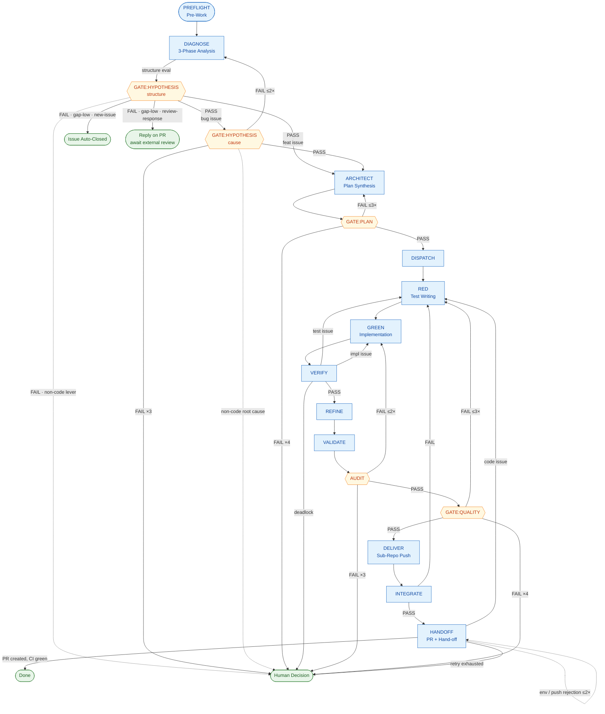

# AutoFlow Guide — Phase-by-Phase Development Lifecycle

> AutoFlow is a structured, evaluation-gated development lifecycle for AI-assisted
> software engineering with Claude Code. This guide is the **phase-body source of
> truth**: each phase's step-by-step procedure, scoring rubric, and `[MUST]`/`[DENY]`
> constraints live here. The cross-phase invariants, the router (phase list + Flow
> Control table), the regression / escalation caps, the Execution Principles, and the
> state schema live in [`CLAUDE.md`](../CLAUDE.md); the DIAGNOSE analysis procedure has
> its own playbook at [`phases/analysis.md`](phases/analysis.md).

---

## Overview

AutoFlow defines 16 phases (`PREFLIGHT` → `HANDOFF`) that guide every code change
from issue analysis to PR hand-off. Each phase has explicit entry/exit criteria, and
evaluation gates prevent low-quality work from reaching the PR. Merging is performed
by an external review process; AutoFlow does not merge.

Key principles:

- **No shortcuts** — every phase is executed in order.
- **Multi-agent separation** — distinct roles handle implementation, testing, and evaluation.
- **Bias prevention** — 3-phase independent analysis before coding.
- **Quantified quality** — 10-point evaluation with a defined PASS threshold.
- **Per-phase model selection** — teammate and subagent spawns use the recommended model per phase (`sonnet` for rubric-scored gates and classification work; `opus` for multi-turn design discussion, implementation, and self-check). Policy and table: [`CLAUDE.md`](../CLAUDE.md) > Spawn Model — Phase-by-Phase.

The phase names generalize upstream's numeric `STEP 0~9` identifiers; the
mapping is preserved 1:1 below.

| upstream | this guide |
|----------|------------|
| STEP 0 | PREFLIGHT |
| STEP 1 | DIAGNOSE |
| STEP 1.5 | GATE:HYPOTHESIS |
| STEP 2 | ARCHITECT |
| STEP 3 | GATE:PLAN |
| STEP 4 | DISPATCH |
| STEP 5a | RED |
| STEP 5b | GREEN |
| STEP 5c | VERIFY |
| STEP 5d | REFINE |
| STEP 5.5 | VALIDATE |
| STEP 5.7 | AUDIT |
| STEP 6 | GATE:QUALITY |
| STEP 7 | DELIVER |
| STEP 8 | INTEGRATE |
| STEP 9 | HANDOFF |

---

## Lifecycle Diagram

The full AutoFlow lifecycle, including regression paths and gate verdicts.
Diamond nodes are evaluation gates; stadium nodes are terminal states.



The same diagram in plain text, for environments without mermaid rendering:

```
PREFLIGHT
    │
    ▼
DIAGNOSE ─── structure eval ──► [FAIL]
                ├─ gap-item low (already satisfied) ─► new-issue: Issue Auto-Closed │ review-response: Reply on PR + await review
                └─ gap real, non-code lever ────────► report to user + pause
    │
    ▼
GATE:HYPOTHESIS (cause, bug only) ◄── retry ≤2×
    │
    ▼
ARCHITECT ◄── retry ≤3×
    │
    ▼
GATE:PLAN
    │
    ▼
DISPATCH → RED → GREEN ⇄ VERIFY (≤3 round-trips) → REFINE
                                                       │
                                                       ▼
                                                   VALIDATE
                                                       │
                                                       ▼
                                                    AUDIT  ◄── retry ≤2×
                                                       │
                                                       ▼
                                                GATE:QUALITY ◄── retry ≤3× → RED
                                                       │
                                                       ▼
                                                    DELIVER
                                                       │
                                                       ▼
                                                   INTEGRATE → [FAIL] → RED
                                                       │
                                                       ▼
                                                   HANDOFF ◄── retry ≤2×
                                                       │
                                                       ▼
                                          PR open — external review merges
```

---

## PREFLIGHT — Pre-Work

**Goal**: ensure a clean Git state before any analysis or coding begins.

| Step | Action |
|------|--------|
| 1 | Prior-cycle resolution — reconcile every `.autoflow/issue-*.json` against its GitHub PR: merged or closed → delete its dev branch (local + origin), sync main, **and archive the issue's `.autoflow/issue-{N}*` files** — move them out of the repo tree to `$AUTOFLOW_ARCHIVE_ROOT/<repo-key>/issue-{N}-<date>/` (never delete; the move fires only on an observed merged/closed PR) (re-filing a rejected issue is a separate, external decision); requested issue with open PR + `active:false` → review-response mode (checkout dev branch; set `mode:review-response`; increment `cycle`); **requested issue's own state `active:true` → resume the in-progress cycle per the Resume procedure below (this is distinct from *another* issue's `active:true`, which is "report and hold")**; another issue `active:true` → report and hold (one-issue-at-a-time); other `active:false` (PR in external review) → cleared, proceed; **any issue `active:false` with `phase:"awaiting-user"` and no PR yet (a pre-PR human-decision pause — DIAGNOSE intake-triage FAIL, structure-gate non-code lever, or GATE:HYPOTHESIS non-code root cause) → preserve its `.autoflow/issue-{N}*` files **in place** and report the pending decision; do NOT archive (the archive move requires an observed merged/closed PR, which this state has never reached).** |
| 1.5 | **Cross-issue recurrence scan** (bounded, single-shot) — runs after step 1 (prior-cycle resolution), before step 2 (Git Clean Check). Spawn ONE `Agent(subagent_type:"autoflow-analyzer", model:"sonnet")` that merely invokes `scripts/preflight/scan-cross-issue-recurrence.sh --format=backlog` (M=20, K=3) over `docs/cycle-digest.jsonl` and redirects stdout to the gitignored scratch `.autoflow/issue-{N}-xissue-scan.md`. See **Cross-issue recurrence scan (step 1.5)** below. |
| 2 | `git status` — confirm no uncommitted changes or untracked files in the working area |
| 3 | `git fetch origin` — sync with remote |
| 4 | Resolve any dirty state (stash, commit, or discard with user approval) |
| 5 | `git checkout -b dev/YYYY-MM-DD-issue-N main` — create a dev branch (new-issue mode); the branch name carries the issue number so `#N`'s dev branch is derivable by convention (`dev/<date>-issue-<N>`) — this convention is what the Resume procedure and the review-response setup below resolve the branch from, since the state schema has no `branch` field; the state file is created from the template with `mode: "new-issue"`, `phase: "in-progress"`; add the `status:in-progress` label to the issue: `gh issue edit #N --add-label "status:in-progress"` |

**Cross-issue recurrence scan (step 1.5).** A bounded, single-shot cross-issue complaint-class **recurrence** scan runs directly after step 1's prior-cycle resolution over `.autoflow/issue-*.json` and **before** step 2's Git Clean Check. It concretizes the "future cross-issue factual-tally scan" the HANDOFF step-6.7 `[DENY]` names (issue #954), reading the durable corpus #953 established.

- **Spawn.** The orchestrator spawns exactly ONE analysis subagent — `Agent(subagent_type:"autoflow-analyzer", model:"sonnet")` (analysis role → not score-gated → spawnable before any `active:true` cycle exists for the requested issue; the explicit `model:"sonnet"` satisfies the Spawn Model [MUST]). It **merely invokes** `scripts/preflight/scan-cross-issue-recurrence.sh --format=backlog` (defaults **M=20** recent-cycle window, **K=3** distinct-issue threshold) and **redirects** the script's stdout to the gitignored scratch file `.autoflow/issue-{N}-xissue-scan.md` — it does no generative rendering of its own (the candidate block is produced deterministically by the script). Non-empty scratch → it returns only that `path` + a one-line summary (orchestrator context discipline); empty output → it reports "no cross-issue recurrence at K=3".
- **Bounded / single-shot / no loop.** Exactly one scan invocation per PREFLIGHT — **single-shot**, with **no retry, no loop, no iteration**. The script reads at most the last M=20 records once (`tail -n`) and exits; it never mutates a git-tracked file.
- **Corpus = `docs/cycle-digest.jsonl` only.** The scan's corpus is the durable, git-tracked `docs/cycle-digest.jsonl` (#953) and nothing else. It does **NOT** read the `.autoflow/` gitignored scratch as its corpus — `.autoflow/*` is per-issue and moved out to the external archive at prior-cycle resolution, so that gitignored scratch cannot be the corpus for a cumulative cross-issue signal.
- **Threshold → candidate finding.** A class token (drawn from `loop_check_class` ∪ `escaped_defects[].class`, normalized by trim + lower-case) appearing across **K=3** distinct issues within the last **M=20** records is a breach; the script renders one **candidate** `###` finding per breached class in the existing backlog grammar. This is a factual recurrence tally emitted for **human** review only. **[DENY]** the scan never auto-modifies any evaluation **criteria** / **rubric** and never feeds a gate or evaluator; promotion of a candidate to an issue stays **human-external** (Decision 4, [`design-rationale.md`](design-rationale.md) > Known Limitations). It is registered in no role-injection whitelist.
- **Relationship to the per-issue loop-check.** This cross-issue scan **supplements, and does not replace**, the per-issue review-response **loop-check** ([`phases/analysis.md`](phases/analysis.md)): the per-issue loop-check compares a single issue across its consecutive review-response cycles (local "this fix did not take"); this cross-issue scan tallies distinct issues cumulatively across the digest (global "the rubric/rule is systematically deficient"). See that doc for the full scope split.
- **Backlog append is deferred out of the clean-tree window (step 2).** The scan writes only the gitignored `.md` **scratch** — never `docs/improvement-backlog.md` — so step 2's Git Clean Check still passes. The real git-tracked backlog append happens **only after** PREFLIGHT establishes the **dev branch** (step 5 in new-issue mode; the existing dev branch in review-response mode), outside PREFLIGHT's clean-tree check window, as a separate standalone `chore(preflight-scan)` infra commit by the orchestrator. The append is not a direct write during PREFLIGHT (not inside PREFLIGHT's step / clean-tree window) and is **never on main** (no-direct-commit-to-main invariant preserved). If PREFLIGHT halts before a dev branch exists, no append happens this run — the gitignored scratch is left in place and the next proceeding PREFLIGHT re-derives it from the unchanged corpus.

**Git Clean Check** (procedural detail → [`git-workflow.md`](git-workflow.md) > Git Clean Check): working tree clean; new-issue mode → main synced with origin; review-response mode → existing dev branch fast-forwarded from origin (`git fetch && git pull --ff-only`). The Merged / Closed-unmerged resolution paths above also start the next cycle from a fresh state-file template, so a re-filed issue never inherits a stale `mode`.

**Review-response mode setup** (requested issue has an open PR + `active:false`): `git checkout dev/<existing-branch>` (the issue's dev branch per the Step-5 naming convention `dev/<date>-issue-{target}`, located with `git branch --list 'dev/*-issue-{target}'`); set `mode: "review-response"`, `active: true`, `phase: "in-progress"`; identify the triggering reviewer comment/thread (the DIAGNOSE review-response target); increment the state file's `cycle` field and reset `phases` to the empty Creation template (preserving the `verdict` rule); add the `status:in-progress` label: `gh issue edit #N --add-label "status:in-progress"`. Skip dev-branch creation (step 5 is new-issue mode only).

**Resume procedure** (requested issue's own state file reads `active:true` — a mid-cycle session resumed after an abnormal end): resume deterministically, do not restart from PREFLIGHT.
1. **Read the last confirmed point** from the state file: the highest phase whose gate `scores` are recorded in `phases` (or `verdict` set for `gate_hypothesis_cause`) is the last *passed* gate; `phase` gives the coarse marker.
2. **Verify the resume prerequisites** before continuing: the issue's dev branch exists and is checked out, and the `.autoflow/issue-{N}-*.md` artifacts the next phase consumes are present. The branch is identified by the **documented dev-branch naming convention** (PREFLIGHT Step 5): the issue-scoped dev branch for `#N` is `dev/<date>-issue-<N>`, located with `git branch --list 'dev/*-issue-<N>'`. If it is missing, or matches ambiguously, or a required artifact is absent, treat the cycle as unrecoverable and report to the user (do not fabricate the missing artifact).

   *Note (branch-source):* the state schema (`CLAUDE.md` > AutoFlow State Tracking) carries **no `branch` field**, so the issue→branch mapping cannot be read from the state file. Rather than add a schema field (a data-model change out of family with this spec-consistency fix), the branch is made derivable by the documented Step-5 convention (`dev/<date>-issue-<N>`, aligned to live practice), so step 2 resolves the branch deterministically against a documented rule — not against undocumented live practice or a non-existent state field.
3. **Re-enter at the phase immediately after the last passed gate.** If the last confirmed point is indeterminate (no recorded gate `scores`, or artifacts inconsistent), fall back conservatively to **re-running from the phase that follows the most recent gate whose `scores` are present** — never skip a gate that has no recorded PASS. A gate is re-run, not assumed passed, whenever its `scores` are absent.
4. Resume does **not** increment `cycle` and does **not** reset `phases` (contrast review-response entry, which does both) — it is a continuation of the same cycle, not a new one.

**Reviewer-backend availability (fail-closed stop condition).** Before DIAGNOSE, PREFLIGHT confirms the configured HANDOFF step-6 review **backend** is **available** by running `scripts/preflight/check-review-backend.sh` — it reads the backend from `.claude/autoflow.local.json` (`.review.backend`, default `codex`; absent ⇒ codex) and probes the CLI presence-only (`command -v codex` / `command -v claude`; auth is not probed — a present-but-unauthenticated backend passes here and surfaces its auth failure at HANDOFF step 6). A non-zero exit is a **fail-closed** hard PREFLIGHT stop (mirrors `drift-check.sh`): the cycle does not begin until the configured backend's CLI is installed or the backend is switched in `.claude/autoflow.local.json`. This moves the former codex hard-requirement from HANDOFF-end to PREFLIGHT-entry. See [`reviewer-backend.md`](reviewer-backend.md).

**Hard stop**: if the Git state is not clean after resolution attempts (e.g. `--ff-only` fails), **stop and report to the user**. Do NOT proceed to DIAGNOSE.

---

## DIAGNOSE — Issue Analysis

→ **Phase playbook (single source of truth): [`phases/analysis.md`](phases/analysis.md).**
Read it on entering DIAGNOSE. It carries the full procedure: the **intake readiness triage**
(`mode=new-issue` only, run ahead of the structure fan-out — a planning/design/ADR pre-req
filter that pauses for the user on FAIL, no auto issue creation), the 3-Phase independent
structure analysis (Phase A structure-only, Phase B issue-only, Phase 3 necessity scoring),
**the per-role document injection whitelist (three distinct roles — Phase A = current-state
area excerpts only; intake triage = issue body + readiness/work-type docs; Phase B = issue
body only)**, the issue-type classification (Type 1 code / Type 2 docs), the per-type scoring rubric and
PASS/FAIL thresholds (Type 1: each ≥ 7, two items; Type 2: each ≥ 7 and avg ≥ 7.5, three
items), the FAIL disposition by failing item and cycle `mode` (gap-low → new-issue close /
review-response reply on PR; non-code lever → report to user + pause), the review-response loop check (trigger repeats the prior cycle's complaint class with a new witness case → reply on PR + pause for the user), cause hypotheses
(≥ 3, "not a code bug" must be one), lightweight verification, hypothesis verdict notes,
task decomposition, affected-docs identification, and the structure- and confirmation-bias
safeguards.

---

## GATE:HYPOTHESIS — Hypothesis Evaluation (bug/incident issues only)

Feat issues skip this gate.

**Evaluator**: independent Evaluation AI, fresh-spawned per call.
**Input**: hypothesis list + lightweight-verification results + verdict notes.

### Scoring (3 items × 10 points)

| Item | Criterion |
|------|-----------|
| Hypothesis diversity | Are non-code causes (data, environment, already-fixed) sufficiently considered? |
| Verification sufficiency | Was lightweight verification actually performed? Are unverified items justified? |
| Verdict evidence | Is the conclusion (code change required / not required) logically supported? |

- **PASS** → ARCHITECT.
- **FAIL** → DIAGNOSE (max 2×). Third FAIL → human decision.
- **Non-code root cause confirmed** → report to user (situation-first — [`CLAUDE.md`](../CLAUDE.md) > Execution Principles > Human-decision presentation), pause AutoFlow.

---

## ARCHITECT — Plan Synthesis (Developer AI + Test AI)

Both perspectives participate, but the discussion runs inside an isolated
**`Workflow`** (the facilitator — `architect-deliberation`), **not** as Agent-Teams
teammates messaging the orchestrator: the Developer-AI and Test-AI run as in-script
sub-agents, their cross-talk stays in workflow variables, and only a single verdict
(`CONVERGED` + artifact paths, or `ESCALATE` at the 6-round cap) returns to the
orchestrator. The facilitator also appends the settled decisions to the decision
ledger. Rationale: [`CLAUDE.md`](../CLAUDE.md#deliberation-isolation-delegated-facilitation)
> Deliberation Isolation; contract: [`teammate-contracts.md`](teammate-contracts.md)
> Facilitator. The orchestrator invokes the facilitation workflow, then **verifies** the
returned verdict — spot-checking targeted artifact excerpts against re-derived facts (the
full read-and-score is GATE:PLAN's); it does not facilitate the discussion turn-by-turn and
does not receive the round-by-round messages.

**Document injection (ARCHITECT onward).** Past DIAGNOSE the Phase A ↔ Phase B isolation no longer applies — the Developer-AI and Test-AI both work from code and design together. Injection is still **role-minimal and routed via `docs/INDEX.md`**, never wholesale: the facilitator passes each in-script sub-agent only the documents its design task needs (e.g. the relevant `docs/adr/*`, `docs/design-rationale.md`). **Deliberation Isolation is unchanged** — the round-by-round cross-talk stays inside the workflow and only the verdict returns to the orchestrator.

**Roles**:
- **Developer AI**: feature design (changed files, API interface, data structures).
- **Test AI**: verification design (acceptance criteria → verification method, testability assessment).

### Output artifacts

1. **Feature Design Document** (Developer-AI-led): files to change, API interface, data structures, dependencies.
2. **Verification Design Document** (Test-AI-led):

| Acceptance criterion | Verification type | Method |
|----------------------|-------------------|--------|
| (criterion 1) | automated | pytest / API test / etc. |
| (criterion 2) | manual    | scenario doc (delegated to user) |
| (criterion 3) | environment-dependent | introduce mock or propose design change |

- For untestable items: state the reason and the alternative (design change / manual delegation / mock).
- Design-change request: parts of the feature design that should be revised so they become testable.
- Committed-surface allow-list: when the design's change surface includes a
  manifest-registered source, pre-register `setup/manifest.json` as a
  derived member of the allow-list at design time (Change Surface Rules >
  Derived artifacts) — do not wait for a test/CI failure to admit it
  (#800 `607720e`).

### Testability-driven design

When the Test AI flags an item as "not automatable", the team discusses whether a feature-design change makes it testable. If not, the item stays as a manual scenario with a stated reason.

### Agreement criteria

Both documents reach ACCEPT from both teammates. The Discussion Protocol applies.
Before mutual ACCEPT, one exchange must verify the resolution conforms to any governing
ADR — the first, non-gated approach check (GATE:PLAN is the gated one);
a divergence is a COUNTER, not an ACCEPT. No score.
The facilitator records the converged decisions in the ledger and returns
`CONVERGED` + artifact paths; non-convergence within the round cap returns `ESCALATE`.

---

## GATE:PLAN — Plan Evaluation

**Evaluator**: fresh-spawned Evaluation AI.
**Input**: feature design + verification design from ARCHITECT.

### Scoring (5 items × 10 points)

| Item | Criterion |
|------|-----------|
| Feasibility   | Can this plan be implemented with the current structure? (grounded in the actual mechanisms, not a misread) |
| Dependencies  | Are affected files and side effects identified? |
| Scope         | Appropriate — not too broad, not missing requirements? (no redundant new mechanism where an extension suffices — over-engineering fails here) |
| Security      | Any security implications introduced? |
| Test plan     | Are acceptance criteria testable? |

`Feasibility` and `Scope` absorb the structural-fit concern that the DIAGNOSE structure gate deliberately does not score: a plan not grounded in the actual structure fails Feasibility; a plan that duplicates an existing mechanism or over-engineers a new one where an extension suffices fails Scope. This is where an actual design exists to judge it — DIAGNOSE only decides *whether* a code change is needed, GATE:PLAN judges *whether the plan fits*. By design this defers wrong-approach detection (e.g. a resolution targeting the wrong subsystem) past ARCHITECT: that judgment needs a design, so ARCHITECT's devil's-advocate is the first approach check and GATE:PLAN the gated one — DIAGNOSE cannot make it without re-introducing the altitude error of scoring feasibility before a design exists.

### ADR-conformance check (scored within Feasibility / Scope)

This named check makes the ADR-conformance concern explicit inside the two items that already absorb structural fit — it adds **no scored item** and changes **no PASS threshold**; a violation caps the named item at 6, failing via the each-item ≥ 7 rule (identical mechanism to the GATE:QUALITY "Known blind-spot checks" below). A **governing ADR** for the change surface is an ADR in `docs/adr/` with status `Accepted`/`Proposed` whose Decision scope intersects the change surface, **or** a change hitting a `docs/adr/README.md:16-23` "When to Create an ADR" trigger area.

- **Trigger → cap**: divergence from a governing ADR, **or** an architecture-impacting change with no governing ADR/owner decision → cap.
- **Per-item cap distribution**: `Feasibility` caps on a structural-grounding divergence (the plan is not grounded in the ADR's decided structure); `Scope` caps on a redundant-mechanism / boundary divergence **or** the undocumented-ADR trigger; **both** cap when both defects are present. One divergence never leaves both items uncapped.
- **N/A by default**: no governing ADR's Decision scope intersects **and** no trigger area is hit → the check does not apply, no cap, the item scores normally.

Precedent: the GATE:QUALITY "Known blind-spot checks" below. Authority: [`docs/adr/0016-adr-conformance-gate-scoring.md`](adr/0016-adr-conformance-gate-scoring.md).

- **PASS** (avg ≥ 7.5, each ≥ 7) → DISPATCH.
- **FAIL** → ARCHITECT (max 3×).

---

## DISPATCH — Task Assignment (Developer AI + Test AI)

`TaskCreate` + `SendMessage` to **both teammates**:

- **Teammate spawn**: ARCHITECT ran as a self-contained `Workflow` that already returned (no persistent ARCHITECT teammates to shut down). At DISPATCH entry the orchestrator spawns fresh agents for RED/GREEN — see [`CLAUDE.md`](../CLAUDE.md) > Cost Control. Spawn prompts pass `.autoflow/*` paths only; discussion history is not carried over.
- **Test AI**: verification-design "automated" items → test-writing tasks.
- **Developer AI**: feature-design implementation tasks (**starts after RED is complete**).
- Both receive: acceptance criteria + verification design + affected docs.

---

## RED — Test Writing (Test First)

The Test AI writes test code from the verification design.

```
1. Convert acceptance criteria → test code (only items typed "automated").
2. Run tests → all must FAIL (Red).
   - A test that does not fail means the criterion is already met or the test is wrong → investigate.
3. For untestable items → write a manual verification scenario document.
4. Hand the test code + scenario document to the Developer AI.
```

**Completion**: all automated tests Red + manual scenarios written.

---

## GREEN — Implementation

The Developer AI writes the minimum code that passes the tests.

```
1. Read the test code authored by the Test AI.
2. Write the minimum code that passes the tests.
   - [MUST] Do NOT implement behavior not covered by tests.
   - [MUST] Stay on the change surface defined in the plan — see [`submodule-common-rules.md`](submodule-common-rules.md) > Change Surface Rules.
   - [MUST] Tests verify correctness; they do not define the solution. Implement the actual logic that solves the problem for all valid inputs — never hard-code to the test inputs, special-case the assertions, or add workaround/helper scripts just to turn a test green. "Minimum code" means the smallest *general* implementation that satisfies the AC, not the narrowest path that satisfies the assertions. If a test looks wrong or infeasible, raise it as a VERIFY cause-branch rather than coding around it.
3. Before committing, if this change touched a manifest-registered source, run
   the manifest regen and stage the result in the same commit.
   - [MUST] If `git diff --name-only <base>...HEAD` intersects
     `jq -r '.artifacts[].source' setup/manifest.json` on any path other than
     `setup/manifest.json` itself, run `setup/gen-manifest-hashes.sh` and stage
     the regenerated `setup/manifest.json` in this commit — the check is
     mechanical set-intersection, not a judgment call. See
     [`submodule-common-rules.md`](submodule-common-rules.md) > Change Surface
     Rules > Derived artifacts.
4. Commit (feat/fix branch).
```

---

## VERIFY — Test Run + Verification

Run the tests; on failure, branch by cause.

```
1. Run all tests.
2. Branch on result:
   All PASS → step 3.
   Some FAIL → cause branching (run under delegated facilitation — the `verify-cause-branch` workflow returns a single
   next_action — RED | GREEN | SEQUENTIAL_FIX | EVALUATION_AI — and the orchestrator
   routes on it; it never sees the round-by-round exchange; see [`CLAUDE.md`](../CLAUDE.md) > Deliberation Isolation):
     The workflow hands the failure log + test code + implementation code to both AIs.
     Test AI:      "Does my test accurately reflect the acceptance criterion?" — self-check.
     Developer AI: "Does my implementation meet the acceptance criterion?"     — self-check.
       ├─ fix_test + no_problem → RED            → fix test → re-confirm Red → re-enter GREEN
       ├─ no_problem + fix_impl → GREEN          → fix implementation → re-run VERIFY
       ├─ fix_test + fix_impl   → SEQUENTIAL_FIX → fix test first → Red → fix impl → Green
       ├─ no_problem + no_problem → EVALUATION_AI → deadlock: Evaluation AI judges against acceptance criteria
       └─ a missing/errored self-check → EVALUATION_AI (recorded as "missing", never as no_problem)
3. Minimal-implementation check (Test AI):
   diff analysis: are there parts of the impl diff not covered by any test?
     ├─ All covered → PASS
     ├─ Uncovered code → ask Developer AI to remove it, or add a test
     └─ Infrastructure / config / non-testable code → exception allowed (state reason)
4. Mock-boundary fidelity check (Test AI):
   for every test double (mock / stub / fake) standing in for a real interface,
   re-derive the real interface at HEAD (signature, argument count, return shape,
   error path) and confirm the double matches — cite the real implementation's
   file:line in the report.
     ├─ All doubles match → PASS
     └─ A double diverges → masked failure, not a Green → branch by cause as in step 2
        (a test built on a wrong double → RED; the impl wrong against the real interface → GREEN)
```

**Mock-boundary fidelity rationale**: a passing suite whose doubles diverge from the real
interface is a masked failure — issue #309 shipped three mock-masked integration gaps
through every internal gate; only external review caught them. The check is a sampled
re-derivation against HEAD, not a re-read of the test's own claims.

**Deadlock resolution**: Evaluation AI judges against the acceptance criteria as the objective baseline.
**Max round-trips**: GREEN ↔ VERIFY max 3. After 3 unresolved → human.

**Foreground execution note**: a short re-verification (a suite re-run) is a foreground command — the assigned Developer AI runs it foreground and reports, or the orchestrator runs it directly foreground — never a background spawn-and-wait (`docs/teammate-common-rules.md` > Bash Execution Mode).

---

## REFINE — Refactor (Green maintained)

```
1. Developer AI: run /simplify
   - Three parallel agents (reuse / quality / efficiency).
   - Apply suggested fixes (no behavior change — tests must pass without modification).
   - If /simplify finds nothing, proceed to step 2 (do NOT skip).
2. [MUST] Re-run all tests → confirm Green.
   - Run even when step 1 made no changes.
   - On FAIL → revert /simplify changes → Developer AI fixes (max 2×).
3. Commit (refactor type; skip if step 1 made no changes).
```

**Why /simplify?** Removes the AI's "nothing to clean up" skip bias by mechanically analysing the code.
**Max retries**: 2; on second failure, abandon refactor and proceed to VALIDATE
with the Green state from VERIFY.

**Foreground execution note**: the step-2 re-run is a short foreground command — the assigned Developer AI runs it foreground and reports, or the orchestrator runs it directly foreground — never a background spawn-and-wait (`docs/teammate-common-rules.md` > Bash Execution Mode).

---

## VALIDATE — Verification Done

```
1. Automated tests: all PASS confirmed (achieved in VERIFY).
2. Minimal-implementation check: PASS confirmed (achieved in VERIFY step 3).
3. Manual checklist: list the manual scenarios from the Test AI (mark "delegated to user").
4. Maintained-docs check: confirm impacted docs are updated.
5. Manifest coherence check: if the diff touched a manifest-registered source
   (Change Surface Rules > Derived artifacts), confirm `setup/manifest.json` was
   regenerated in the same change — re-run the set-intersection check locally so
   a missed GREEN regen is caught here, before HANDOFF/CI, not at AC2e.
6. Deploy/CI-path verification check: if the diff matched the INTEGRATE
   deploy/CI-path condition (### Deploy/CI-path conditional verification),
   confirm the INTEGRATE deploy/CI-path bundle (a)/(b)/(c) ran and passed
   (against a target service repo, per tests/manual/issue-847-manual-scenarios.md)
   — re-state the matched paths so a silently-skipped INTEGRATE step is caught
   here, before HANDOFF. (Or diff touched no deploy/CI-path surface.)
```

**Verdict**: automated tests all PASS + minimal-implementation PASS + manual scenarios listed + manifest coherence confirmed (or diff touched no manifest source) + deploy/CI-path verification confirmed (or diff touched no deploy/CI-path surface). Manual items marked "delegated to user" do not block VALIDATE.

---

## AUDIT — Security Audit (independent evaluation)

After VALIDATE, run a project-specific security audit on the change. Complements
GATE:QUALITY's `Security` item with 5 dedicated, project-specific items.

**Evaluator**: fresh-spawned Evaluation AI.
**Input**: change diff + the project-specific security checklist
(`docs/security-checklist.md`).

### Scoring (5 items × 10 points)

Items adapt to the project's threat surface; defaults below.

| Item | Criterion |
|------|-----------|
| Authn/Authz       | Are auth flows on changed endpoints complete? |
| Input validation  | Are external inputs (queries, parameters, payloads) validated/escaped? |
| Data exposure     | Are tokens / passwords / PII kept out of logs and responses? |
| Infra isolation   | Are internal ports/services not exposed externally? |
| Dependencies      | No known vulnerabilities in changed external dependencies? |

- **PASS** (avg ≥ 7.5, each ≥ 7, security ≤ 3 → immediate block) → GATE:QUALITY.
- **FAIL** → fix, re-evaluate (max 2×). Third FAIL → human.

GATE:QUALITY's `Security` item references the AUDIT result to avoid duplicate work.

---

## GATE:QUALITY — Completion Evaluation

**Evaluator**: fresh-spawned Evaluation AI.
**Input**: full change set + test results + AUDIT result.

### Scoring (10 items × 10 points)

Completeness, Quality, Test coverage, Test quality, Security (references AUDIT),
Fit, Impact scope, Minimal implementation, Commit conventions, Doc updates.

The `Minimal implementation` item is scored against [`submodule-common-rules.md`](submodule-common-rules.md) > Change Surface Rules: a diff with hunks that do not trace to an AC fails this item regardless of code quality.

### Known blind-spot checks (scored within existing items)

Several defect patterns repeatedly passed every internal gate and were caught only by
external (Codex) review — #309 (mock-masked integration gaps), #120 (a test asserting a
weaker proxy than its AC, plus a fabricated log cited as evidence), #222 (relocation
regressions: stale inbound references and a false-RED doc harness) — plus one
**proactively-added** check mandated by `ADR-0016` (conformance to a governing ADR), which
is not a past Codex catch but a policy the gate now enforces. The evaluator applies
these checks **inside the existing 10 items** — they add no scored items and change no
PASS threshold. Each violation caps the named item at 6, which fails the gate via the
each-item ≥ 7 criterion:

- **Test quality — mock-boundary fidelity**: sample the suite's test doubles and verify
  each against the real interface at HEAD (signature, argument count, return shape).
  A double that diverges from the real interface caps `Test quality` at 6.
- **Test quality / Completeness — assertion-claim alignment**: for each AC, confirm the
  test asserts the behavior the AC states, not a weaker proxy (e.g. "the function was
  called" where the AC requires a result shape). Confirm every cited evidence line
  (test summary, log excerpt) reproduces by re-running the cited command — evidence that
  was authored but never produced by a run caps the citing item at 6.
- **Impact scope / Doc updates — reference integrity on moves**: when the diff relocates
  or renames files, sections, or identifiers, require evidence of a repo-wide
  inbound-reference sweep (direct references, test-harness expectations, paraphrased
  mentions). A dangling reference caps the affected item at 6.
- **Fit — ADR conformance** (proactively-added per `ADR-0016`, not a past Codex catch): on
  the final change set, re-confirm the shipped change conforms to any governing ADR (same
  governing-ADR / trigger-area / N/A definition as the GATE:PLAN ADR-conformance check). A
  divergence from a governing ADR, or an architecture-impacting change with no governing
  ADR/owner decision, caps Fit at 6. Regression backstop for the GATE:PLAN check.

- **PASS** (avg ≥ 7.5, each ≥ 7, security ≤ 3 → block) → DELIVER.
- **FAIL** → RED (max 3×).

---

## DELIVER — Sub-Repo Push

DELIVER pushes the cycle's completed work to its remote branch(es) and shuts down the implementation teammates.

In a single-repo deployment (target-centric — the post-reversal default; zero submodules, see [`CLAUDE.md`](../CLAUDE.md) > Deployment Topology), DELIVER is a single `git push -u origin <branch>` and the Developer AI shuts down. There is no fork distinction.

*Secondary (multi-repo):* In a multi-repo deployment (one or more submodules), DELIVER fans out across the sub-repo forks:

- Each Submodule AI pushes its branch to its fork (`git push origin <branch>`).
- Teammate shutdown — Submodule AIs report completion and stop.
- The host's dev branch is NOT pushed yet (that happens at HANDOFF, when the host PR is created). By the time the host PR is created, the host dev branch's `services` gitlink (the submodule pointer) must point to this cycle's sub-repo PR head. The commit that bumps that pointer is the **orchestrator's** — the host `services` gitlink is a host-file change (see [`CLAUDE.md`](../CLAUDE.md) > Commit Ownership), and it is committed at HANDOFF step 4b, the single source of the pointer-bump commit format (DELIVER names the actor and target only; it does not restate the format).

---

## INTEGRATE — Integration Verification

In a single-repo deployment (target-centric — the default), INTEGRATE runs the project-level integration test suite (or a smoke test). A project with no integration layer reports "INTEGRATE: no-op (single-repo / no integration suite)" in the completion notes — this is a registry-driven no-op, not a discretionary skip.

In a multi-repo deployment (one or more submodules), INTEGRATE builds the system in the dev environment and verifies cross-sub-repo behavior:

```
1. Build all affected sub-repos in dev (e.g., docker compose -f docker-compose.dev.yml up -d --build <services>).
2. Health checks pass for each service.
3. Functional integration tests pass.
4. Cross-cutting concerns (auth, network ingress, etc.) verified.
```

**Failure**: INTEGRATE FAIL → RED (existing GREEN↔VERIFY round-trip rules apply).

### Deploy/CI-path conditional verification

Some integration-breaking changes never touch the dev-compose surface the steps above build: deploy scripts, CI-config files, submodule layout, and env / build-arg wiring pass the dev-compose run clean and the breakage surfaces only after merge (the #774 / #776 / #778 / #781 class from the single #773 restructure — each a priority:high post-merge regression that consumed a full separate cycle). This check adds a **diff-path-conditional** gate keyed on the class of surface being integrated. It is topology-independent — it lives outside the single-repo / multi-repo branch above and applies in both: CI-config and build-wiring diffs occur in single-repo targets too, while the submodule / deploy classes resolve to a defined no-op there.

**Trigger predicate (deterministic).** Let the diff be `git diff --name-only <base>...HEAD` (base = `git merge-base HEAD main`). The condition **fires** iff any changed path matches the trigger glob set:

| Class | Glob(s) | Regression witness |
|---|---|---|
| Submodule layout | `.gitmodules` | #778 (nested container path) |
| CI config | `.github/workflows/**`, `**/Jenkinsfile`, `Jenkinsfile` | #776 (Jenkinsfile Validate-Compose) |
| Deploy scripts | `deploy-*.sh`, `**/deploy-*.sh` | #774 (deploy-librechat.sh submodule not updated) |
| Env / build-arg | `.env`, `.env.*`, `**/.env`, `**/.env.*` | #776 (nested `services/.env`), #781 (build wiring) |

Stated as an enforceable one-liner (the frozen predicate — mirrors the manifest `comm` / `grep` idiom in [`submodule-common-rules.md`](submodule-common-rules.md) > Change Surface Rules > Derived artifacts):

```
git diff --name-only <base>...HEAD \
  | grep -E '(^|/)\.gitmodules$|(^|/)\.github/workflows/|(^|/)Jenkinsfile$|(^|/)deploy-[^/]*\.sh$|(^|/)\.env(\.[^/]*)?$'
```

Non-empty ⇒ the verification bundle below is a **mandatory PASS/FAIL gate** for this cycle. Empty ⇒ record `INTEGRATE deploy/CI-path: no-op (diff touched no deploy/CI-path surface)` — a defined no-op, not a discretionary skip.

**Verification bundle** (runs only when the trigger is non-empty; each item is itself a defined no-op when the target ships no such surface):

- **(a) Deploy-script dry-run, incl. recursive submodule init** — run the target's `deploy-*.sh` in dry-run (`--dry-run` / read-only) with `git submodule update --init --recursive`, confirming the deploy path resolves the current submodule pointers. Catches the #774 / #778 class (deploy / container-path breakage). *No-op* when the target ships no deploy script.
- **(b) CI-config static validation** — lint / schema-check the changed CI file itself (`.github/workflows/*` via `actionlint` / YAML-schema; `Jenkinsfile` via the target's `jenkins declarative-linter` or equivalent). Catches the #776 class. *No-op* when no CI file changed.
- **(c) Landing/host routing smoke check** — a smoke request against the built host / landing route (health / routing reachability), catching production build-wiring breakage. Catches the #781 class. *No-op* when the target exposes no host / landing route.

The bundle commands exercise a *target service repo's* surfaces; their live effectiveness against a real target repo is walked in `tests/manual/issue-847-manual-scenarios.md` (this single-repo framework repo owns none of these surfaces, so its own cycles hit the defined no-op).

**Failure**: a bundle item that fails is an **INTEGRATE FAIL → RED** (existing GREEN↔VERIFY round-trip rules apply; no new regression cap is introduced).

---

## HANDOFF — PR Creation + Hand-off

AutoFlow's mission ends by handing off an open PR — after PR creation, CI, the configured-reviewer review, and resolved review triage (step 6.5). Merging, issue close, and deployment are outside AutoFlow's authority, performed entirely by an external review process that AutoFlow does not define or perform.

```
1. Change summary (changed files, commit hashes; per-sub-repo if applicable).
2. Test results report.
3. Push the dev branch: `git push -u origin dev/<branch>` (in review-response mode the branch is already tracked; the push updates the existing PR).
   - **[MUST]** *Secondary (multi-repo), review-response mode*: once the sub-repo fix has landed and that sub-repo PR's `blocked-by-review` label has cleared (the AC4 propagation-batching condition — see step 6.5), and **before** this push updates the host PR, re-bump the host `services` pointer to that sub-repo PR's new head **once**, then confirm `git ls-tree HEAD services | awk '{print $3}'` equals that head. This manual pointer-equality check is the **only remaining** defense against a stale pointer now that the machine verification is retired (#795 / ADR-0015 D3); it fires once at the clean point, not for a fix push in isolation.
4. Create PR(s) (skipped in review-response mode — step 3's push updates the existing PR):
   - PR title follows the [`title-guide.md`](title-guide.md) convention (`[type · epic-slice · #N] description`).
   - PR body follows the [`pr-body-guide.md`](pr-body-guide.md) principles.
   - Host-only change (target-centric — the default): create the host PR via `scripts/handoff/create-host-pr.sh --issue N --title "..." --body-file <path> --no-subrepo-dep`. The script still passes `--draft` (uniform pre-review marker) and still applies the `blocked-by-review` gate label, but does not apply the `blocked-by-subrepo` label — a host-only PR carries no merge-order gate (see Merge Sequencing > host-only case).
   - *Secondary (multi-repo):* Sub-repo changes present:
     a. Create each sub-repo PR (fork → upstream) **with `--label "blocked-by-review"`**, body `Part of Munsik-Park/autoflow#N` (no close keyword). The review gate is **per-PR**: **every** PR created for this cycle — the host PR *and* each sub-repo PR — carries `blocked-by-review` and is reviewed on its **own diff** in step 6 (so the review scope is each repo's actual code, not "the host only"). The `blocked-by-review` label must exist in each sub-repo (one-time operator setup — see [`external-review-sequencing.md`](external-review-sequencing.md)). `blocked-by-subrepo` is a separate, host-only merge-order gate (step 4b), not a review gate.
     b. Create the host PR. **Before** creating it, the **orchestrator** aligns the host dev branch's `services` gitlink to this cycle's sub-repo PR head — this is the **single source** of the pointer-bump commit format: run `git -C services checkout <sub-repo-PR-head>`, then `git add services`, then commit with the message `chore(#N): bump services pointer to <short-sha>` (the same `chore(#N): …` convention as the `git-workflow.md` reconcile snippet; DELIVER and the review-response re-bump in step 3 forward-ref this format rather than restating it). Then create the host PR via `scripts/handoff/create-host-pr.sh --issue N --title "..." --body-file <path>`. The script always passes `--draft`, applies the `blocked-by-review` gate label (cleared by the configured-reviewer review in step 6 when clean), and applies the `blocked-by-subrepo` label. The body file is the template-rendered host PR body (see `.github/pull_request_template.md` and PR Issue Auto-Close in [`git-workflow.md`](git-workflow.md)).
5. Confirm CI is green on the created PR(s). **[MUST]** Step 5 confirms CI by running `scripts/handoff/confirm-ci-green.sh --pr <N> [--repo <owner/name>]` — the orchestrator does **not** hand-write a poll loop (the same named-invocation enforcement step 4 has via `create-host-pr.sh`). The script reads `gh pr view <N> --json mergeable,mergeStateStatus` **first** and early-exits before any poll on a non-mergeable PR, then runs a finite, deadline-bounded poll only once the PR reads `mergeable: MERGEABLE` / `mergeStateStatus: CLEAN` — never reading a clean-but-empty status as green. This confirmation is a **topology-independent invariant** (single- and multi-repo identical); only the exit-`10` *resolution* is topology-branched. The host CI (`continuous-integration/jenkins/pr-merge`) builds the **merge revision** (the PR merged onto its base), so a `CONFLICTING` / `mergeStateStatus: DIRTY` PR yields no merge commit and Jenkins **silently skips the build** — the status stays 0-count and a naive "wait for green" loop hangs forever; do **not** misread the empty status as a webhook miss (webhook deliveries are 200 OK in this case — see #570). Exit-code contract (`scripts/handoff/confirm-ci-green.sh`):
   - `0` — CI green: `scripts/handoff/confirm-ci-green.sh` saw ≥1 check present and every element green.
   - `10` — not mergeable (`CONFLICTING` / `DIRTY` / `!MERGEABLE`) at precheck **or** on a mid-poll flip — **only on a JSON-confirmed read**; a failed / timed-out / empty / non-JSON precheck read is **not** treated as a conflict, it **falls through** to the bounded poll (never `10`). The stderr carries the reserved `HANDOFF-INTERNAL-RETRY` token. Do **not** wait on CI; branch by cause — a concurrent cycle advancing `main`'s `services` gitlink → resolve via [`external-review-sequencing.md`](external-review-sequencing.md) > Reconcile preflight; any other merge conflict → resolve against `origin/main` (rebase / merge) and re-push (HANDOFF internal retry).
   - `11` — `MERGEABLE` but no check ever published within the bound (`CI_POLL_TIMEOUT_SECS`, default 900); confirm the webhook / scan fallback (the job's `PeriodicFolderTrigger`, or a `synchronize` re-push) before escalating to the operator — NOT green.
   - `12` — a check concluded failure (red CI) → RED.
   - `13` — checks present but still pending at the deadline (slow CI) → inconclusive; raise `CI_POLL_TIMEOUT_SECS` / re-run (env retry, max 2), or escalate.
   - `14` — could not confirm the PR mergeable state within the bound: gh transport / auth / network / parse failure suspected (**not** a merge conflict). The precheck is bounded and a degraded read falls through, so a run where neither the precheck nor any poll iteration ever confirms `mergeable` lands here; the stderr carries the reserved `HANDOFF-INTERNAL-RETRY` token → treat as an environment/transport error → HANDOFF internal retry (max 2), then escalate. Check `gh auth` / connectivity and re-run — NOT green.
   - `64` — usage / bad-arg / bad-env-int (caller fixes the invocation).
6. Post-PR reviewer review (the configured reviewer backend — `codex` default, `claude` opt-in; see [`reviewer-backend.md`](reviewer-backend.md)) (**per-PR**): run `scripts/review/codex-review-pr.sh --pr <N> --expected-head <branch> [--repo <owner/name>]` on **every** PR created in step 4 — the host PR (omit `--repo` → current repo) **and each sub-repo PR** (`--repo <sub-repo>`), each reviewed against **its own diff** (passing `--expected-head` — the PR's own head branch — lets the wrapper confirm it is reviewing the intended OPEN PR, so a clipped `--pr` value lands on a clear stop rather than a review of the wrong PR). Each spawns an independent reviewer session (per [`reviewer-backend.md`](reviewer-backend.md)) that reviews against the shared `.codex/review.md` instruction body and posts a Korean review comment to that PR (with `--repo`, the sub-repo PR under review; severity-ranked findings). Per `.codex/review.md`, the configured reviewer removes the `blocked-by-review` gate label from the PR when the review finds zero `Critical`/`High`/`Medium` findings, and leaves it in place otherwise — gate-label clearing runs inside the isolated reviewer session. The review output is the PR comment itself, not a session response, so a later session or the operator reads it from GitHub. Each PR's `blocked-by-review` is cleared by its **own** review (with `--repo`, the clear targets that sub-repo PR). A sub-repo PR review is **required**, not optional — for a multi-repo change the host PR's diff is only the `services` submodule-pointer bump (pointing to llmroute), so reviewing the host alone never covers the sub-repo code. It does not approve/request-changes, merge, or close. In review-response mode (re-review) it re-runs per-PR against each PR still carrying the `blocked-by-review` gate this cycle (the host PR and any sub-repo PR whose code changed); the reviewer recognises the re-review and updates accordingly.

   **Start confirmation.** Each review runs in the background, and several run at once (the host PR plus each sub-repo PR), so confirm each one began with a signal scoped to its own PR. The wrapper passes the PR number into the codex prompt, so the same `pull request #<N>` string appears in both the `codex exec` argv and the rollout: `pgrep -f "pull request #<N>"` matches only this PR's session, and a fresh `~/.codex/sessions/<date>/rollout-*.jsonl` carrying `task_started` whose prompt names `pull request #<N>` attributes that rollout to this PR (add the `--repo` owner/name to the pattern when a host and a sub-repo PR happen to share a number). Either PR-scoped signal proves this review began its task. The wrapper's `[codex-review] starting codex …` marker in this invocation's own captured output is a supporting signal that the wrapper reached the launch point. A confirmed start with an advancing rollout `mtime` means the review is healthy, so let it finish on its own clock, however long that takes. When the window (~30s) passes with this PR's process and rollout both absent — even after the marker printed — treat the launch as not started: run it again once, and hand to the operator on a second miss. (A `codex exec` that fails right after the marker exits non-zero, so the wrapper returns on its own and the completed run surfaces that failure directly.) This keeps each PR's start judged on its own session, lets a slow-but-healthy review run to completion, and surfaces a launch that never started within the first half-minute. **This start-confirmation oracle is per-backend (issue #979).** The `~/.codex/sessions` rollout / `pgrep` / advancing-`mtime` signals above are the **codex** backend's oracle. The **claude** backend instead runs `claude -p` synchronously and prints a wrapper **completion marker** `[review] claude completed for PR #<N> (exit=…)` when the subprocess returns — that marker (not a codex rollout probe) is the claude start/finish signal; a non-zero exit in the marker means the review run itself failed. See [`reviewer-backend.md`](reviewer-backend.md).
6.5. Review triage (per-PR; after step 6, before termination). For each PR, read two signals: the `blocked-by-review` label state (`gh pr view <N> --json labels`) and the review verdict. The orchestrator does **not** read the reviewer comment body itself (Cost Control); a `sonnet` subagent ingests it (`gh pr view <N> --comments`), writes severity-classified findings to `.autoflow/issue-{N}-review-findings.md`, and returns `{max_severity, findings, low_confidence_items}` + the label state. The **verdict (`max_severity`) is the primary signal; the label is a derived, fail-open-prone signal** — the two can disagree because `.codex/review.md` lets a clean review still leave the label on if `--remove-label` fails. Branch on the pair:
   - **[MUST] Findings-file `max_severity` contract.** The ingesting subagent **always** writes exactly one `max_severity: <None|Low|Medium|High|Critical>` line to `.autoflow/issue-{N}-review-findings.md`, using **colon** notation as the canonical form — presence is mandatory, including on a **clean review**, which emits `max_severity: None` (never an omitted line). The consumer additionally tolerates `=` and whitespace separators (see step 6.7 emitter), but colon is the contract the producer emits. This presence guarantee is load-bearing: it is what lets the step-6.7 emitter treat a present findings file with no resolvable `max_severity` as a hard error (fail-loud) rather than a legitimately-clean review.
   - **Propagation batching (multi-repo).** When a sub-repo fix would bump the host `services` pointer, **defer** the host pointer bump until that sub-repo PR's `blocked-by-review` label has cleared (its reviewer re-review is clean); at that clean point bump **once** — the same re-bump point as step 3's `[MUST]`. This holds for the general parent-pointer / sub-repo-PR relation, independent of how many repos deep the change sits. If an intervening host-CI check makes an exceptional interim bump unavoidable, record the reason in the commit message (`chore(#N): interim services bump: <reason>`). This step 6.5 block is the source of truth for the batching norm; [`external-review-sequencing.md`](external-review-sequencing.md) carries a one-line cross-ref for reviewers.
   - **`max_severity ≥ Medium`** (the reviewer confirmed `Critical`/`High`/`Medium`; the label is present as expected) — do **not** end. Auto-enter a review-response cycle in-session with the reviewer comment as the DIAGNOSE trigger target — the same setup PREFLIGHT performs for a user-initiated review-response (set `mode:"review-response"`, increment `cycle`, reset `phases`, run the DIAGNOSE review-response loop check). The cycle flows DIAGNOSE → … → HANDOFF and re-runs step 6 reviewer review on the PRs still carrying the label; the label is cleared **only** by that reviewer re-review — the orchestrator never removes it (hook deny). Each auto-triggered review-response entry is recorded in `.autoflow/issue-{N}-ledger.md` with a `review-autofix` marker.
     - **Pause for the user** (`AskUserQuestion`, with the question and option descriptions written situation-first per [`CLAUDE.md`](../CLAUDE.md) > Execution Principles > Human-decision presentation; `active:false`, `phase:"awaiting-user"`) when the attempt hits **any** of: (a) the fix needs a contract / acceptance-criterion change, (b) the fix direction is ambiguous, (c) the finding is a `Low Confidence` item, (d) the review-response loop check matches (same complaint class, new witness). The user's answer is appended to the ledger and selects re-entry.
     - **Attempt cap = 7.** Count the *consecutive `review-autofix`-marked ledger entries since the last user re-entry decision (reset by that decision; if none yet this cycle, since the first auto-entry)* — the number of auto-resolution attempts not yet checked with the user. On the 7th such entry without the `blocked-by-review` label clearing, stop auto-resolving and pause for the user (`active:false`, `phase:"awaiting-user"`). A user re-entry decision (the user approving continuation at a pause) **resets** this window to zero — the next auto-entry starts a fresh budget of 7. The reset anchor is the user re-entry decision only.
     - **Durable record (host PR).** Post a one-line comment on the **host PR** — the always-present cycle anchor carrying `Closes #N` — via `gh pr comment <hostPR> --body "[autoflow:review-autofix] …"` for two events: (i) when the cap fired — the 7th consecutive attempt paused for the user — and (ii) when a user **re-entry decision** approved continuation (the window-reset event). These GitHub-side records survive the scratch-file cleanup at the next PREFLIGHT prior-cycle resolution, so cap-fire and re-entry stay durably auditable.
   - **Label present but `max_severity < Medium` (or no verdict is determinable)** — this is **not** a code finding. The review was clean (or produced no verdict) yet the label stuck — a `--remove-label` / review-infrastructure failure (`.codex/review.md` > label-removal-failure clause). Do **not** start a review-response cycle (there is nothing to fix). Re-run the step-6 reviewer review on that PR so the re-review clears the label; if a re-run still leaves the label on, escalate to the user / operator (`active:false`, `phase:"awaiting-user"`). This path does **not** consume the 7-attempt code-resolution cap (no code change is attempted).
   - **No label and `max_severity = Low`** — the subagent returns the `Low` items + an impact note. The orchestrator decides by **pure agent judgment** (no fixed rule) whether any `Low` finding is worth fixing now: yes → run the same in-session review-response resolution loop for those items (`Low` alone does not trigger a user pause unless one of the 4 criteria above is hit); no → proceed to step 7, optionally leaving a one-line PR note that the `Low` items were reviewed and deferred.
   - **No label and no findings** — proceed directly to step 7.
6.7. Cycle digest emission (after review triage is resolved — no PR retains `blocked-by-review` — and before step 7 flips `active` to `false`). This is the sole window where the cycle outcome is final (AUDIT + GATE:QUALITY PASS, reviewer review closed) and the state file + ledger still exist in the authoring session. The orchestrator spawns ONE analysis subagent — `Agent(subagent_type:"autoflow-analyzer", model:"sonnet")` (analysis role → not score-gated → spawnable at `active:true`; the `model:"sonnet"` parameter is explicit per Spawn Model [MUST], the emission being read-and-serialize work). The subagent invokes `scripts/handoff/emit-cycle-digest.sh <issue-json> <ledger> <review-findings>`, which serializes ONE canonical digest record (schema below) and **appends** it (`>>`, never truncating) to `docs/cycle-digest.jsonl`. The subagent returns only the digest `path:line` anchor plus a one-line summary (orchestrator context discipline — the orchestrator never reads `docs/cycle-digest.jsonl` into context).
   - **Fail-loud on an unparseable `max_severity`.** A *present* review-findings file whose `max_severity` cannot be resolved to a valid enum (`None`|`Low`|`Medium`|`High`|`Critical`) now **aborts** digest emission with a **non-zero exit** and a stderr diagnostic naming the file and the offending line(s) — the emitter is fail-loud, no longer silently defaulting an unparseable/unresolvable value to `None`. An *absent* findings file (empty third arg or a path that does not exist) still yields `review_max_severity: None` with exit 0, unchanged. This surfaces producer/consumer notation drift at emission time instead of writing a false-clean record to the write-only-forward corpus.
   - **PR co-ride.** The digest commit is an update-push to the cycle's own dev branch, which updates the open PR; it introduces no additional push path and no additional PR for the digest. The hook admits this `git push` (AUDIT + GATE:QUALITY PASS; not a push to `main`). CI re-runs on the docs-only delta (benign).
   - **Record schema** (JSON Lines — one object per issue). Canonical field names: `issue`, `terminal_cycle`, `date`, `mode`, `gates` (each `{pass, avg, items, below7}`, or `{verdict}` for the verdict-only `gate_hypothesis_cause`), `regressions` (`gate_plan`/`verify`/`audit`/`gate_quality`/`review_autofix_cycles`), `architect` (`rounds`, `escalate`), `loop_check_class`, `review_max_severity` (`None`|`Low`|`Medium`|`High`|`Critical`; renamed from `codex_max_severity`, issue #979 AC-7 — backend-neutral), `escaped_defects` (array). Each gate's `avg`/`items` derive from the live `phases.<gate>.scores` — the same raw scores the gate hook averages — never a placeholder. The machine-checkable schema fixture is `tests/fixtures/cycle-digest-schema.json`. Disclosure: the per-gate `regressions` counts (`gate_plan`/`verify`/`audit`/`gate_quality`) are currently emitted as constant `0` — the ledger has no structured grammar to derive them from (only `review_autofix_cycles` is derived, by marker count); read them as "not derived", not as "zero regressions", until a ledger-format convention populates them.
   - **[DENY]** `docs/cycle-digest.jsonl` is never read into any gate evaluation, any Evaluation-AI prompt, or any teammate context beyond the emitting subagent. It is a write-only-forward data plane (consumed only by humans and, as of #954, the read-only PREFLIGHT step-1.5 cross-issue recurrence scan — a factual-tally reader that emits a human-promoted candidate finding and never feeds a gate/evaluator), preserving Decision 4 and fresh-spawn evaluator bias-freedom. It is registered in no role-injection whitelist (`docs/phases/analysis.md`, `docs/INDEX.md`, the ARCHITECT-onward injection guidance) and routed by none.
   - **Residual scope.** This single terminal write-point covers only cycles that reach HANDOFF. A pre-HANDOFF-abort cycle (escalate/abandon before a PR exists — i.e. HANDOFF-unreached) has no clean-outcome record to digest and is out of this write-point's reach; it is **deferred in-place — no follow-up issue is filed now** (a second write-point would be the rejected PREFLIGHT-class complexity, tracked at that time if aborted-cycle telemetry is later wanted).
7. `.autoflow/issue-{N}.json` (only once review triage is resolved — no PR retains `blocked-by-review`): set `active` to `false`, record `phase: "awaiting-external-review"`; remove the `status:in-progress` label from the issue: `gh issue edit #N --remove-label "status:in-progress"`.
8. Report: "PR #N open (draft) — configured-reviewer review posted — handed to external review." AutoFlow ends; the session may terminate.
```

**[MUST]** AutoFlow runs neither `gh pr merge` nor a push to the default branch (`main`). Merging — including, for multi-repo changes, the sub-repo → pointer → host sequencing — is owned entirely by the external review process. Submodule pointer reconciliation defaults to the operator but may be delegated to AutoFlow on explicit request after the sub-repo PR is merged upstream.

**[MUST]** The host PR body uses `Closes #N` so the external merge closes the issue automatically. Sub-repo PR bodies use `Part of Munsik-Park/autoflow#N` and omit `Closes`.

Topology decides which PRs HANDOFF creates (see [`CLAUDE.md`](../CLAUDE.md) > Deployment Topology): in a single-repo deployment (target-centric — the default; zero submodules), HANDOFF creates one host PR with `Closes #N`. In a multi-repo deployment (one or more submodules), HANDOFF creates each affected sub-repo PR plus the host PR; change scope determines which sub-repo PRs exist.

The cleanup that follows an external merge or rejection runs at PREFLIGHT of the next cycle (or in the live session if it observes the decision before terminating) — dev-branch deletion plus archival (move to the external `$AUTOFLOW_ARCHIVE_ROOT/<repo-key>/` store) of the resolved issue's `.autoflow/issue-{N}*` management files; see PREFLIGHT > prior-cycle resolution.

### HANDOFF failure → regression

Classify the cause and regress along the matching path.

```
PR creation / CI (steps 3-5) failure:
  CI failure (code issue)      → RED (test/impl fix, existing rules apply)
  CI failure (env / transient) → CI retry, then step 5 retry (max 2)
  PR CONFLICTING (no checks,   → resolve vs origin/main (rebase/merge) + re-push, OR
   build silently skipped)        concurrent-cycle gitlink → Reconcile preflight;
                                  then step 5 retry (max 2) — never wait on CI green
  Push rejected (branch state) → dev branch rebase on main → step 3 retry (max 2)
```

**Max retries**: HANDOFF internal retry max 2. Two failures → human.
**RED regression**: existing GREEN↔VERIFY round-trip rules (max 3) apply.

### Merge Sequencing (external review)

In a single-repo deployment (target-centric — the default; zero submodules), the cycle produces a single host PR and there is no sub-repo merge-order step at all: HANDOFF opens one host PR with no `blocked-by-subrepo` label, and the external reviewer promotes the draft to ready and merges it directly. The merge-order sequence below governs only a multi-repo deployment.

> **Transition note (issue #91 → services nesting; historical, #798-detached)** — **As of #798 (2026-07) `claude-autoflow` carries zero submodules and is single-repo: the `services` submodule was detached, so the wording below is a historical record of the pre-#798 nesting era and applies only to a multi-repo consumer that operates such a host-private fork submodule.** This section was authored with `danny-avila/LibreChat:main` (upstream) as the sub-repo merge target, later revised (issue #91) to the host-operated fork. After the services-nesting refactor (2026-06-27) the host's direct submodule is `services` = **`{{REPO_SERVICE_HOST}}`**: the host-level sub-repo PR that the `blocked-by-subrepo` merge-order gate governs is the **llmroute PR** (merged into `{{REPO_SERVICE_HOST}}:main`). Nested `librechat` (`{{REPO_SUBMODULE}}` fork) and `librechat-deploy` PRs are llmroute's internal concern — merged inside llmroute before the llmroute PR — and are outside host handoff scope. The authoritative procedure is [`external-review-sequencing.md`](external-review-sequencing.md) and [`submodule-common-rules.md`](submodule-common-rules.md) > **Submodule URL & Pointer Policy**.

*Secondary (multi-repo):* AutoFlow opens the host PR as a draft with the `blocked-by-subrepo` label; merging is performed by the external reviewer in this order (see also issue #91 for stale-pointer risk and [`external-review-sequencing.md`](external-review-sequencing.md) for the full reviewer-facing procedure):

1. **Sub-repo (llmroute) PR merged first.** The reviewer merges the host's direct sub-repo PR into `{{REPO_SERVICE_HOST}}:main` (nested `librechat`/`librechat-deploy` PRs are merged inside llmroute first — llmroute's internal concern, outside host handoff scope). The host PR carries the `blocked-by-subrepo` label through this step; the operator removes the label once the sub-repo merge and pointer reconcile are confirmed complete, which clears the host PR for merge (see [`external-review-sequencing.md`](external-review-sequencing.md) > Merge-order clearance).
2. **Pointer reconciliation in the host dev branch.** The reviewer updates the submodule pointer in the host PR's dev branch to the llmroute PR merge commit, then pushes (or asks the original branch owner to push, which may be AutoFlow on explicit request). When delegated to AutoFlow, this step follows the **Reconcile preflight** (concurrent-cycle gitlink guard + post-reconcile mergeable/Jenkins gate) in [`external-review-sequencing.md`](external-review-sequencing.md) > Reconcile preflight — with multiple cycles in external review, a stale-base pointer bump otherwise leaves the PR `CONFLICTING` and fails the Jenkins `pr-merge` build.
3. **Operator confirms the sub-repo merge and pointer reconcile.** Before the merge-order gate is cleared, the operator manually verifies that (i) the host PR is open and carries `blocked-by-subrepo`, (ii) the upstream sub-repo (llmroute) PR is `merged`, and (iii) the host PR's `services` submodule pointer equals the llmroute PR's merge commit (nested librechat/deploy pointer reconcile is llmroute's internal concern). This pointer-equality confirmation is the operator's manual check (it was formerly published as a machine status check by an automated workflow, now retired — see [`external-review-sequencing.md`](external-review-sequencing.md) > Merge-order clearance). Once confirmed, the operator removes `blocked-by-subrepo` (a single gate cannot safely serialize N concurrent sub-repo cycles automatically). See [`external-review-sequencing.md`](external-review-sequencing.md) for the full operator + reviewer guide.
4. **Promote the host PR draft → ready.** The reviewer manually clicks "Ready for review" once their internal review checklist is satisfied. AutoFlow does not auto-promote.
5. **Merge the host PR.** With the `blocked-by-subrepo` label removed and the PR ready, the reviewer merges (the operator's step-3 pointer-reconcile confirmation backs the label removal). The host PR body's literal close-keyword line closes the issue.

**Host-only case**: steps 1-3 are skipped — a host-only PR carries no `blocked-by-subrepo` label and no merge-order gate. The reviewer still performs steps 4 and 5 manually.

**[MUST]** AutoFlow does not perform steps 1, 4, or 5. Step 2 may be delegated to AutoFlow on explicit request. AutoFlow only creates the draft PR(s) at HANDOFF step 4. The hook continues to deny `gh pr merge` and pushes to `main` while a state file has `active:true`.

---

## Execution Principles

→ Single source of truth: [`CLAUDE.md`](../CLAUDE.md) > Execution Principles. These are
always-on orchestrator invariants (not phase-local), so they stay resident in the core
file: Safety first, Verify before transition, Every phase is mandatory, Teammate idle
handling, **Verify teammate claims before dispatch** (every report's Evidence anchor is
verified before ACCEPT — an anchor-less report is rejected, not interpreted), and Stop on
error.

---

## See Also

- [`CLAUDE.md`](../CLAUDE.md) — cross-phase invariants, the router (phase list + Flow Control), regression caps, Execution Principles, state schema.
- [`phases/analysis.md`](phases/analysis.md) — DIAGNOSE analysis procedure (3-Phase A/B/3, scoring rubric, bias prevention).
- [`design-rationale.md`](design-rationale.md) — why every rule exists.
- [`evaluation-system.md`](evaluation-system.md) — scoring and PASS thresholds.
- [`submodule-common-rules.md`](submodule-common-rules.md) — Discussion Protocol, sub-repo rules.
- [`repo-boundary-rules.md`](repo-boundary-rules.md) — cross-repo coordination.
- [`git-workflow.md`](git-workflow.md) — bash procedures, branch structure.
