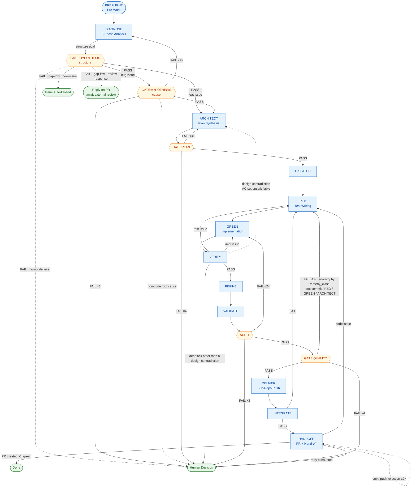

# AutoFlow Guide — Phase-by-Phase Development Lifecycle

> AutoFlow is a structured, evaluation-gated development lifecycle for AI-assisted
> software engineering with Claude Code. This guide is the **phase-body source of
> truth**: each phase's step-by-step procedure, scoring rubric, and `[MUST]`/`[DENY]`
> constraints live here. The cross-phase invariants, the router (phase list + Flow
> Control table), the regression / escalation caps, the Execution Principles, and the
> state schema live in [`CLAUDE.md`](../CLAUDE.md); the DIAGNOSE analysis procedure has
> its own playbook at [`phases/analysis.md`](phases/analysis.md).

---

## Overview

AutoFlow defines 16 phases (`PREFLIGHT` → `HANDOFF`) that guide every code change
from issue analysis to PR hand-off. Each phase has explicit entry/exit criteria, and
evaluation gates prevent low-quality work from reaching the PR. Merging is performed
by an external review process; AutoFlow does not merge.

Key principles:

- **No shortcuts** — every phase is executed in order.
- **Multi-agent separation** — distinct roles handle implementation, testing, and evaluation.
- **Bias prevention** — 3-phase independent analysis before coding.
- **Quantified quality** — 10-point evaluation with a defined PASS threshold.
- **Per-phase model selection** — teammate and subagent spawns declare the model the per-phase policy names for that phase. The values live in one machine-readable source, `.claude/autoflow/spawn-policy.json`, resolved by `bash scripts/spawn-policy/spawn-policy.sh model <phase-key>` and never restated in prose; the rule that governs it is [`CLAUDE.md`](../CLAUDE.md) > Spawn Model — Phase-by-Phase.

The phase names generalize upstream's numeric `STEP 0~9` identifiers; the
mapping is preserved 1:1 below.

| upstream | this guide |
|----------|------------|
| STEP 0 | PREFLIGHT |
| STEP 1 | DIAGNOSE |
| STEP 1.5 | GATE:HYPOTHESIS |
| STEP 2 | ARCHITECT |
| STEP 3 | GATE:PLAN |
| STEP 4 | DISPATCH |
| STEP 5a | RED |
| STEP 5b | GREEN |
| STEP 5c | VERIFY |
| STEP 5d | REFINE |
| STEP 5.5 | VALIDATE |
| STEP 5.7 | AUDIT |
| STEP 6 | GATE:QUALITY |
| STEP 7 | DELIVER |
| STEP 8 | INTEGRATE |
| STEP 9 | HANDOFF |

---

## Lifecycle Diagram

The full AutoFlow lifecycle, including regression paths and gate verdicts.
Diamond nodes are evaluation gates; stadium nodes are terminal states.


```mermaid
flowchart TD
    PRE([PREFLIGHT<br/>Pre-Work]):::phase
    DIA[DIAGNOSE<br/>3-Phase Analysis]:::phase
    HYPS{{GATE:HYPOTHESIS<br/>structure}}:::gate
    HYPC{{GATE:HYPOTHESIS<br/>cause}}:::gate
    ARC[ARCHITECT<br/>Plan Synthesis]:::phase
    PLAN{{GATE:PLAN}}:::gate
    DIS[DISPATCH]:::phase
    RED[RED<br/>Test Writing]:::phase
    GREEN[GREEN<br/>Implementation]:::phase
    VER[VERIFY]:::phase
    REF[REFINE]:::phase
    VAL[VALIDATE]:::phase
    AUD{{AUDIT}}:::gate
    QUAL{{GATE:QUALITY}}:::gate
    DEL[DELIVER<br/>Sub-Repo Push]:::phase
    INT[INTEGRATE]:::phase
    HAND[HANDOFF<br/>PR + Hand-off]:::phase
    CLOSE([Issue Auto-Closed]):::terminal
    REVW([Reply on PR<br/>await external review]):::terminal
    DONE([Done]):::terminal
    HUMAN([Human Decision]):::terminal

    PRE --> DIA
    DIA -->|structure eval| HYPS
    HYPS -->|FAIL · gap-low · new-issue| CLOSE
    HYPS -->|FAIL · gap-low · review-response| REVW
    HYPS -.->|FAIL · non-code lever| HUMAN
    HYPS -->|PASS<br/>feat issue| ARC
    HYPS -->|PASS<br/>bug issue| HYPC
    HYPC -->|PASS| ARC
    HYPC -->|FAIL ≤2×| DIA
    HYPC -->|FAIL ×3| HUMAN
    HYPC -.->|non-code root cause| HUMAN
    ARC --> PLAN
    PLAN -->|PASS| DIS
    PLAN -->|FAIL ≤3×| ARC
    PLAN -->|FAIL ×4| HUMAN
    DIS --> RED
    RED --> GREEN
    GREEN --> VER
    VER -->|test issue| RED
    VER -->|impl issue| GREEN
    VER -->|deadlock other than a design contradiction| HUMAN
    VER -.->|design contradiction<br/>AC set unsatisfiable| ARC
    VER -->|PASS| REF
    REF --> VAL
    VAL --> AUD
    AUD -->|FAIL ≤2×| GREEN
    AUD -->|FAIL ×3| HUMAN
    AUD -->|PASS| QUAL
    QUAL -->|PASS| DEL
    QUAL -->|FAIL ≤3× · re-entry by remedy_class<br/>doc commit / RED / GREEN / ARCHITECT| RED
    QUAL -->|FAIL ×4| HUMAN
    DEL --> INT
    INT -->|FAIL| RED
    INT -->|PASS| HAND
    HAND -.->|env / push rejection ≤2×| HAND
    HAND -->|code issue| RED
    HAND -->|retry exhausted| HUMAN
    HAND -->|PR created, CI green| DONE

    classDef phase fill:#e3f2fd,stroke:#1565c0,color:#0d47a1
    classDef gate fill:#fff8e1,stroke:#f57f17,color:#bf360c
    classDef terminal fill:#e8f5e9,stroke:#2e7d32,color:#1b5e20
```

The same diagram in plain text, for environments without mermaid rendering:

```
PREFLIGHT
    │
    ▼
DIAGNOSE ─── structure eval ──► [FAIL]
                ├─ gap-item low (already satisfied) ─► new-issue: Issue Auto-Closed │ review-response: Reply on PR + await review
                └─ gap real, non-code lever ────────► report to user + pause
    │
    ▼
GATE:HYPOTHESIS (cause, bug only) ◄── retry ≤2×
    │
    ▼
ARCHITECT ◄── retry ≤3×
    │
    ▼
GATE:PLAN
    │
    ▼
DISPATCH → RED → GREEN ⇄ VERIFY (≤3 round-trips) → REFINE
                          └─ design contradiction (AC set unsatisfiable) ─► ARCHITECT (≤3×) → GATE:PLAN → RED
                                                       │
                                                       ▼
                                                   VALIDATE
                                                       │
                                                       ▼
                                                    AUDIT  ◄── retry ≤2×
                                                       │
                                                       ▼
                                                GATE:QUALITY ◄── retry ≤3× → by remedy_class (doc commit / RED / GREEN / ARCHITECT)
                                                       │
                                                       ▼
                                                    DELIVER
                                                       │
                                                       ▼
                                                   INTEGRATE → [FAIL] → GREEN (impl)
                                                       │
                                                       ▼
                                                   HANDOFF ◄── retry ≤2×
                                                       │
                                                       ▼
                                          PR open — external review merges
```

---

## PREFLIGHT — Pre-Work

**Goal**: ensure a clean Git state before any analysis or coding begins.

| Step | Action |
|------|--------|
| 1 | Prior-cycle resolution — reconcile every `.autoflow/issue-*.json` against its GitHub PR: merged or closed → delete its dev branch (local + origin), sync main, **and archive the issue's `.autoflow/issue-{N}*` files** — they are moved out to the external archive at `$AUTOFLOW_ARCHIVE_ROOT/<repo-key>/issue-{N}-<date>/`, outside the repo tree (never delete; the move fires only on an observed merged/closed PR) (re-filing a rejected issue is a separate, external decision); requested issue with open PR + `active:false` → review-response mode (checkout dev branch; set `mode:review-response`; increment `cycle`); **requested issue's own state `active:true` → resume the in-progress cycle per the Resume procedure below (this is distinct from *another* issue's `active:true`, which is "report and hold")**; another issue `active:true` → report and hold (one-issue-at-a-time); other `active:false` (PR in external review) → cleared, proceed; **any issue `active:false` with `phase:"awaiting-user"` and no PR yet (a pre-PR human-decision pause — DIAGNOSE intake-triage FAIL, structure-gate non-code lever, or GATE:HYPOTHESIS non-code root cause) → preserve its `.autoflow/issue-{N}*` files **in place** and report the pending decision; do NOT archive (the archive move requires an observed merged/closed PR, which this state has never reached).** |
| 2 | `git status` — confirm no uncommitted changes or untracked files in the working area |
| 3 | `git fetch origin` — sync with remote |
| 4 | Resolve any dirty state (stash, commit, or discard with user approval) |
| 5 | `git checkout -b dev/YYYY-MM-DD-issue-N main` — create a dev branch (new-issue mode); the branch name carries the issue number so `#N`'s dev branch is derivable by convention (`dev/<date>-issue-<N>`) — this convention is what the Resume procedure and the review-response setup below resolve the branch from, since the state schema has no `branch` field; the state file is created from the template with `mode: "new-issue"`, `phase: "in-progress"`; add the `status:in-progress` label to the issue: `gh issue edit #N --add-label "status:in-progress"` |

**Git Clean Check** (procedural detail → [`git-workflow.md`](git-workflow.md) > Git Clean Check): working tree clean; new-issue mode → main synced with origin; review-response mode → existing dev branch fast-forwarded from origin (`git fetch && git pull --ff-only`). The Merged / Closed-unmerged resolution paths above also start the next cycle from a fresh state-file template, so a re-filed issue never inherits a stale `mode`.

**Review-response mode setup** (requested issue has an open PR + `active:false`): `git checkout dev/<existing-branch>` (the issue's dev branch per the Step-5 naming convention `dev/<date>-issue-{target}`, located with `git branch --list 'dev/*-issue-{target}'`); set `mode: "review-response"`, `active: true`, `phase: "in-progress"`; identify the triggering reviewer comment/thread (the DIAGNOSE review-response target); increment the state file's `cycle` field and reset `phases` to the empty Creation template (preserving the `verdict` rule); add the `status:in-progress` label: `gh issue edit #N --add-label "status:in-progress"`. Skip dev-branch creation (step 5 is new-issue mode only).

**[MUST] Preserve the previous cycle's artifacts** (issue #135): before any phase of the new cycle writes, rename every `.autoflow/issue-{N}-<artifact>.md` of the previous cycle to `.autoflow/issue-{N}-c{C}-<artifact>.md`, where `C` is the previous cycle number — except the ledger, the state file, and `issue-{N}-review-findings.md`, which are cycle-spanning. Without this the new cycle's Phase A/B/3, REFINE and AUDIT overwrite the flat names, and the bounded path below has nothing to reuse.

**Scope-bounded entry** (issue #135): when `.autoflow/issue-{N}-review-findings.md` carries `scope-bounded: true` (written by HANDOFF step 6.5 from `scripts/review/scope-bounded.sh triage`), the cycle takes the **bounded path**: DIAGNOSE Phase A is not re-authored (the previous cycle's `issue-{N}-c{C}-phase-a.md` is its input — the dev branch HEAD is the PR head at entry, so the structure it describes is unchanged), ARCHITECT runs with `args: { issue: "N", bounded: "true" }` (Draft + the config's bounded turn ceiling; first-turn devil's advocate and resume unchanged), and AUDIT takes the previous cycle's Low list as input (AUDIT above). Phase B, Phase 3, the loop check, GATE:PLAN, RED, GREEN, VERIFY, REFINE, VALIDATE's whole-tree sweep, GATE:QUALITY, CI and the reviewer re-review are unchanged — those are the independent checks, and the bounded path removes re-derivation, not verification. After GREEN the orchestrator runs `scripts/review/scope-bounded.sh check-fix --base <PR head at entry> --head HEAD`; if the fix added a file (a new mechanism), the bounded path is left from that point: ARCHITECT is re-deliberated with the full cap (this re-entry is a path change, not a GATE:PLAN FAIL, and consumes no ARCHITECT re-entry budget) and Phase A is re-authored before it. `scope-bounded: false` or an absent line is the full path.

**Resume procedure** (requested issue's own state file reads `active:true` — a mid-cycle session resumed after an abnormal end): resume deterministically, do not restart from PREFLIGHT.
1. **Read the last confirmed point** from the state file: the highest phase whose gate `scores` are recorded in `phases` (or `verdict` set for `gate_hypothesis_cause`) is the last *passed* gate; `phase` gives the coarse marker.
2. **Verify the resume prerequisites** before continuing: the issue's dev branch exists and is checked out, and the `.autoflow/issue-{N}-*.md` artifacts the next phase consumes are present. The branch is identified by the **documented dev-branch naming convention** (PREFLIGHT Step 5): the issue-scoped dev branch for `#N` is `dev/<date>-issue-<N>`, located with `git branch --list 'dev/*-issue-<N>'`. If it is missing, or matches ambiguously, or a required artifact is absent, treat the cycle as unrecoverable and report to the user (do not fabricate the missing artifact).

   *Note (branch-source):* the state schema (`CLAUDE.md` > AutoFlow State Tracking) carries **no `branch` field**, so the issue→branch mapping cannot be read from the state file. Rather than add a schema field (a data-model change out of family with this spec-consistency fix), the branch is made derivable by the documented Step-5 convention (`dev/<date>-issue-<N>`, aligned to live practice), so step 2 resolves the branch deterministically against a documented rule — not against undocumented live practice or a non-existent state field.
3. **Re-enter at the phase immediately after the last passed gate.** If the last confirmed point is indeterminate (no recorded gate `scores`, or artifacts inconsistent), fall back conservatively to **re-running from the phase that follows the most recent gate whose `scores` are present** — never skip a gate that has no recorded PASS. A gate is re-run, not assumed passed, whenever its `scores` are absent.
4. Resume does **not** increment `cycle` and does **not** reset `phases` (contrast review-response entry, which does both) — it is a continuation of the same cycle, not a new one.

**Reviewer-backend availability (fail-closed stop condition).** Before DIAGNOSE, PREFLIGHT confirms the configured HANDOFF step-6 review **backend** is **available** by running `scripts/preflight/check-review-backend.sh` — it reads the backend from `.claude/autoflow.local.json` (`.review.backend`, default `codex`; absent ⇒ codex) and probes the CLI presence-only (`command -v codex` / `command -v claude`; auth is not probed — a present-but-unauthenticated backend passes here and surfaces its auth failure at HANDOFF step 6). A non-zero exit is a **fail-closed** hard PREFLIGHT stop (mirrors `drift-check.sh`): the cycle does not begin until the configured backend's CLI is installed or the backend is switched in `.claude/autoflow.local.json`. This moves the former codex hard-requirement from HANDOFF-end to PREFLIGHT-entry. See [`reviewer-backend.md`](reviewer-backend.md).

**Hard stop**: if the Git state is not clean after resolution attempts (e.g. `--ff-only` fails), **stop and report to the user**. Do NOT proceed to DIAGNOSE.

---

## DIAGNOSE — Issue Analysis

→ **Phase playbook (single source of truth): [`phases/analysis.md`](phases/analysis.md).**
Read it on entering DIAGNOSE. It carries the full procedure: the **intake readiness triage**
(`mode=new-issue` only, run ahead of the structure fan-out — a planning/design/ADR pre-req
filter that pauses for the user on FAIL, no auto issue creation), the 3-Phase independent
structure analysis (Phase A structure-only, Phase B issue-only, Phase 3 necessity scoring),
**the per-role document injection whitelist (three distinct roles — Phase A = current-state
area excerpts only; intake triage = issue body + readiness/work-type docs; Phase B = issue
body only)**, the issue-type classification (Type 1 code / Type 2 docs), the per-type scoring rubric and
PASS/FAIL thresholds (Type 1: each ≥ 7, two items; Type 2: each ≥ 7 and avg ≥ 7.5, three
items), the FAIL disposition by failing item and cycle `mode` (gap-low → new-issue close /
review-response reply on PR; non-code lever → report to user + pause), the review-response loop check (trigger repeats the prior cycle's complaint class with a new witness case → reply on PR + pause for the user), cause hypotheses
(≥ 3, "not a code bug" must be one), lightweight verification, hypothesis verdict notes,
task decomposition, affected-docs identification, and the structure- and confirmation-bias
safeguards.

---

## GATE:HYPOTHESIS — Hypothesis Evaluation (bug/incident issues only)

Feat issues skip this gate.

**Evaluator**: independent Evaluation AI, fresh-spawned per call.
**Input**: hypothesis list + lightweight-verification results + verdict notes.

### Scoring (3 items × 10 points)

| Item | Criterion |
|------|-----------|
| Hypothesis diversity | Are non-code causes (data, environment, already-fixed) sufficiently considered? |
| Verification sufficiency | Was lightweight verification actually performed? Are unverified items justified? |
| Verdict evidence | Is the conclusion (code change required / not required) logically supported? |

- **PASS** → ARCHITECT.
- **FAIL** → DIAGNOSE (max 2×). Third FAIL → human decision.
- **Non-code root cause confirmed** → report to user (situation-first — [`CLAUDE.md`](../CLAUDE.md) > Execution Principles > Human-decision presentation), pause AutoFlow.

---

## ARCHITECT — Plan Synthesis (Developer AI + Test AI)

Both perspectives participate, but the discussion runs inside an isolated
**`Workflow`** (the facilitator — `architect-deliberation`), **not** as Agent-Teams
teammates messaging the orchestrator: the Developer-AI and Test-AI run as in-script
sub-agents, their cross-talk stays in workflow variables, and only a single verdict
(`CONVERGED` + artifact paths, `AC_CHANGE` on an acceptance-criterion change that pauses for the
operator, or `ESCALATE` at the configured turn ceiling) returns to the
orchestrator. Convergence is turn-based (issue #152): the two participants alternate
single-participant turns, each reporting `modified` and `accept`, and the deliberation ends
only when two consecutive turns both report an unmodified accept — a turn that revised a
document never converges, so a ceiling-turn revision simply escalates and its review belongs
to a resumed exchange. Every Converge turn prompt states that rule to the participant in one
sentence (issue #159): accepting the current design means making no edit and reporting
`modified: false`; rewording that changes nothing the design states is not a reason to edit —
without the sentence, participants who accepted the design kept polishing a line each turn and
never formed the unmodified-accept pair. The turn ceilings are config values
(`.claude/autoflow/spawn-policy.json` > `deliberation_caps`). The facilitator also appends the settled decisions to the decision
ledger. Rationale: [`CLAUDE.md`](../CLAUDE.md#deliberation-isolation-delegated-facilitation)
> Deliberation Isolation; contract: [`teammate-contracts.md`](teammate-contracts.md)
> Facilitator. The orchestrator invokes the facilitation workflow, then **verifies** the
returned verdict — spot-checking targeted artifact excerpts against re-derived facts (the
full read-and-score is GATE:PLAN's); it does not facilitate the discussion turn-by-turn and
does not receive the round-by-round messages.

**Artifact-existence check (orchestrator-side).** On a `CONVERGED` return the orchestrator must
confirm both design artifacts exist and are non-empty before GATE:PLAN — `.autoflow/issue-{N}-feature-design.md`
and `.autoflow/issue-{N}-verification-design.md` — and treat a missing or empty one as
ESCALATE-equivalent rather than proceeding. The workflow script cannot perform this check itself:
the hosted Workflow runtime injects no filesystem access and rejects `import(` at parse time, so
the capability lives at the layer that has a shell.

**Document injection (ARCHITECT onward).** Past DIAGNOSE the Phase A ↔ Phase B isolation no longer applies — the Developer-AI and Test-AI both work from code and design together. Injection is still **role-minimal and routed via `docs/INDEX.md`**, never wholesale: the facilitator passes each in-script sub-agent only the documents its design task needs (e.g. the relevant `docs/adr/*`, `docs/design-rationale.md`). **Deliberation Isolation is unchanged** — the round-by-round cross-talk stays inside the workflow and only the verdict returns to the orchestrator.

**Roles**:
- **Developer AI**: feature design (changed files, API interface, data structures).
- **Test AI**: verification design (acceptance criteria → verification method, testability assessment).

### Output artifacts

1. **Feature Design Document** (Developer-AI-led): files to change, API interface, data structures, dependencies.
2. **Verification Design Document** (Test-AI-led):

| Issue AC | Acceptance criterion | Type | Kind | Method | Reason |
|----------|----------------------|------|------|--------|--------|
| AC1 | (criterion 1) | automated | driving | pytest / API test / etc. | — |
| AC2 | (criterion 2) | existing-coverage | — | the schema check that already rejects this shape | the check runs on every build and fails on exactly this property |
| AC3 | (criterion 3) | manual | — | scenario doc (delegated to user) | no automatable oracle; the behavior is observed by a person |
| AC4 | (criterion 4) | none | — | — | absence costs nothing: the value is read from a sample file the user edits |
| — | (criterion 5) | environment-dependent | — | introduce mock or propose design change (except where the composition-oracle clause applies) | — |

- **`Type` is the per-criterion verification disposition**, one of
  `automated` / `existing-coverage` / `delivery-check` / `manual` / `environment-dependent` /
  `none`; `Kind` applies to `automated` rows only (`driving` / `regression` /
  `characterization`). Both vocabularies, and when each disposition is the right answer, are
  defined once at *Test necessity* below.
- **`Issue AC` is the join key.** Each row's value is either an `AC id` from the
  `## Acceptance criteria` table in `.autoflow/issue-{N}-phase-b.md`, or `—` for a criterion this
  verification design added on its own. **[MUST]** Every AC id in that table gets a row, and a
  criterion the design verifies by anything other than an automated test keeps its row, states that
  disposition, and states its `Reason` in one line — the row is never deleted. A design-added
  criterion (`—`) is never a finding and owes no reason. This is what turns "was an acceptance
  criterion dropped?" into a key join rather than a reading of prose, which is what lets the
  Reconcile check stand in front of a human decision (Reconcile > *Acceptance-criterion change*
  below).

- For untestable items: state the reason and the alternative (design change / manual delegation (except where the composition-oracle clause applies) / mock (same exception)).
- Design-change request: parts of the feature design that should be revised so they become testable.
- Committed-surface allow-list: when the design's change surface includes a
  manifest-registered source, pre-register `setup/manifest.json` as a
  derived member of the allow-list at design time (Change Surface Rules >
  Derived artifacts) — do not wait for a test/CI failure to admit it
  (#800 `607720e`).

#### Record rules

The deliberation's own record lives in the **issue register** the facilitation script holds, not
in the two design documents. Consequences for what each artifact carries:

- **The design documents are design-only.** They state the current design and its conclusions —
  no round history, no per-round open/resolved tables, no closure rationale parked for a later
  round to read. A superseded passage is rewritten, not annotated.
- **No transcription.** Measurement logs, command output and code text are never copied into a
  design document. Evidence is one line of *what was checked, how*, re-verified next round with
  tooling rather than by re-reading the document.
- **Readable naming, no tallies.** An issue is referred to by a short readable name, never by a
  serial number, and is updated in place rather than renumbered. Totals and counts are not
  written into the documents; the register is the count.
- **The register is the durable channel.** Each entry carries `name` / `conclusion` / `evidence` /
  `status` (`open` / `agreed` / `rejected`) plus the side that raised it, is rendered into both
  round prompts every round from round 2 on, and closes only when its **raiser** returns a
  disposition. On `CONVERGED`, rejected entries are appended to the decision ledger under
  authority `ARCHITECT rejected`, which the next deliberation's Draft prompts read back — the
  cross-session half of the no-re-litigation rule. See
  [`teammate-contracts.md`](teammate-contracts.md) > Facilitator > Return Contract.

#### Test necessity

A test exists only when it is needed. The burden of proof lies on the test, never on its absence:
not writing a test needs no justification, and a proposed test that cannot answer both judgments
below is not written. This clause is the policy body; every other document references it rather
than restating it.

- **[MUST]** Each proposed verification answers two judgments, in the row that carries it:
  1. **Required behavior** — is this a behavior or contract a consumer actually requires, as
     opposed to an imagined failure mode?
  2. **Cost of absence** — if no verification exists and this breaks after merge, who loses what,
     concretely?
- **[MUST]** When the two judgments cannot both be answered, the disposition is `none`. The
  default is deliberate: the cost of an unneeded test is paid three times (authoring, checking,
  maintaining) and has already been paid in a prior cycle, while the cost of the missing test on
  such subjects was nil.
- Necessity is a **judgment**, not a classification: no subject is exempt by category and none is
  obligated by category. The two guidance notes below are that judgment applied to the two areas
  where it is commonly wrong — they are not separate rules.

**Verification disposition** (the `Type` of each acceptance-criteria row):

| Disposition | Meaning |
|---|---|
| `automated` | an executable test in this cycle's suite |
| `existing-coverage` | already detected by an existing test, lint rule, schema, compiler/type check, build or packaging check — the row names which |
| `delivery-check` | a cycle-scoped check that the change was wired / generated / delivered; lives in the existing `lane: cycle-scoped` manifest lane, and RED/GREEN semantics do not apply to it |
| `manual` | a scenario a person executes; the row names the scenario file |
| `environment-dependent` | verifiable only against an environment this cycle cannot drive (except where the composition-oracle clause applies) |
| `none` | no persistent verification has positive value — the row states why absence costs nothing |

- **[MUST]** Every disposition other than `automated` on an **issue** AC row carries a one-line
  `Reason`. A row for a design-added criterion (`Issue AC` = `—`) is never a finding and needs no
  reason.

**Test kind** (the `Kind` of each `automated` row, and the RED expectation for it):

| Kind | Meaning | RED |
|---|---|---|
| `driving` | a required behavior not yet implemented | must FAIL before GREEN |
| `regression` | reproduces a known defect | must FAIL before the fix |
| `characterization` | records existing behavior the change must preserve | may PASS from the start |

**Configuration and data.** A value is not a required behavior; the behavior that consumes it is.
Asserting a literal that already lives in a config or sample file duplicates a fact and protects
nothing, and a user-editable sample loses its verification subject at the first edit. Whether
"production config boots the app" or "every reference resolves" deserves a test is decided by the
two judgments above, not by the subject being data.

**Implementation internals.** A helper name, call order, private branch or internal representation
is not a required behavior. A test that pins these becomes a copy of the implementation and blocks
refactoring. Production code gains no interface, indirection or dependency injection solely to fit
a test shape.

- **Effective from** — the obligation binds verification designs authored after this clause lands;
  a cycle already past ARCHITECT is not retroactively deficient. The dispositions and reasons are
  the Test AI's to author, and the ARCHITECT facilitator may record them on the Test AI's behalf
  when it writes the converged artifact.

#### Verification depth

- **[MUST]** The verification design opens with a **risk line** — one line naming
  who is harmed and how if this change is wrong.
  Depth is justified against that risk, and this clause sets a justification form, never a quantity
  cap: no layer count, file count, or line budget, because a proxy metric invites the distortion it
  is meant to prevent (blocking a needed layer, or merging layers to dodge a count).
- **[MUST]** Every verification layer, and every new spec file, states in one line
  the failure mode it catches that no other layer catches. "Another layer" is any mechanism that
  fails on that failure mode, not only another test — an existing test, a lint rule, a schema, a
  compiler or type check, a build or packaging check all count, and naming one is the
  `existing-coverage` disposition (*Test necessity* above).
  A layer that cannot name one is removed from the agreement rather than argued down —
  undiversified duplication is over-verification, which GATE:PLAN's `Scope` criterion scores as
  over-engineering.
- **Amendment** — a risk discovered mid-deliberation may raise depth, provided the reason is
  recorded as an entry in the **issue register** the facilitation script holds. Depth is revisable,
  not capped, and the amendment adds no artifact: the register is already the deliberation's
  durable channel (*Record rules* above).
- **[MUST]** State the determination once in the verification design. The obligation is
  unconditional — every verification design has at least one layer — so an absent statement is a
  missing obligation, not a "not applicable".
- **Effective from** — the obligation binds verification designs authored after this clause lands;
  a cycle already past ARCHITECT is not retroactively deficient. The determination is the Test AI's
  to author, and the ARCHITECT facilitator may record it on the Test AI's behalf when it writes the
  converged artifact.

#### Composition oracle

- **[MUST]** When the design's change surface names shared state that a **settled decision** also
  names, the verification design must assign at least one oracle that drives that contact point
  through the **real execution environment** — no mock, stub, fake, or simulation may stand in for the shared state.
- **Trigger** — a set intersection, not a judgment. Let `T` be the set of shared-state identifiers named by the design's change surface,
  and `S` the set of shared-state identifiers referenced by the governing settled decisions; the clause
  fires when `T ∩ S ≠ ∅`. One oracle is owed **per element** of `T ∩ S`. A single oracle may discharge
  several elements, provided every element is traced by some oracle — each oracle's row carries the
  intersecting identifier(s) as its trace.
- **Settled decision** — an accepted or proposed ADR under `docs/adr/`, a prior issue's agreed
  design, or an entry in this issue's decision ledger (`.autoflow/issue-{N}-ledger.md`).
- **Shared state** — state that outlives a single call and that more than one decision reads or
  writes. The obligation binds to no concrete realization; the following are examples only, and
  deleting them leaves the trigger fully computable: e.g. a datastore collection or field and the
  query layer over it, a hardware register or firmware setting, a file-format field, a
  wire-protocol field, a shared memory region.
- **[MUST]** State the determination once in the verification design. When the sets do not meet,
  declare that explicitly — a `no intersection` determination. An absent statement is not read as
  "not triggered".
- When no such oracle can be built, that is a **design-change request** (the bullet above), not a
  manual-scenario fallback and not a mock. This clause narrows the untestable-items bullet and the
  table's environment-dependent row above for triggered composition contact points; both keep
  offering mock or manual delegation for every other untestable item.
- **Complements, does not replace, the VERIFY mock-boundary check.** Step 4's
  `Mock-boundary fidelity check (Test AI)` compares a double's *shape* against the real interface;
  this clause covers **composition-time behavior** — what the change does when it meets the real
  state a settled decision contracted over. The two axes are independent; neither subsumes the
  other. The reactive counterpart is the VERIFY → ARCHITECT design-contradiction route, which
  catches the same class after implementation.
- **Effective from** — the obligation binds verification designs authored after this clause lands;
  a cycle already past ARCHITECT is not retroactively deficient. The determination is the Test AI's
  to author, and the ARCHITECT facilitator may record it on the Test AI's behalf when it writes the
  converged artifact.

### Testability-driven design

When the Test AI flags an item as "not automatable", the team discusses whether a feature-design change makes it testable. If not, the item stays as a manual scenario with a stated reason (except where the composition-oracle clause applies).

### Agreement criteria

Convergence is turn-based (issue #152): the deliberation ends only when two consecutive turns —
one per participant — both report `modified: false, accept: true`; a turn that revised a
document never converges, and every other state continues to the next participant. The
Discussion Protocol applies. Before accepting, one exchange must verify the resolution conforms
to any governing ADR — the first, non-gated approach check (GATE:PLAN is the gated one); a
divergence is raised as a counter and `accept` is withheld. No score.
Mutual acceptance is necessary but not sufficient: a converged run additionally passes the
**Reconcile** acceptance-criterion check below, because whether the issue's acceptance criteria may
change is not the deliberation's to settle.
The facilitator records the converged decisions in the ledger and returns
`CONVERGED` + artifact paths; a converged run carrying an unauthorized acceptance-criterion change
returns `AC_CHANGE`; non-convergence within the configured turn ceiling returns `ESCALATE`.

### Acceptance-criterion change — the `AC_CHANGE` pause (operator-facing)

An issue's acceptance criteria are the **operator's**, not the deliberation's. Nothing in the flow
used to ask *who has the authority* to drop one: ARCHITECT converged on mutual ACCEPT alone, and the
two gates behind it scored the quality of the stated reason. The **Reconcile** phase is the
checkpoint that asks.

**What the operator is asked, and what they are not.** A reduction in *verification method* — an AC
verified by an existing mechanism, a manual scenario, a delivery check, or by nothing at all — is a
verification-method choice, not a change to the criterion. It passes three tiers, and only the third
is the operator:

1. **Deliberation (ARCHITECT).** The deliberation may choose any disposition in the *Test necessity*
   vocabulary for an issue AC, **with its reason stated in that row**. A weak reason is argued down
   here and never leaves the deliberation.
2. **External reviewer (HANDOFF).** Every reduced disposition and its reason is carried into the host
   PR body (HANDOFF step 4), so the reviewer judges each one on its stated reason. A doubtful
   judgment is caught here.
3. **Operator.** Asked only when the AC's **content** must change — excluded, revised, or split.

The findings below are exactly the states that reach tier 3: an AC no row carries, and a reduction
with no reason for a reviewer to judge. Whether a row verifies the property its AC states is not a
tier-3 state — that judgment is GATE:PLAN `Test plan`'s and GATE:QUALITY's (issue #160).

**What runs.** Between `Converge` and `Ledger`, and **only on a converged run** (verdict precedence
is `ESCALATE` before `AC_CHANGE` before `CONVERGED` — an infrastructure or non-convergence cause
still outranks a design outcome), the facilitator calls one closed-schema comparison channel over
three artifacts: the `## Acceptance criteria` table in `.autoflow/issue-{N}-phase-b.md`, the
converged verification design's `Issue AC` column, and the issue ledger. The channel **transcribes**
and never judges — whether a change was *justified* is exactly the faculty a well-written rationale
can capture, and it is the operator's. The facilitator's own code derives, per AC id, at most one
finding, first match wins:

| Transcribed state | Finding |
|---|---|
| no verification-design row carries the id | `dropped` |
| a row carries it with a disposition other than `automated` and its `Reason` cell is empty or `—` | `unreasoned` |

Both findings are computed without reading meaning — a key join and a cell-emptiness check. There
is no third, semantic finding (issue #160 retired `substituted`, "the row asserts a different
property than the issue's"): asked of a channel forbidden to judge, that reading degraded to a
wording comparison, which paused #157 cycle 1 on a legitimate split of one criterion into two rows
with different verification methods and would pass a real misreading that keeps the wording. A
criterion carried by more than one row, or restated in a row's own words, is not a finding. Whether
a row verifies the property its AC states is judged where an AC-reading rubric already exists:
GATE:PLAN `Test plan` (below) and GATE:QUALITY's assertion-claim alignment.

A **reasoned** reduced disposition is not a finding — it is the deliberation exercising tier 1, and
it is carried to the PR body for tier 2. The channel transcribes only whether a reason is *stated*,
never whether it is *good*: judging a reason is the faculty a well-written rationale can capture, so
it belongs to the reviewer and to GATE:PLAN's `Scope` depth items, not to a comparison channel. A
finding covered by an `[ac-decision]` ledger entry naming the same AC id (exact match after
trimming — never a prefix) is **authorized** and is not a pause.

**Fail-closed.** A null return, a malformed payload, or an absent, empty or unparseable AC table
resolves to `AC_CHANGE` with its own sentinel — `ac reconciliation unavailable` or `ac list absent` — rather than
degrading to `CONVERGED`. Degrading would silently restore the hole in the one failure mode where
nothing else is watching. The sentinel is carried on the return's own `acReason` field, not inside
`escalation`, so the operator can tell an infrastructure pause from a real acceptance-criterion
finding. A well-formed payload whose transcribed row set is **empty** takes the `ac list absent`
sentinel rather than converging: a channel that transcribed nothing is indistinguishable from one
that found no table, and only the fail-closed reading keeps an unread source from passing silently
— the same reading GATE:PLAN's AC-authority check already applies to an absent, empty or
unparseable table.

**Orchestrator disposition.** On `AC_CHANGE`: report **situation-first**
([`CLAUDE.md`](../CLAUDE.md) > Execution Principles > Human-decision presentation) naming the
affected criteria and what the design proposes for each, set `active: false`,
`phase: "awaiting-user"`, and **do not spawn GATE:PLAN**. The options offered are: exclude the
criterion, revise it in the proposed form, or split it into a separate issue.

**Recording the answer and re-entering.** The operator's answer is one `[ac-decision]` ledger entry
per decided AC, in the grammar fixed at [`CLAUDE.md`](../CLAUDE.md) > Decision Ledger >
*Acceptance-criterion decisions*; when the disposition is `revised` or `split`, the Phase B AC table
is edited to match first. Re-entry is the ordinary resume,
`Workflow({ name: "architect-deliberation", args: { issue: "N", resume: "true" } })` — the run mints
one open register entry per pause cause, so the resume is not refused by the `no open entry` guard,
and those minted entries are the resumed round's agenda. An AC pause and its resume consume **no**
ARCHITECT re-entry budget (*Cap and counter accounting* below): the pause is a human authority
checkpoint inside the deliberation already counted.

**The infrastructure pause has no exit mechanism, by decision.** `ac reconciliation unavailable`
is not clearable by an `[ac-decision]` entry — that path produces no finding for an entry to cover —
so **every resume re-runs Reconcile** and re-pauses until the underlying cause is repaired. This is
an accepted consequence, not an oversight: it follows the contract every other infrastructure
escalation in this workflow already has (none carries a bounded retry or an in-flow override), and
the operator's exit is the ordinary one — author the missing Phase B AC table or verification-design
rows, or re-run once the channel recovers.

### Bounded — a scope-bounded review-response deliberation

When the review-response cycle entered on `scope-bounded: true` (PREFLIGHT > *Scope-bounded
entry*), the orchestrator invokes
`Workflow({ name: "architect-deliberation", args: { issue: "N", bounded: "true" } })`. The run is
the cold path with one difference: its turn ceiling is the config's `bounded_max_turns` instead of
`max_turns` (`.claude/autoflow/spawn-policy.json` > `deliberation_caps`). Draft runs, the
first-turn devil's-advocate rule holds, and an `ESCALATE` may be resumed exactly as below (the
resume admits one further exchange from the register regardless of the ceiling the escalated run
had). `bounded` is accepted only as a JSON / object argument; a malformed value fails loud like a
malformed `resume`. Rationale: [`design-rationale.md`](design-rationale.md) > Decision 12.

### Resume — re-entering an ESCALATEd deliberation (operator-facing)

An `ESCALATE` return hands the decision to the operator. Re-invoking the workflow bare would cold-restart it — Draft re-authors both design documents from scratch and turn numbering restarts at 1. `resume` is the alternative: it re-enters the deliberation at the state the prior run left in its register.

**Procedure**:

1. **Read the register** — `.autoflow/issue-{N}-architect-register.json`. Its `entries` show every concern the prior run raised with its `conclusion`, `evidence` and `status`; `escalation` states why the run stopped. Its `lastResponses` field records each side's final turn report (`modified`/`accept` plus counters) — before deciding whether to spend a resume exchange, open it and read which state the run ended in: a final turn still modifying means the revision cycle ran out of budget (an extension is the natural prescription), while an unmodified `accept: false` deadlock means the same objection is likely to repeat — deciding the disputed point directly (e.g. an `[ac-decision]` ruling) may serve better than an extension. After an `ESCALATE` the ledger holds one outcome entry and no per-side record. One control-flow path reads that field (issue #159): the resume admission, which reads each side's `accept` alone to recognize the **all-accept terminal state** below; the operator is its other reader.
2. **Decide.** A resume is worth one exchange when the open entries look closable by one further exchange. When they do not — the split is a design disagreement needing a redefinition, or the run escalated for an infrastructure cause — resume is not the instrument, and the workflow refuses several of those shapes on its own (see the guard sentinels in [`teammate-contracts.md`](teammate-contracts.md) > Facilitator). One no-open-entry shape is admitted rather than refused (issue #159): the **all-accept terminal state** — `lastResponses` shows both sides `accept: true`, every entry is `agreed` or `rejected`, and the run escalated only because each accepting turn also edited a document, so no unmodified-accept pair formed. That is a deliberation one further exchange can close, and the resume enters it as a **confirmation exchange**: both turn prompts state that no entry is open, that the exchange exists to confirm the design as it stands, and that accepting it means making no edit. The register is facilitator-owned state — the operator never edits it to manufacture an agenda; the admission is the workflow's own.
3. **Invoke** `Workflow({ name: "architect-deliberation", args: { issue: "N", resume: "true" } })`. Draft does not run and no design document is re-authored. The run continues from the register's `lastTurn` and admits **exactly one** further exchange (two turns, side parity continuing). The resumed run's first turn has no predecessor to pair with, so the exchange converges only on its own two unmodified-accept turns; the open register entries are the exchange's **agenda**, carried into both prompts, not a convergence condition — on a confirmation exchange there is none, and the stated agenda is the confirmation itself. A converged resume returns `CONVERGED` only when the Reconcile check that follows finds no unauthorized acceptance-criterion change, and `AC_CHANGE` when it does; otherwise the run returns `ESCALATE`, the register is rewritten, and a further resume re-enters on the same agenda rather than being latched out by the `already converged` guard.
4. **Route the return** exactly as a cold run's: `CONVERGED` → GATE:PLAN (after the artifact-existence check above), `AC_CHANGE` → the *Orchestrator disposition* above — report situation-first, set `active: false` / `phase: "awaiting-user"`, and **do not spawn GATE:PLAN** (a resume converging into an AC pause routes to the operator, not to the gate), `ESCALATE` → back to the operator, who may resume again.

**Cap and counter accounting** — a resume is an operator decision that admits one further **exchange** (two turns) past the persisted turn count and is unbounded in how many times it may be taken; it does **not** consume the ARCHITECT re-entry budget of 3 per cycle. The re-entry counter tracks whole re-deliberations triggered by GATE:PLAN FAIL or a VERIFY design contradiction; a resume is a continuation of the deliberation already counted, not a new one. The workflow reads and writes no `.autoflow/issue-{N}.json` state file, so this accounting is the orchestrator's, and the return's `resumed` field is what lets it tell the two entries apart.

---

## GATE:PLAN — Plan Evaluation

**Evaluator**: fresh-spawned Evaluation AI.
**Input**: feature design + verification design from ARCHITECT, the issue's acceptance-criterion
list (`.autoflow/issue-{N}-phase-b.md` > `## Acceptance criteria`), and the issue decision ledger
(`.autoflow/issue-{N}-ledger.md`).

### Scoring (5 items × 10 points)

| Item | Criterion |
|------|-----------|
| Feasibility   | Can this plan be implemented with the current structure? (grounded in the actual mechanisms, not a misread) |
| Dependencies  | Are affected files and side effects identified? |
| Scope         | Appropriate — not too broad, not missing requirements? (no redundant new mechanism where an extension suffices — over-engineering fails here) |
| Security      | Any security implications introduced? |
| Test plan     | Are acceptance criteria testable? — and does each verification-design row verify the property the AC it names states, not a weaker or different proposition? (issue #160: this judgment is this item's, not Reconcile's) |

`Feasibility` and `Scope` absorb the structural-fit concern that the DIAGNOSE structure gate deliberately does not score: a plan not grounded in the actual structure fails Feasibility; a plan **or its verification design** that duplicates an existing mechanism or over-engineers a new one where an extension suffices fails Scope — the over-engineering half applies symmetrically to both, so a verification layer or new spec file that names no failure mode another layer does not already catch (ARCHITECT > Output artifacts > *Verification depth*) fails Scope on the same clause. This is where an actual design exists to judge it — DIAGNOSE only decides *whether* a code change is needed, GATE:PLAN judges *whether the plan fits*. By design this defers wrong-approach detection (e.g. a resolution targeting the wrong subsystem) past ARCHITECT: that judgment needs a design, so ARCHITECT's devil's-advocate is the first approach check and GATE:PLAN the gated one — DIAGNOSE cannot make it without re-introducing the altitude error of scoring feasibility before a design exists.

### ADR-conformance check (scored within Feasibility / Scope)

This named check makes the ADR-conformance concern explicit inside the two items that already absorb structural fit — it adds **no scored item** and changes **no PASS threshold**; a violation caps the named item at 6, failing via the each-item ≥ 7 rule (identical mechanism to the GATE:QUALITY "Known blind-spot checks" below). A **governing ADR** for the change surface is an ADR in `docs/adr/` with status `Accepted`/`Proposed` whose Decision scope intersects the change surface, **or** a change hitting a `docs/adr/README.md:16-23` "When to Create an ADR" trigger area.

- **Trigger → cap**: divergence from a governing ADR, **or** an architecture-impacting change with no governing ADR/owner decision → cap.
- **Per-item cap distribution**: `Feasibility` caps on a structural-grounding divergence (the plan is not grounded in the ADR's decided structure); `Scope` caps on a redundant-mechanism / boundary divergence **or** the undocumented-ADR trigger; **both** cap when both defects are present. One divergence never leaves both items uncapped.
- **N/A by default**: no governing ADR's Decision scope intersects **and** no trigger area is hit → the check does not apply, no cap, the item scores normally.

Precedent: the GATE:QUALITY "Known blind-spot checks" below. Authority: [`docs/adr/0016-adr-conformance-gate-scoring.md`](adr/0016-adr-conformance-gate-scoring.md).

### AC-authority check (scored within Scope)

Same mechanism as the ADR-conformance check above: **no added scored item, no threshold change**; a
violation caps `Scope` at 6, which fails the gate through the each-item ≥ 7 rule. Authority:
[`docs/adr/0020-acceptance-criterion-authority.md`](adr/0020-acceptance-criterion-authority.md).

- **The comparison** is a key join, both sides keyed: every `AC id` in the issue's
  `## Acceptance criteria` table against the `Issue AC` column of the verification design's
  acceptance-criteria table. A **difference** is one of exactly two states, the same set
  Reconcile derives: the design carries no row for the criterion (`dropped`); or it carries the
  criterion with a disposition other than `automated` and states no reason (`unreasoned`). A row
  whose proposition differs from the issue's is **not** a difference here — that is a semantic
  reading, scored under `Test plan` (issue #160). A reduced disposition **with**
  a stated reason is not a difference — it is a verification-method choice the deliberation is
  authorized to make (ARCHITECT > *Acceptance-criterion change*), and its **reason quality** is
  scored by `Scope` under the existing verification-depth clause above, adding no scored item.
- **Trigger → cap**: any difference **not** covered by a `[ac-decision]`-marked ledger entry whose
  `- AC:` line names that same id caps `Scope` at 6. The marker is what the gate matches on;
  `operator decision` is that entry's authority **value** and is not itself the match key.
- **An unresolvable check also caps.** An absent, empty or unparseable `## Acceptance criteria`
  table caps `Scope` at 6: the gate cannot establish authority, and an unresolvable check that
  scores normally is the same hole under a different name.
- **N/A by default** applies only to the difference set, never to the source: no difference and a
  readable AC table → no cap, the item scores normally.
- **Effective from** — the check binds evaluations of cycles whose DIAGNOSE authored an AC table
  under this clause, the same *Effective from* convention the composition-oracle and
  verification-depth clauses use. A cycle already past DIAGNOSE is not retroactively deficient.

- **PASS** (avg ≥ 7.5, each ≥ 7) → DISPATCH.
- **FAIL** → ARCHITECT (max 3×).

---

## DISPATCH — Task Assignment (Developer AI + Test AI)

`TaskCreate` for **both roles**, each then carried into its phase by a direct spawn whose prompt states the task:

- **Role spawn**: ARCHITECT ran as a self-contained `Workflow` that already returned. At DISPATCH entry the orchestrator spawns fresh agents for RED/GREEN — anonymous direct spawns (`subagent_type`), one per phase entry; see [`CLAUDE.md`](../CLAUDE.md) > Cost Control. Spawn prompts pass `.autoflow/*` paths only; discussion history is not carried over.
- **Test AI**: verification-design "automated" items → test-writing tasks.
- **Developer AI**: feature-design implementation tasks (**starts after RED is complete**). The spawn prompt carries the whole-tree-run prohibition (GREEN step 2): the Developer AI runs only its resolved run set or the specific suites its change requires, and never a whole-tree run of the suite runner — neither the `--all` flag nor the bare invocation, which selects the full set on an empty delta or a `push` event.
- Both receive: acceptance criteria + verification design + affected docs.

---

## RED — Test Writing (Test First)

The Test AI writes test code from the verification design.

```
1. Convert acceptance criteria → test code (only rows typed `automated`).
   - Rows typed `existing-coverage` / `none` produce no test — the verification design already
     states what covers them, or why absence costs nothing.
   - Rows typed `delivery-check` produce a cycle-scoped check in the existing `lane: cycle-scoped`
     manifest lane, not a RED test; RED/GREEN semantics do not apply to them.
2. Run the new tests → every `driving` and `regression` test must FAIL (Red).
   - A `driving` or `regression` test that does not fail means the criterion is already met or the
     test is wrong → investigate.
   - A `characterization` test records existing behavior and may PASS from the start; a passing
     characterization test is the expected outcome, not an investigation trigger.
3. For rows typed `manual` (and `environment-dependent` rows resolved to a manual scenario) → write
   a manual verification scenario document.
4. Hand the test code + scenario document to the Developer AI.
```

**Header contract**: every executable spec under `tests/**` declares, in a column-1 comment header, what it is and what it costs — at creation, not retroactively. The grammar's single definition site is `scripts/test/suite-manifest.sh`, and `scripts/test/check-suite-manifest.sh` enforces it.

  ```
  # ci-subject: <path-or-glob> [<path-or-glob> ...]
  # lane: standing | cycle-scoped
  # retire-with: #<issue-number>      (required iff lane: cycle-scoped)
  # cycle-arm: #<issue-number>        (required iff a path allow-list array)
  # budget-secs: <positive integer> | SUITE_BUDGET_CEILING_SECS
  ```

- `ci-subject` — the trigger surface. It is no longer only a coverage declaration: `scripts/test/select-suites.sh` consumes it to decide which suites a change requires, so an under-declared surface is a coverage hole, not a cosmetic gap.
- `lane` — `standing` asserts permanent state and lives forever; `cycle-scoped` asserts its own cycle's landed diff and is inert off its own dev branch. The two-lane partition is what makes the naming rule below machine-readable rather than remembered.
- `retire-with` — names the issue whose merge retires a cycle-scoped suite.
- `cycle-arm` — names the cycle whose landed diff a change-surface allow-list array asserts. It is separate from `retire-with` because a **standing** suite may carry a cycle-scoped arm; collapsing the two would mark live standing suites for retirement.
- `budget-secs` — the wall-clock ceiling for one run, **derived from the suite's own CI step duration**, never from local wall-clock. A suite with no CI-measured duration yet declares `SUITE_BUDGET_CEILING_SECS` verbatim, so a guessed budget is not a representable state. The workflow step's `timeout-minutes` must equal `ceil(budget-secs / 60)`.

**Naming**: an issue number belongs in a test file name only when that file is cycle-scoped — retired in the cycle's final commit. A standing test is subject-named. The `lane` field above is the declaration; the filename is a convention that follows it.

**Leaf rule**: a suite executes its subject, not another suite. A sibling's regression is caught by that sibling's own CI step, under its own name; re-running it here is duplicate execution. Enforced by `scripts/test/check-suite-leaf.sh`.

**Admission**: before creating a suite file at all, answer these four questions. They are the leaf rule and the two-lane rule applied *before* the file exists rather than after, and each one that answers "yes" removes a file this tree would otherwise have to maintain and retire.

- Does an existing standing lint already hold the property tree-wide? If so the check is that lint's, not a new arm's.
- Is the check delivery-pinned to this cycle's landed diff? Then `lane: cycle-scoped` with `retire-with:` is the default, not an exception.
- Does the check compare against a checked-in basis? Then the ratchet-or-fossil rule decides its lane.

**Completion**: every `driving` / `regression` test Red (a `characterization` test may be green) + every new spec conforming to the header contract above + manual scenarios written.

---

## GREEN — Implementation

The Developer AI implements the issue acceptance criteria within the agreed scope — the feature
design plus the verification design. Automated tests are one form of evidence for that scope, not
its definition: an issue AC whose disposition is `manual`, `existing-coverage`, `delivery-check`,
`environment-dependent` or `none` (ARCHITECT > Output artifacts > *Test necessity*) is still
implemented; only its evidence differs.

```
1. Read the verification design's acceptance-criteria table and the test code authored by the Test AI.
2. Write the minimum code that satisfies every issue AC in scope and passes the `automated` tests.
   - [MUST] Do NOT implement behavior outside the agreed scope (feature design + verification design's issue ACs). A required AC without an automated test is in scope; a behavior no AC requires is not, whether or not a test could be written for it.
   - [MUST] Stay on the change surface defined in the plan — see [`submodule-common-rules.md`](submodule-common-rules.md) > Change Surface Rules.
   - [MUST] Tests verify correctness; they do not define the solution. Implement the actual logic that solves the problem for all valid inputs — never hard-code to the test inputs, special-case the assertions, or add workaround/helper scripts just to turn a test green. "Minimum code" means the smallest *general* implementation that satisfies the AC, not the narrowest path that satisfies the assertions. If a test looks wrong or infeasible, raise it as a VERIFY cause-branch rather than coding around it.
   - [MUST] Never start a **whole-tree run** of the suite runner. The prohibition is keyed on the run, not on a flag: both the `--all` flag and the **bare invocation** reach the whole tree, the bare form whenever its resolved delta is empty or the event is a `push` (see [`submodule-common-rules.md`](submodule-common-rules.md) > Testing Standards). The whole-tree sweep has exactly one invoker and one position — the orchestrator, at VALIDATE step 1. Execute only your resolved run set, or the specific suites your change requires; the acceptance run that produces evidence is GREEN step 5's, which you do not run.
   - [MUST] If the acceptance criteria are themselves mutually unsatisfiable — no implementation can satisfy them all — implement the satisfiable subset, record the contradiction in `.autoflow/issue-{N}-*-green-blocker.md` (the conflicting AC IDs, the measurement that reproduces the conflict, and `path:line` anchors), and proceed to VERIFY; the residual failure is what the arbitration adjudicates.
3. Before committing, if this change touched a manifest-registered source, run
   the manifest regen and stage the result in the same commit.
   - [MUST] If `git diff --name-only <base>...HEAD` intersects
     `jq -r '.artifacts[].source' setup/manifest.json` on any path other than
     `setup/manifest.json` itself, run `setup/gen-manifest-hashes.sh` and stage
     the regenerated `setup/manifest.json` in this commit — the check is
     mechanical set-intersection, not a judgment call. See
     [`submodule-common-rules.md`](submodule-common-rules.md) > Change Surface
     Rules > Derived artifacts.
4. Commit (feat/fix branch).
5. Orchestrator (not the Developer AI): GREEN step 5 — quiesce the tree per the
   capture point's own obligation (Green-tree register > Capture point), evaluate the tree-identity
   predicate at the capture point, run the acceptance run on the mismatch branch,
   and register the Green. See the step-5 block below.
```

**GREEN step 5 — acceptance run and register write.** Step 5 is run by the orchestrator
rather than by the Developer AI: it is where the orchestrator discharges *Verify teammate claims
before dispatch* ([`CLAUDE.md`](../CLAUDE.md) > Execution Principles) for the step-4 commit's
test-summary anchor. It is a producer site of the *Green-tree register* (see VERIFY >
Green-tree register) and a consumer of it, so it opens by evaluating the *Tree-identity predicate*
at that block's capture point — `git status --porcelain`, then `git rev-parse HEAD^{tree}` and
`git rev-parse HEAD`, taken at one instant from the repository root, foreground, immediately
before the acceptance run starts.

- **Match** → the discharge applies: no acceptance run happens and no `green-tree` entry is
  written, as on any inherited path. The outcome is reported `inherited` and cited to the source
  entry.
- **Mismatch** → the acceptance run happens, and a `green-tree` entry with `runner: GREEN step 5`
  is written at GREEN exit when and only when all three hold: the capture point was clean, the run
  was **all-PASS**, and the run covered the registrable scope below.

Either way the step writes one `green-tree-use` entry — the register's "one on every predicate
evaluation" rule reaching this site by extension.

- **Provenance of the `result` field**: the `result` recorded is the summary line of the run the
  orchestrator itself executed at this step. The Developer AI's reported summary line is
  never a source for it — at this site that report is the anchor being discharged, not the content
  of the record. The register's `Teammates never write it` clause constrains the writer; this
  sentence constrains the source, and both are needed where the writer is already the orchestrator.
- **Acceptance-run scope — record what you ran**: an entry is registrable when its `suites` field
  names exactly the suites the run executed and passed over a clean capture point. The invariant
  this replaces ("an offerable Green must not certify less than the consumer that inherits it would
  have executed") is preserved **per suite** rather than per set, which is the stronger reading: a
  later consumer inherits only the suites the source entry names, and everything else it needs is
  resolved afresh. The scope is still stated **by reference**, not re-derived here: it is the
  suite set VERIFY step 1 would run at that tree — the same resolver, at the same capture point.
  [MUST] To obtain an offerable entry the orchestrator resolves that set and executes it:

  ```
  bash scripts/test/suite-coverage.sh --ledger .autoflow/issue-<N>-ledger.md --cycle <C> \
    > .autoflow/issue-<N>-run-set.txt || { echo "suite-coverage BLOCK — running the enumerated set" >&2; }
  bash scripts/test/run-suites.sh --selected .autoflow/issue-<N>-run-set.txt
  ```

  [MUST] The `|| { … }` between the two commands is load-bearing, not stylistic. The resolver's
  non-zero exit is otherwise invisible to the second command, and an empty or truncated plan reaches
  `run-suites: 0 suite(s) selected` and exit `0` — so an unread BLOCK would present as a clean pass,
  the exact inverse of *degrades to executing, never to skipping*. With the check, the step records
  `mismatch-cause: selection-block` instead of a silent `passed`. A step whose text omits the status
  check is a defect.
- **Writing the entry**: the register write is not hand-authored. `scripts/test/green-tree-register.sh
  --append` writes the ledger entry and the shared-store entry from one call, re-takes the capture point
  and refuses on a dirty worktree or a moved tree/head, and mints each named suite's `@<input-hash>`
  token at the verified tree — see VERIFY > Green-tree register > *The writer*.
- **Failure disposition**: an acceptance run that is not all-PASS writes no `green-tree` entry and
  writes a `green-tree-use` entry with `outcome: failed`. GREEN does not become a gate: the
  failure is carried into VERIFY, where step 1's predicate mismatches with `no-entry`, the suite
  runs, and step 2's cause branching adjudicates it exactly as it does today. No flow-control
  transition changes.
- **Re-entry disposition**: a cycle's first GREEN always mismatches with cause `no-entry`, so the
  run happens there. On a `VERIFY → GREEN` re-entry that lands a tracked change the tree has moved
  and the step mismatches with `tree-differs`; a re-entry landing none matches and
  inherits without re-running, writing no new `green-tree` entry — the `green-tree-use` entry
  records the inheritance so the skipped run is not silent.

---

## VERIFY — Test Run + Verification

Run the tests; on failure, branch by cause.

```
1. [MUST] Quiesce the tree before the capture point — the capture point's own obligation
   (Green-tree register > Capture point). Then evaluate the tree-identity predicate, then the suite-coverage predicate it is the fast path of
   (both under Green-tree register below), then execute the resolved run set.
   Whole-tree match → nothing executes; inherit the cited Green and report `inherited`.
   Otherwise        → execute the resolved run set (the resolver's plan, via the idiom in GREEN step 5);
                      report `passed` when the plan was non-empty and every executed suite passed,
                      `mixed` when some suites inherited and the rest executed and passed.
2. Branch on result:
   All PASS → step 3.
   Some FAIL → cause branching (run under delegated facilitation — the `verify-cause-branch` workflow returns a single
   next_action — RED | GREEN | SEQUENTIAL_FIX | EVALUATION_AI — and the orchestrator
   routes on it; it never sees the round-by-round exchange; see [`CLAUDE.md`](../CLAUDE.md) > Deliberation Isolation):
     The workflow hands the failure log + test code + implementation code to both AIs.
     Test AI:      "Does my test accurately reflect the acceptance criterion?" — self-check.
     Developer AI: "Does my implementation meet the acceptance criterion?"     — self-check.
       ├─ fix_test + no_problem → RED            → fix test → re-confirm Red → re-enter GREEN
       ├─ no_problem + fix_impl → GREEN          → fix implementation → re-run VERIFY
       ├─ fix_test + fix_impl   → SEQUENTIAL_FIX → fix test first → Red → fix impl → Green
       ├─ no_problem + no_problem → EVALUATION_AI → deadlock: Evaluation AI judges against acceptance criteria — except on a design contradiction (see Deadlock resolution below)
       └─ a missing/errored self-check → EVALUATION_AI (recorded as "missing", never as no_problem)
3. Minimal-implementation check (Test AI):
   diff analysis: does the implementation introduce observable behavior or contract
   outside the agreed scope (feature design + verification design)?
     ├─ Everything the diff does is in scope → PASS
     ├─ Out-of-scope observable behavior → ask the Developer AI to remove it; if it is in fact
     │  required, raise it as a scope question (ARCHITECT), never by silently adding a test
     └─ A helper, private branch or internal abstraction whose required behavior is already
        protected at a higher level does not owe its own direct test — that is in scope, not a gap
4. Mock-boundary fidelity check (Test AI):
   for every test double (mock / stub / fake) standing in for a real interface,
   re-derive the real interface at HEAD (signature, argument count, return shape,
   error path) and confirm the double matches — cite the real implementation's
   file:line in the report.
     ├─ All doubles match → PASS
     └─ A double diverges → masked failure, not a Green → branch by cause as in step 2
        (a test built on a wrong double → RED; the impl wrong against the real interface → GREEN)
```

**Mock-boundary fidelity rationale**: a passing suite whose doubles diverge from the real
interface is a masked failure — issue #309 shipped three mock-masked integration gaps
through every internal gate; only external review caught them. The check is a sampled
re-derivation against HEAD, not a re-read of the test's own claims.

**Detection record**: the outcomes of steps 3 and 4 are recorded on the per-issue decision ledger
`.autoflow/issue-{N}-ledger.md` as a fixed-field entry whose heading carries a `verify-detection` marker,
the cycle, and the VERIFY pass. The Test AI reports the outcomes; the ledger is host-owned, so
**the orchestrator appends the record** — written **at VERIFY exit**, on every VERIFY pass that reached
step 3, before the phase transition is taken (to REFINE on a pass, or to RED / GREEN / SEQUENTIAL_FIX /
Evaluation-AI arbitration on a branch). Entry fields: `step-3 minimal-implementation` and
`step-4 mock-boundary fidelity`, each one of `detected` / `clean` / `not-run`; `iteration set` — the
doubles by name with the real interface each stands for, or `none`; `grounds` — the Test AI report's
Evidence anchor; `authority` — `VERIFY step 3/4 record`.

- **Vocabulary**: `detected` = the check found out-of-scope observable behavior or a diverging double;
  `clean` = the check ran and found none; `not-run` = the check did not execute. A check that did not
  execute is recorded as `not-run` and **never** as `clean` — the same truthfulness rule step 2 applies
  to a missing self-check.
- **Non-interference with HANDOFF's auto-resolution cap**: a `verify-detection` entry is a **record, not
  a decision** — its marker is distinct from `review-autofix`, it is not an auto-resolution attempt, and it
  neither increments nor resets that cap's count window (step 6.5).
- **Non-interference with the ARCHITECT ledger seed**: the entry's `authority` is `VERIFY step 3/4 record`,
  outside the settled-decision set the seed rule selects (`ARCHITECT mutual ACCEPT` / `ARCHITECT rejected`),
  so a detection record is never seeded into a later deliberation as a settled decision. The ledger's
  no-re-litigation rule binds decisions, so a later cycle's detection outcome neither supersedes nor is
  blocked by an earlier one.

**Deadlock resolution**: Evaluation AI judges against the acceptance criteria as the objective baseline — except on a design contradiction, where that oracle is the contradicted artifact and the verdict is ARCHITECT re-deliberation. Its verdict is one of four:

- the test misreads an acceptance criterion → RED;
- the implementation misses an acceptance criterion → GREEN;
- **design contradiction** — implementation and test are each faithful to the design and the
  acceptance criteria are mutually unsatisfiable, reproduced by measurement → **ARCHITECT
  re-deliberation**. The Developer AI has already recorded the contradiction in
  `.autoflow/issue-{N}-*-green-blocker.md` at GREEN (see GREEN step 2): the conflicting AC IDs,
  the measurement that reproduces the conflict, and `path:line` anchors. The re-deliberation
  returns through GATE:PLAN and re-enters RED, and consumes the existing GATE:PLAN → ARCHITECT cap
  (max 3× per cycle; the 4th → human);
- undecidable → human.

**Max round-trips**: GREEN ↔ VERIFY max 3. After 3 unresolved → human.

**Foreground execution note**: a short re-verification (a suite re-run) is a foreground command — the assigned Developer AI runs it foreground and reports, or the orchestrator runs it directly foreground — never a background spawn-and-wait (`docs/teammate-common-rules.md` > Bash Execution Mode).

### Green-tree register

A second fixed-field entry type on the same per-issue decision ledger `.autoflow/issue-{N}-ledger.md`,
alongside the `verify-detection` entry above. It records that a suite run happened over a known tree, so a
later step whose tree is provably identical can inherit that Green instead of re-running the suite.

**Capture point**: all of an entry's observed values are taken at one instant — a command pair run from the
repository root, foreground, immediately before the suite is started and before any other step work
intervenes: `git status --porcelain`, then `git rev-parse HEAD^{tree}` and `git rev-parse HEAD`. The
*Tree-identity predicate* below is evaluated at the same instant, so the branch decision and the entry are
keyed to identical observations. A non-empty `git status --porcelain` at the capture point suppresses the
entry entirely — the run still happens, but no entry is written for it. An entry carries the capture-point
values, never values re-taken at phase exit, so a tree change occurring after the capture point leaves the
entry keyed to the tree the suite actually executed over.

**Tree quiescence is a property of the capture point.** From the instant the capture point is taken
until the run it opened has finished, no tracked-tree write occurs. The orchestrator obtains that
condition through its **spawn schedule**: no tree-writing spawn is issued between the capture point
and the end of the run it opened, and a capture point is taken only while no tree-writing spawn is
in flight — with anonymous direct spawns there is no message channel through which mid-run tree work
could arrive. Because the rule is scoped to the capture point rather than to a list of steps, it
reaches every site that takes one, present and future, by construction. The spawned-agent side of
the obligation is [`teammate-common-rules.md`](teammate-common-rules.md) > Tree Quiesce
(spawn-boundary form).

**Writer**: the orchestrator, at the exit of the phase whose step executed the run, and only on an all-PASS
outcome over a clean capture point. Teammates never write it — that write authority is the provenance
guarantee, and it is what makes the later inheritance something other than trusting a claim.

**Entry grammar**: condition 2 of the predicate selects an entry by machine, so the form is fixed rather
than left to the reader. An entry is a heading line followed by one line per field:

```
### green-tree | cycle: <C> | runner: <PHASE> step <S>
- tree: <hash>
- head: <hash>
- worktree: clean
- suites: <repo-relative path> [<repo-relative path> ...]
- result: <summary line>
- authority: Green-tree register
```

- **`suites` is a mandatory field of the grammar, and there is no legacy-entry clause.** It names exactly the suites the run
  executed and passed — the machine-readable form of what the `result` prose used to carry. An entry
  written under the prior grammar is *incomplete* by the selection rule below, so no fast path and no
  coverage fold can fire on it: the predicate mismatches with cause `no-entry` and the suite set
  executes. That is the fail-safe direction, and it costs at most one extra run, because the ledger is
  per-issue and the fold is cycle-scoped.

- **A `suites` token carries the suite's input hash.** Each token is `<path>[@<input-hash>]`, split at
  the **last** `@`, so the field's written form is

  ```
  - suites: <repo-relative path>@<input-hash> [<repo-relative path>@<input-hash> ...]
  ```

  A token with **no** `@` is the shipped bare-path form. It still folds and still satisfies the fast
  path's membership test, but it carries no certificate, so the input-hash short-circuit in the
  *Suite-coverage predicate* below cannot fire on it — every entry written before this grammar
  therefore answers exactly as it did, and the extension is additive at the token level rather than a
  migration. The hash is the suite's **input closure** at the entry's `tree`: the suite's own path,
  every tracked path matching a token of its `# ci-subject:` header, and every tracked path under
  `tests/lib/**`, hashed as one `(blob sha, path)` manifest. `tests/lib/**` is part of the closure
  because the selector selects **every** suite when a shared library moves; a key omitting it would be
  narrower than the selection boundary rather than a refinement of it. The token form never reaches a
  plan: `scripts/test/suite-coverage.sh` prints bare repo-relative paths on stdout, because
  `run-suites.sh --selected` consumes that stdout as a path list.

- **The register spans two stores: the per-issue ledger and a repo-scoped shared store.** The same
  certificate is written to both, by one writer, so the two cannot drift. The shared store lives
  **outside the repository tree** at `$AUTOFLOW_ARCHIVE_ROOT/<repo-key>/green-trees/register.md` —
  never tracked content, never a dirty-worktree contributor at a capture point, never review surface —
  and its entries carry their own marker and authority:

  ```
  ### green-tree-shared | issue: #<N> | cycle: <C> | runner: <PHASE> step <S>
  - tree: <hash>
  - head: <hash>
  - worktree: clean
  - suites: <repo-relative path>@<input-hash> [<repo-relative path>@<input-hash> ...]
  - result: <summary line>
  - authority: Green-tree register (shared store)
  ```

  The marker is deliberately **not** `### green-tree | cycle: `: the ledger scanner's marker literal
  stays untouched, and `cycle` numbering is per-issue, so a shared file carrying the ledger marker
  would collide two issues' cycle 1 entries under one selection rule. Carrying `issue:` in the heading
  makes each certificate's provenance readable without opening another file.

  **The shared store is a cache, not a ledger**, and the difference decides three dispositions. It
  carries no authority; it may be **pruned** (the writer retains the 200 most recent entries by
  default); and a **malformed entry in it is skipped with one warning, never a BLOCK** — the opposite
  of the ledger's disposition, deliberately. A malformed *local* entry is a positive statement this
  cycle cannot read, and guessing at it widens inheritance; skipping a foreign certificate narrows, so
  halting every later issue over another issue's file would fail in the wrong direction. Losing the
  store entirely costs re-runs and nothing else.

- **The writer is `scripts/test/green-tree-register.sh`**, and both stores are written by one
  invocation of it:

  ```
  bash scripts/test/green-tree-register.sh --append --root . --ledger .autoflow/issue-<N>-ledger.md \
    --issue <N> --cycle <C> --runner "<PHASE> step <S>" --tree <hash> --head <hash> \
    --result "<summary line>" --suites "<path> [<path> ...]"
  ```

  It **re-takes the capture point at write time** and refuses — writing to neither store — when the
  worktree is dirty or when the observed `tree`/`head` differ from the ones the caller recorded before
  the run. That turns the suppression rule above into a mechanical refusal and closes the window
  between the run and the write. It computes each named suite's input hash at the verified tree, so
  the caller passes bare paths and the tokens are minted, never hand-written. `--match [--cover-enumerated]`
  is the query side, and is what condition 2's shared arm below is answered from.

- **Marker**: the heading begins `### green-tree | cycle: ` — the literal that distinguishes it from
  `verify-detection`, `review-autofix` and settled-decision entries. A settled-decision entry is a **level-2**
  heading carrying an allocated identifier — `## <ID> — <title> (cycle <C>, <PHASE>)`, and for a
  review-autofix attempt `## O<n> — <title> (cycle <C>, HANDOFF) [review-autofix]` (see
  [`CLAUDE.md`](../CLAUDE.md) > Decision Ledger > *Entry identifier*). The level distinction alone separates
  the two families: a record entry is never level-2 and never carries an identifier.
- **Field form**: `- <name>: <value>`; the name is unique within the entry and the value is the remainder of
  the line after the first `: `. Values are compared with `[` / `case`, never `eval`.
- **Ordering / selection**: the ledger is append-only, so entries appear in chronological order. Selection is
  marker-scoped and then positional, in that order. "The most recent `green-tree` entry of the current cycle"
  is the entry under the **last** heading line in the file that both begins with the marker
  `### green-tree | cycle: ` and whose `cycle:` value equals the current cycle. Heading lines carrying any
  other marker — `### green-tree-use | cycle: `, `verify-detection`, and every level-2 settled-decision
  heading `## <ID> — …` including the `[review-autofix]`-marked ones — are skipped by the scan, not selected and then rejected: a foreign-marker heading later in the
  file never terminates the search and never produces a mismatch. The rule is parameterised by marker — "the
  most recent `<marker>` entry of cycle `<C>`" is the entry under the last heading beginning
  `### <marker> | cycle: ` whose cycle matches — and condition 2 instantiates it with `green-tree` only. An
  entry the marker-scoped scan selects whose field block is incomplete or whose heading is malformed is
  **not selected and yields a mismatch**; that clause applies to the selected marker's own entries, not to
  entries of other markers. The `runner` value — `GREEN step 5`, `VERIFY step 1` or `REFINE step 2` — is
  carried for citation, never consulted by the scan, so a GREEN-runner entry and a VERIFY-runner entry of
  the same cycle compete on position alone and the admissible-phase vocabulary is not a precedence order.

**What identity certifies**: an identical `tree` certifies an identical tracked-content input. It does not
certify an identical suite outcome, because an assertion may read state that is not in the tree — a
cycle-scoped delta assertion resolves its comparison base through `resolve_base_ref`, whose fallback is
`git merge-base HEAD origin/main` (`tests/lib/base-ref.sh`), so a fetch that advances `origin/main` changes
the computed diff while the tree hash is unchanged and the worktree stays clean.
base-ref-dependent assertions, and any assertion whose result depends on state outside the tree
(remote refs, network, clock, environment), are outside what the inheritance guarantee covers; widening
inheritance across a boundary at which the base ref may move is out of scope.

### Tree-identity predicate

Evaluated by the orchestrator at GREEN step 5 entry, VERIFY step 1 entry and REFINE step 2 entry,
foreground, from the repository root, at the capture point defined above. **Match** iff all three hold:

1. `git status --porcelain` produces no output (worktree clean);
2. `git rev-parse HEAD^{tree}` equals the `tree` field of the most recent `green-tree` entry of the current
   cycle, selected by the ordering rule above, **or** `green-tree-register.sh --match --cover-enumerated`
   selects a non-empty set of shared entries (the *shared arm*);
3. that entry's `result` is a pass line.

- **Match** → the step does not run the suite. It records an inheritance line
  citing the source entry by its heading (cycle and `runner`) and its `tree`, `head` and `result` fields,
  rather than re-typing the summary as its own — the cited entry is the anchor a reader re-derives, and an anchor-less inheritance is rejected
  rather than interpreted. No new `green-tree` entry is written on an inherited path; the source entry
  remains the single record of that run.
- **Mismatch** — any outcome other than a match → the *Suite-coverage predicate* below decides the run
  set per suite, and a fresh `green-tree` entry is written at phase exit on an all-PASS outcome over a
  clean capture point, its `suites` field naming what ran. The fast path's own three mismatch outcomes
  are: no selectable entry for the cycle (`no-entry`), a dirty worktree (`dirty-worktree`), and a
  differing tree (`tree-differs`).
- **The shared arm.** A shared entry **qualifies** when its `tree` equals the captured tree, its
  `result` is a pass, and its `head` resolves. `--cover-enumerated` applies the coverage test to the
  **union** of the qualifying entries' `suites` fields — not to any one of them. The union is not a
  convenience: certificates are minted per phase-step run naming the suites *that* run executed, so two
  issues at one tree ordinarily leave two entries naming different subsets, and joint coverage is the
  ordinary cross-issue case. It is also the rule the *Suite-coverage predicate* below applies, and the
  two must agree — under a single-covering-entry rule the resolver would plan nothing while this
  predicate reported a mismatch, which is `outcome: inherited` with a non-`none` cause, forbidden by the
  biconditional below. On a match the `source:` field cites **every** heading the query printed, and
  `mismatch-cause` stays `none`. Qualifying entries at the captured tree that do **not** jointly cover
  the enumerated set are a mismatch with cause `no-entry` — the existing cause for "no selectable entry
  covers what this step must certify"; the three mismatch causes are unchanged.
- **Head resolvability is part of being selectable.** An entry whose `head` field **does not resolve to a commit**
  in this repository is not selectable, exactly as an entry with an incomplete field block is not — condition 2's
  ordering rule declines it and the predicate mismatches with the existing cause `no-entry`. The fast path does
  **not** fall back to an earlier entry with the same `tree`: the declined entry stays visible to the
  *Suite-coverage predicate* below, whose fold validates every head it lifts and executes the suites that entry
  covers with the per-suite reason `unresolvable-head`. The requirement follows from what a match records — the
  cited `head` is the anchor a reader re-derives, and a head naming no object cannot be re-derived — so declining
  it moves a suite only from inheritance toward execution, never the reverse.
- A cycle's first VERIFY inherits when GREEN step 5 registered a Green and the tree has not moved since
  that capture point. When no such entry is selectable — the acceptance run was narrower than the
  registrable scope, its capture point was dirty, or it was not all-PASS — the predicate mismatches with
  cause `no-entry` and the suite runs, which is the pre-existing behavior. The three mismatch causes are
  unchanged; the GREEN-acceptance path adds a producer and a consumer, not a fourth cause.

### Suite-coverage predicate

The three conditions above are the **whole-tree fast path**; they are not the whole predicate. When
they do not all hold, the partition between what executes and what is inherited is decided **per
suite**, by `scripts/test/suite-coverage.sh` — a script, not prose. The resolver owns no selection
predicate of its own: it invokes `scripts/test/select-suites.sh` for every reach question, so the
inheritance boundary is the selection boundary by construction. Governing record:
[`docs/adr/0019-scope-fit-verification-policy.md`](adr/0019-scope-fit-verification-policy.md).

Its resolution order, at the same capture point:

1. **Declared out-of-tree inputs** — any enumerated suite whose header carries
   `# out-of-tree-inputs: yes` is executed, reason `out-of-tree-inputs`, before any other test and
   regardless of the reach answer. Such a suite's answer can move while the tree does not (a base ref
   resolved through `resolve_base_ref` follows `origin/main`), and per-suite keying would otherwise
   let it inherit across exactly that advance. Declaration beats derivation.
2. **Dirty worktree** — every candidate executes, reason `dirty-worktree`. Unchanged.
3. **Whole-tree fast path** — the three conditions above, over the cycle's own ledger; every suite the
   selected entry's `suites` field names is inherited, cited `via: tree`.
4. **Shared tree match** — any *shared* entry whose `tree` equals the captured tree, whose `result` is a
   pass and whose `head` resolves contributes the suites it names, cited `via: shared-tree`. Unlike
   step 3 this is a **union** over every matching entry, not a last-entry rule: tree equality is exact
   content identity, so recency carries no information across issues and "last" is not even well
   defined there. This is the step that removes the cross-issue cold start — an issue whose own ledger
   is empty still inherits what another issue certified at this very tree.
5. **Coverage fold** — the shared entries and then the cycle's `green-tree` entries are scanned in file
   order into a map `suite → head at which it last passed`, a later entry superseding an earlier one
   only for the suites it names, so a local entry of the current cycle supersedes a shared certificate
   for the suites it names. Without the fold a narrow run would erase the coverage a wide run
   established. Every head lifted out of either store is validated as a resolvable commit before it is
   used as a ref; a head that does not resolve is the named cause `unresolvable-head` and its suites
   execute. An entry the shared arm declined for an unresolvable head is still visible here, so it is
   declined by name rather than silently dropped.
6. **Input-hash short-circuit** — the covering entry carries an `@<input-hash>` token for this suite and
   it equals the suite's input hash at the captured tree → inherit, cited `via: input-hash`. It is kept
   deliberately **behind** the head validation above: the comparison itself needs no resolvable head, so
   admitting one here would inherit on an anchor no reader can re-derive. It is sound rather than a
   widening loophole because the input closure is *definitionally* the path set the selection predicate
   reads — if every closure member's blob is identical at both trees, no delta restricted to that
   closure can be non-empty and the selector cannot select the suite. It is strictly *more* defined than
   the reach test in the two places that test degenerates: an empty delta, which the selector defines as
   *select everything*, and a non-ancestor head, where three-dot semantics answer a different question.
   It uses neither a delta nor ancestry, so neither degeneracy reaches it. A bare (hash-less) token
   never short-circuits.
7. **Reach test**, per distinct covering head `h`: `h` equal to the captured head → inherit (an empty
   delta is defined as *select everything*, which is the inverse of the answer wanted here); `h` not
   an ancestor of HEAD → execute, reason `head-not-ancestor` (three-dot delta semantics answer a
   different question there, and the resolver refuses to reason rather than answer narrowly);
   otherwise the selector's answer against `--base h` decides — selected → execute, reason
   `reach-changed`; not selected → inherit, citing the covering entry `via: reach`.
8. **Uncovered candidates** execute, reason `no-coverage`; **non-candidates** are recorded inherited with
   reason `not-in-cycle-delta` and carry no source entry — a positive statement that the resolver
   considered the suite and declined it, not a silence.

Neither addition introduces a run reason: both produce INHERIT, so the reason vocabulary is unchanged.
Each citation record instead carries a trailing **`via: <basis>`** naming which admission path produced
it — `tree`, `shared-tree`, `input-hash` or `reach` — declared in the `citation-basis` block of
`scripts/test/suite-coverage.sh` beside its `reason-tokens` block, and never restated here. In a
`green-tree-use` entry every basis still maps to the single fixed token `covered-by-source`: the
ledger's vocabulary does not grow with it.

The resolver emits one record per **enumerated** suite in every mode, so `inherited-suites` and
`ran-suites` below partition the enumerated set exactly. A BLOCK never emits a partial plan: the
whole enumerated set becomes the plan, every record carries reason `block-fallback`, and the exit is non-zero
— a failure to reason about inheritance degrades to executing, never to skipping.

**Reported vocabulary**: the step's reported outcome is one of `passed` / `inherited` / `mixed` / `failed`, and the
words are not interchangeable. `passed` = the suite executed at this step and all tests passed. `inherited`
= the suite did **not** execute at this step; the predicate matched and the Green comes from the cited
entry. `failed` = the suite executed and did not all pass. A step that did not execute the suite is reported
as `inherited` and **never** as `passed` — the same truthfulness rule the *Detection record* above applies
with `not-run` ≠ `clean`. `inherited` is nowhere defined as a synonym or subtype of `passed`, and a report on
an inherited path that states a suite summary line as its own is a contract violation.

**Mismatch-cause record**: on the mismatch path the step records which condition fired, alongside the run's
own outcome, so the re-aimed REFINE `[MUST]` leaves a trace on both branches rather than only on the match
path. The field is **step-level and closed**: the fast path's own three outcomes — `no-entry`,
`dirty-worktree`, `tree-differs` — plus `selection-block`, recorded when the resolver exits non-zero, and
the value none, which is what the match path records because no condition fired there at all. That is why
none is a member of the grammar without being a cause: it is the field's value in the absence of one. The
resolver's per-suite reasons are a **different** vocabulary at a different layer and are never recorded
here; they land in the run-reasons field below. Because the field is scalar and the step reaches the
resolver only after a fast-path mismatch, a BLOCK evaluation has two fired conditions and one value must
win: `selection-block` outranks every fast-path cause, and among the fast-path causes themselves only one
can hold, since they are the three disjoint outcomes of a single predicate evaluation. The field is
therefore single-valued by rule, not by luck.

**Where both records land**: the inheritance line and the mismatch-cause record are one durable record of
the step's predicate evaluation, written by the orchestrator at the same phase exit as the register write,
on the same ledger, under its own marker `green-tree-use` and following the same *Entry grammar*:

```
### green-tree-use | cycle: <C> | runner: <PHASE> step <S>
- outcome: passed | inherited | mixed | failed
- mismatch-cause: no-entry | dirty-worktree | tree-differs | selection-block | none
- inherited-suites: <path> [...] | none
- ran-suites: <path> [...] | none
- run-reasons: <suite> <token> [; <suite> <token> ...] | none
- source: <source entry heading> [; <source entry heading> ...] | tree: <hash> | head: <hash> [; <hash> ...] | result: <summary line> [; <summary line> ...]
- authority: Green-tree register
```

- `inherited-suites` and `ran-suites` are the resolver's partition of the enumerated set, recorded as
  the step acted on it: `ran-suites` is exactly the plan the step executed, and the two together are
  `suite_enumerate`. A wrong fold therefore leaves a re-derivable trace rather than a silent
  narrowing.
- `run-reasons` names, per enumerated suite, the reason it landed in its partition; the token vocabulary
  is owned by the declaration block in `scripts/test/suite-coverage.sh` (between its `reason-tokens`
  markers) and is never restated here, so the entry grammar cannot drift from the vocabulary the
  resolver emits. `none` when the step never called the resolver. A suite whose resolver record is the
  interpolated `source: … | head: … | result: …` citation is recorded with the fixed token
  `covered-by-source` — the reason *class* (this suite inherited because a covering entry passed the
  reach test), not the citation text, which carries both a ` | ` and free text and would leave the
  field with no decidable record boundary. Records are written **grouped by token**, in the order the
  resolver declares them, so a run in which forty suites share one reason reads as forty adjacent
  pairs rather than an interleaved list. The grouping is an ordering convention only: the `<suite>
  <token>` pair form is what the grammar fixes, because splitting on `;` and then on whitespace must
  recover the (suite, token) pairs directly, with no regrouping step for a reader to get wrong.
- `source`, `head` and `result` are **`;`-separated parallel lists**, in one order, because the shared
  arm can match more than one entry. `;` is the separator because a heading already contains ` | `, so
  `|` cannot separate a list of them, and `;` appears in no heading component — it is also the separator
  `run-reasons` already uses. Citing one of several contributing entries would put a heading in the
  record that does not account for the suites the others covered, which is the un-re-derivable citation
  this field exists to prevent; every cited head must be re-derivable on its own. The single-entry form
  is unchanged, and `tree` stays scalar: every contributing entry carries the same `tree` by the
  qualification rule.
- `mixed` is the new and now-ordinary outcome — some suites inherited, the rest executed and passed.
  The truthfulness rule extends to it unchanged: a suite that did not execute is never reported inside
  a `passed` claim, and `failed` still wins over both whenever any executed suite did not pass.

- One is written on every predicate evaluation — including the dirty-capture run, whose cause record would
  otherwise be lost to the entry suppression above. `source` is present exactly when `outcome` is
  `inherited`, and `mismatch-cause` is `none` exactly then, so no entry can claim an inherited outcome and a
  fired cause at once.
- A `green-tree-use` entry is **never selectable by condition 2** of the predicate: only a `green-tree` entry
  is. This is what the marker-scoped ordering rule above yields when instantiated with `green-tree` — a
  `green-tree-use` heading is skipped during the scan rather than selected and then rejected — so such an
  entry written after a `green-tree` entry in the same cycle neither becomes the selection nor forces a
  mismatch. Inheritance never chains: every inherited Green traces in one hop to an entry written by a run
  that happened.
- Like the *Detection record*, both entry types are a **record, not a decision**: each `authority`
  sits outside the ARCHITECT settled-decision seed set (`ARCHITECT mutual ACCEPT` / `ARCHITECT rejected`),
  and neither increments nor resets HANDOFF's auto-resolution count window (step 6.5).

---

## REFINE — Refactor (Green maintained)

```
1. Developer AI: run /simplify
   - Three parallel agents (reuse / quality / efficiency).
   - Apply suggested fixes (no behavior change — tests must pass without modification).
   - If /simplify finds nothing, proceed to step 2 (do NOT skip).
2. [MUST] Re-run all tests the change requires — execute the resolved run set → confirm Green, except on an inherited Green.
   - [MUST] Quiesce the tree before this step's capture point — the capture point's own obligation
     (VERIFY > Green-tree register > Capture point).
   - [MUST] Evaluate the tree-identity predicate (VERIFY > Green-tree register) at this step's entry and
     record the outcome. The obligation is the evaluation, not the run, so the step cannot silently drop it;
     evaluate it even when step 1 made no changes, because a "/simplify changed nothing" claim is
     settled by the hash comparison — `git rev-parse HEAD^{tree}` against the `tree` of the most recent
     `green-tree` entry of the current cycle, over an empty `git status --porcelain` — and not by the claim.
   - Match → do not re-run; inherit that Green, report `inherited`, and cite the source entry.
   - Mismatch (`no-entry` / `dirty-worktree` / `tree-differs` — a /simplify edit is still uncommitted at this
     point, so it shows dirty) → execute the resolved run set (the idiom in GREEN step 5) → confirm Green.
   - On FAIL → revert /simplify changes → Developer AI fixes (max 2×).
3. Commit (refactor type; skip if step 1 made no changes).
```

**Why /simplify?** Removes the AI's "nothing to clean up" skip bias by mechanically analysing the code.
**Max retries**: 2; on second failure, abandon refactor and proceed to VALIDATE
with the Green state from VERIFY.

### REFINE report (`.autoflow/issue-{N}-refine-report.md`)

The Developer AI writes one report per REFINE pass, with three sections in this order — the report
is an input to GATE:QUALITY, so every section is present and a section with nothing to say states
`none` explicitly (an omitted section is a VALIDATE step-4 failure, not a silence):

1. `## Applied` — each /simplify suggestion applied, one line each.
2. `## Rejected / deferred` — each suggestion not applied, with the reason (`behavior-changing`,
   `out of scope`, `disagree`, …).
3. `## Out-of-scope observations — guard / boundary logic touched` — the subset of the rejected
   list whose reason is *behavior-changing* **and** whose subject is validation, a guard, path /
   root resolution, input or output boundary handling, or error handling. These are the suggestions
   REFINE is right to refuse (REFINE preserves behavior) and that nevertheless describe a possible
   defect in the shipped change. Each entry names the suggestion, the `path:line` it points at,
   and what behavior would change. The section is the defect signal issue #135 found missing: in
   #130 cycle 1 a /simplify agent proposed exactly the fix the external reviewer later filed as
   Medium, REFINE correctly rejected it as behavior-changing, and no phase read the rejection.

GATE:QUALITY reads section 3 as scoring input for `Quality` and `Impact scope` (below) and cites
what it read. Writing the section is the Developer AI's duty; judging it is the fresh evaluator's —
the author's "this is fine" is not the disposition.

**Foreground execution note**: the step-2 re-run is a short foreground command — the assigned Developer AI runs it foreground and reports, or the orchestrator runs it directly foreground — never a background spawn-and-wait (`docs/teammate-common-rules.md` > Bash Execution Mode).

---

## VALIDATE — Verification Done

```
1. Automated tests: all PASS confirmed — and confirmed HERE, not inherited from VERIFY.
   [MUST] Whole-tree sweep, the coverage floor: `bash scripts/test/run-suites.sh --all`,
   unconditionally, evaluating no inheritance predicate, and register the resulting Green with
   `suites` naming the enumerated set. [MUST] Quiesce the tree before the sweep's capture point —
   the capture point's own obligation (VERIFY > Green-tree register > Capture point). This is the
   one position at which a whole-tree run is invoked, and the orchestrator is its only invoker. This is the one position in a cycle at which the whole
   enumerated tree executes. It does not inherit and has no exception: were the sweep allowed to
   subtract inherited suites, a cycle could reach hand-off with every verdict tracing back through
   inheritance to a first run that was itself selection-scoped. Inheritance rests on `ci-subject`
   declaration quality, and this unconditional sweep is what bounds an under-declared header's
   damage to a single cycle rather than letting it reach the reviewer.
   On failure → cause-branched by the **first failing assertion's suite**: read that suite's
   `# ci-subject:` header; a subject set naming only test assets (`tests/**`) classifies `test` →
   RED, any other subject classifies `impl` → GREEN → VERIFY step 1 → REFINE → VALIDATE
   (`scripts/gate/remedy-route.sh route <class>`). The header names what the suite covers, not
   why it failed — when the subject set is mixed or the orchestrator cannot tell whether the suite
   or its subject is wrong, classify `impl` (the farther point). The existing GREEN ↔ VERIFY
   round-trip rules apply and no new cap is introduced.
2. Minimal-implementation check: PASS confirmed (achieved in VERIFY step 3).
3. Manual checklist: list the manual scenarios from the Test AI (mark "delegated to user").
4. Maintained-docs check: confirm impacted docs are updated, and that the REFINE report
   (`.autoflow/issue-{N}-refine-report.md`) exists with its three sections present — an empty
   section says `none`; an omitted section fails this step (REFINE > REFINE report).
5. Manifest coherence check: if the diff touched a manifest-registered source
   (Change Surface Rules > Derived artifacts), confirm `setup/manifest.json` was
   regenerated in the same change — re-run the set-intersection check locally so
   a missed GREEN regen is caught here, before HANDOFF/CI, not at AC2e.
6. Deploy/CI-path verification check: if the diff matched the INTEGRATE
   deploy/CI-path condition (### Deploy/CI-path conditional verification),
   confirm the INTEGRATE deploy/CI-path bundle (a)/(b)/(c) ran and passed
   (against a target service repo, per tests/manual/issue-847-manual-scenarios.md)
   — re-state the matched paths so a silently-skipped INTEGRATE step is caught
   here, before HANDOFF. (Or diff touched no deploy/CI-path surface.)
7. Lint-chain check: if the diff touched files the target repo's lint chain
   covers (Change Surface Rules > Lint chain on the staged surface), confirm the
   lint chain ran clean on them at commit time — re-derive it from the committing
   role's per-chain lint-outcome anchor, so a skipped pre-commit lint is caught
   here, before HANDOFF/CI, not at external review. A discovered chain covering a
   staged file clears only on a confirmed execution — locally at commit time, or
   by a named pull-request CI job that HANDOFF's CI-green confirmation requires;
   a stated reason alone never clears it. The clearing outcomes are `clean`,
   `fixed-and-staged`, `not-applicable` or `not-run (ci-deferred)` whose
   covering-job evidence re-derives (Change Surface Rules > `not-run` reason
   classes), and the deferral is discharged at HANDOFF step 5.
   `not-run (unexecuted)` does not clear this step: the committing role runs the
   chain over the staged surface and re-reports the outcome for re-evaluation,
   or — if the chain is genuinely not executable in this checkout and no covering
   job can be named — the cycle pauses for the user (`active:false`,
   `phase:"awaiting-user"`), presented situation-first per host CLAUDE.md >
   Execution Principles > Human-decision presentation.
```

**Verdict**: automated tests all PASS + minimal-implementation PASS + manual scenarios listed + manifest coherence confirmed (or diff touched no manifest source) + deploy/CI-path verification confirmed (or diff touched no deploy/CI-path surface) + lint outcome confirmed per discovered chain, with no `unexecuted` chain outstanding (or diff touched no lint-covered file). Manual items marked "delegated to user" do not block VALIDATE.

---

## AUDIT — Security Audit (independent evaluation)

After VALIDATE, run a project-specific security audit on the change. Complements
GATE:QUALITY's `Security` item with 5 dedicated, project-specific items.

**Evaluator**: fresh-spawned Evaluation AI.
**Input**: change diff + the project-specific security checklist
(`docs/security-checklist.md`). In a **review-response cycle**, additionally the previous cycle's
AUDIT report (`.autoflow/issue-{N}-c{C-1}-audit.md`, preserved at PREFLIGHT) — its `## Low findings`
list is the re-score's starting set.

**Report file**: the evaluator's report is written to `.autoflow/issue-{N}-audit.md` and carries a
`## Low findings` section (each Low item with `path:line` and a one-line claim; `none` when empty),
so that a later cycle can take it as input. The state file keeps only the scores.

**Review-response re-score** (issue #135): the fresh evaluator does not re-derive the whole audit.
It re-scores **the change surface of this cycle** (the review-response diff) against the checklist,
re-checks each prior Low finding only where that diff touches its file, and inherits the rest by
citation — the same narrowed-input rule as GATE:QUALITY's re-entry re-score, using the same
`rescore` output field. Fresh spawn is unchanged; the input is.

### Scoring (5 items × 10 points)

Items adapt to the project's threat surface; defaults below.

| Item | Criterion |
|------|-----------|
| Authn/Authz       | Are auth flows on changed endpoints complete? |
| Input validation  | Are external inputs (queries, parameters, payloads) validated/escaped? |
| Data exposure     | Are tokens / passwords / PII kept out of logs and responses? |
| Infra isolation   | Are internal ports/services not exposed externally? |
| Dependencies      | No known vulnerabilities in changed external dependencies? |

- **PASS** (avg ≥ 7.5, each ≥ 7, security ≤ 3 → immediate block) → GATE:QUALITY.
- **FAIL** → fix, re-evaluate (max 2×). Third FAIL → human.

GATE:QUALITY's `Security` item references the AUDIT result to avoid duplicate work.

---

## GATE:QUALITY — Completion Evaluation

**Evaluator**: fresh-spawned Evaluation AI.
**Input**: full change set + test results + AUDIT result, plus the issue's acceptance-criterion list
(`.autoflow/issue-{N}-phase-b.md` > `## Acceptance criteria`), the converged verification design,
the issue decision ledger (`.autoflow/issue-{N}-ledger.md`), and the REFINE report
(`.autoflow/issue-{N}-refine-report.md`, section `## Out-of-scope observations — guard / boundary
logic touched`).

**[MUST] REFINE observations are scoring input** (issue #135): the evaluator reads the REFINE
report's out-of-scope-observations section, dispositions every entry (`defect — scored` /
`not a defect — reason`), and records the dispositions in the `refine_observations` output field
([`evaluation-system.md`](evaluation-system.md) > Evaluation Output Format). An entry dispositioned
`defect` is scored under `Quality` or `Impact scope` like any other finding. An absent
`refine_observations` field, or one that does not account for every entry in the section, is a
report defect: reject and re-spawn, as for a missing `fail_hypothesis`.

### Scoring (10 items × 10 points)

Completeness, Quality, Test coverage, Test quality, Security (references AUDIT),
Fit, Impact scope, Minimal implementation, Commit conventions, Doc updates.

The `Minimal implementation` item is scored against [`submodule-common-rules.md`](submodule-common-rules.md) > Change Surface Rules > GATE:QUALITY linkage, which holds the criterion body and the positive criteria the item is scored by.
Guiding rule: prefer the smallest sufficient change that resolves the confirmed problem within the diagnosed scope.
A hunk tracing to neither an AC nor the confirmed cause fails this item regardless of code quality, and so does a change too narrow to resolve the confirmed cause.

### Known blind-spot checks (scored within existing items)

Several defect patterns repeatedly passed every internal gate and were caught only by
external (Codex) review — #309 (mock-masked integration gaps), #120 (a test asserting a
weaker proxy than its AC, plus a fabricated log cited as evidence), #222 (relocation
regressions: stale inbound references and a false-RED doc harness) — plus one
**proactively-added** check mandated by `ADR-0016` (conformance to a governing ADR), which
is not a past Codex catch but a policy the gate now enforces. The evaluator applies
these checks **inside the existing 10 items** — they add no scored items and change no
PASS threshold. Each violation caps the named item at 6, which fails the gate via the
each-item ≥ 7 criterion:

- **Test quality — mock-boundary fidelity**: sample the suite's test doubles and verify
  each against the real interface at HEAD (signature, argument count, return shape).
  A double that diverges from the real interface caps `Test quality` at 6.
- **Test quality / Completeness — assertion-claim alignment**: for each AC, confirm the
  test asserts the behavior the AC states, not a weaker proxy (e.g. "the function was
  called" where the AC requires a result shape) and not a different property than the
  one the AC it names states (issue #160: Reconcile makes no such reading). Confirm every cited evidence line
  (test summary, log excerpt) reproduces by re-running the cited command — evidence that
  was authored but never produced by a run caps the citing item at 6.
- **Impact scope / Doc updates — reference integrity on moves**: when the diff relocates
  or renames files, sections, or identifiers, require evidence of a repo-wide
  inbound-reference sweep (direct references, test-harness expectations, paraphrased
  mentions). A dangling reference caps the affected item at 6.
- **Test quality — test-asset disposition**: for each test file this cycle adds, state its
  disposition — **standing** (subject-named, no issue
  number, CI registration retained) or **cycle-scoped** (it depends on a base ref or a diff, or it
  asserts this cycle's own landed state → deleted in the cycle's final commit together with its
  disposition row and its CI registration). A file with no stated disposition, or a file judged
  cycle-scoped that remains CI-registered, caps `Test quality` at 6.
- **Fit — ADR conformance** (proactively-added per `ADR-0016`, not a past Codex catch): on
  the final change set, re-confirm the shipped change conforms to any governing ADR (same
  governing-ADR / trigger-area / N/A definition as the GATE:PLAN ADR-conformance check). A
  divergence from a governing ADR, or an architecture-impacting change with no governing
  ADR/owner decision, caps Fit at 6. Regression backstop for the GATE:PLAN check.
- **Completeness — AC-authority check** (proactively-added per `ADR-0020`, not a past Codex catch):
  the backstop for acceptance-criterion drift introduced **after** ARCHITECT — a VERIFY → RED test
  edit, or the satisfiable-subset GREEN implementation the GREEN playbook explicitly permits.
  **This is not the GATE:PLAN key join, and the difference is deliberate**: there only one side is
  keyed — the verification design carries `Issue AC`, while test assertions and implementation sites
  carry no AC id and this policy adds one to neither. The check is therefore a **name-the-site
  obligation**: for each verification-design row whose `Issue AC` is not `—`, the evaluator names
  the test file and assertion, or the implementation site, that discharges it. A row for which no
  site can be named, and which no `[ac-decision]`-marked ledger entry covers, caps `Completeness`
  at 6. The guarantee is correspondingly **weaker** than GATE:PLAN's — an evaluator judgment over a
  keyed checklist rather than a mechanical diff — because the alternative is an AC id annotation on
  every test and source file, maintained by the same agents the check exists to witness against.
  Neither gate subsumes the other: the ARCHITECT-side check cannot see post-ARCHITECT drift, and
  this one runs only after the cycle's work is done. **Effective from** — as with the GATE:PLAN
  half, this binds cycles whose DIAGNOSE authored an AC table under the clause.

- **PASS** (avg ≥ 7.5, each ≥ 7, security ≤ 3 → block) → DELIVER.
- **FAIL** → routed by `remedy_class` (below; max 3× — the cap counts FAILs, not the distance re-entered).

### FAIL routing (`remedy_class`)

A FAIL does not route to RED by default. The evaluator tags **every failed item** (score < 7) with a
`remedy_class` — the kind of change that clears it — and the orchestrator re-enters the cycle at the
nearest phase that can make that change. The evaluator is the classifying authority (the same
principle as VERIFY deadlock arbitration): the Developer AI / Test AI do not re-classify.

| `remedy_class` | Meaning | Re-entry |
|---|---|---|
| `doc` | the item clears by editing documentation / comments with no behavior change | orchestrator doc commit → selected suites → GATE:QUALITY re-score |
| `test` | the item clears by changing test assets | RED (current path) |
| `impl` | the item clears by changing implementation | GREEN → VERIFY step 1 → REFINE → VALIDATE |
| `design` | the item clears only by revisiting the converged design | ARCHITECT (consumes the ARCHITECT re-entry counter, as the VERIFY design-contradiction row does) |
| `operator` | the evaluator cannot classify with confidence | report situation-first, `active:false`, `phase:"awaiting-user"`; the operator's answer fixes the class |

- **Default class per item** — the evaluator's starting point, overridable with a stated reason:
  `Doc updates` → `doc`; `Test coverage`, `Test quality` → `test`; `Fit` → `design`; every other
  item → `impl` (`scripts/gate/remedy-route.sh default-class <item>`). A `Doc updates` cap caused
  by text that executes — a prompt string inside a workflow script, a hook message — is `impl`, not
  `doc`. When the evaluator is not confident, it writes `operator` rather than guessing: an
  unclassifiable item is never carried along a route chosen for its neighbours.
- **Mixed classes go to the farthest point**: `design` > `impl` > `test` > `doc`; `operator` anywhere
  pauses. `scripts/gate/remedy-route.sh route <class>...` is the single owner of this rule; the
  orchestrator records the routed class as `phases.gate_quality.remedy_class` in the state file
  ([`CLAUDE.md`](../CLAUDE.md) > AutoFlow State Tracking > Remedy class recording).
- **[MUST]** A FAIL report with a failed item lacking `remedy_class` is a contract violation: reject
  it and re-spawn a fresh Evaluation AI, exactly as for a missing `fail_hypothesis`
  ([`teammate-contracts.md`](teammate-contracts.md) > Evaluation AI > Remedy class).
- **Caps are unchanged**: `max 3×` and the escalation on the 4th FAIL stand. What changes is the
  distance a re-entry travels, not the number of re-entries permitted.

#### `doc` re-entry — class-level remedy

The `doc` route skips RED / GREEN / VERIFY, so its remedy must be **class-level, not site-level**: the
#138 cycle fixed the evaluator's listed sites twice and was failed twice more on residual sites of
the same kind. The fix anchors on a **repo-wide sweep for the pattern the evaluator named**, not on
the list of sites it happened to find.

1. Write `.autoflow/issue-{N}-remedy-sweep.md` with two sections: `## Command` — the repo-wide
   command(s) that enumerate the pattern — and `## Output` — their output, the full hit list. The
   remedy fixes every hit (or records why a hit is legitimately exempt).
2. Commit the doc remedy (orchestrator authority: [`CLAUDE.md`](../CLAUDE.md) > Team Structure /
   Commit Ownership). **The hook denies `git commit` while `remedy_class` is `doc` until the sweep
   record exists with both sections non-empty** — it checks the record file, never the wording of an
   instruction. On a second `doc` FAIL of the same class, the response is a wider sweep predicate,
   not a standing doc-phrase suite (none are kept after #141).
3. Run the suites the selection rule picks for the doc diff (`scripts/test/select-suites.sh`); no
   whole-tree run — the cycle's one whole-tree sweep is VALIDATE step 1, already executed.
4. Re-score (below).

### Re-entry re-score

After any class's re-entry, GATE:QUALITY runs again as a **fresh spawn with a narrowed input**: it
re-scores the items that failed plus every previously-passing item whose anchor files the re-entry
diff touched; the remaining items inherit their prior score by citation. The report states the
re-scored item list and the inheritance source (the prior report's path) in its `rescore` field
([`evaluation-system.md`](evaluation-system.md) > Evaluation Output Format). The state file still
receives all ten scores — the hook computes avg / min over the full set — inherited ones copied
verbatim from the cited report. An inherited item whose anchor file appears in the re-entry diff
and is missing from the re-scored list is a report defect: reject and re-spawn.

---

## DELIVER — Sub-Repo Push

DELIVER pushes the cycle's completed work to its remote branch(es) and shuts down the implementation teammates.

In a single-repo deployment (target-centric — the post-reversal default; zero submodules, see [`CLAUDE.md`](../CLAUDE.md) > Deployment Topology), DELIVER is a single `git push -u origin <branch>` and the Developer AI shuts down. There is no fork distinction.

*Secondary (multi-repo):* In a multi-repo deployment (one or more submodules), DELIVER fans out across the sub-repo forks:

- Each Submodule AI pushes its branch to its fork (`git push origin <branch>`).
- Teammate shutdown — Submodule AIs report completion and stop.
- The host's dev branch is NOT pushed yet (that happens at HANDOFF, when the host PR is created). By the time the host PR is created, the host dev branch's `services` gitlink (the submodule pointer) must point to this cycle's sub-repo PR head. The commit that bumps that pointer is the **orchestrator's** — the host `services` gitlink is a host-file change (see [`CLAUDE.md`](../CLAUDE.md) > Commit Ownership), and it is committed at HANDOFF step 4b, the single source of the pointer-bump commit format (DELIVER names the actor and target only; it does not restate the format).

---

## INTEGRATE — Integration Verification

In a single-repo deployment (target-centric — the default), INTEGRATE runs the project-level integration test suite (or a smoke test). A project with no integration layer reports "INTEGRATE: no-op (single-repo / no integration suite)" in the completion notes — this is a registry-driven no-op, not a discretionary skip.

In a multi-repo deployment (one or more submodules), INTEGRATE builds the system in the dev environment and verifies cross-sub-repo behavior:

```
1. Build all affected sub-repos in dev (e.g., docker compose -f docker-compose.dev.yml up -d --build <services>).
2. Health checks pass for each service.
3. Functional integration tests pass.
4. Cross-cutting concerns (auth, network ingress, etc.) verified.
```

**Failure**: INTEGRATE FAIL → GREEN — fixed `impl` class (an integration or bundle failure is by nature an implementation-side remedy) → VERIFY step 1 → REFINE → VALIDATE; existing GREEN↔VERIFY round-trip rules apply.

### Deploy/CI-path conditional verification

Some integration-breaking changes never touch the dev-compose surface the steps above build: deploy scripts, CI-config files, submodule layout, and env / build-arg wiring pass the dev-compose run clean and the breakage surfaces only after merge (the #774 / #776 / #778 / #781 class from the single #773 restructure — each a priority:high post-merge regression that consumed a full separate cycle). This check adds a **diff-path-conditional** gate keyed on the class of surface being integrated. It is topology-independent — it lives outside the single-repo / multi-repo branch above and applies in both: CI-config and build-wiring diffs occur in single-repo targets too, while the submodule / deploy classes resolve to a defined no-op there.

**Trigger predicate (deterministic).** Let the diff be `git diff --name-only <base>...HEAD` (base = `git merge-base HEAD main`). The condition **fires** iff any changed path matches the trigger glob set:

| Class | Glob(s) | Regression witness |
|---|---|---|
| Submodule layout | `.gitmodules` | #778 (nested container path) |
| CI config | `.github/workflows/**`, `**/Jenkinsfile`, `Jenkinsfile` | #776 (Jenkinsfile Validate-Compose) |
| Deploy scripts | `deploy-*.sh`, `**/deploy-*.sh` | #774 (deploy-librechat.sh submodule not updated) |
| Env / build-arg | `.env`, `.env.*`, `**/.env`, `**/.env.*` | #776 (nested `services/.env`), #781 (build wiring) |

Stated as an enforceable one-liner (the frozen predicate — mirrors the manifest `comm` / `grep` idiom in [`submodule-common-rules.md`](submodule-common-rules.md) > Change Surface Rules > Derived artifacts):

```
git diff --name-only <base>...HEAD \
  | grep -E '(^|/)\.gitmodules$|(^|/)\.github/workflows/|(^|/)Jenkinsfile$|(^|/)deploy-[^/]*\.sh$|(^|/)\.env(\.[^/]*)?$'
```

Non-empty ⇒ the verification bundle below is a **mandatory PASS/FAIL gate** for this cycle. Empty ⇒ record `INTEGRATE deploy/CI-path: no-op (diff touched no deploy/CI-path surface)` — a defined no-op, not a discretionary skip.

**Verification bundle** (runs only when the trigger is non-empty; each item is itself a defined no-op when the target ships no such surface):

- **(a) Deploy-script dry-run, incl. recursive submodule init** — run the target's `deploy-*.sh` in dry-run (`--dry-run` / read-only) with `git submodule update --init --recursive`, confirming the deploy path resolves the current submodule pointers. Catches the #774 / #778 class (deploy / container-path breakage). *No-op* when the target ships no deploy script.
- **(b) CI-config static validation** — lint / schema-check the changed CI file itself (`.github/workflows/*` via `actionlint` / YAML-schema; `Jenkinsfile` via the target's `jenkins declarative-linter` or equivalent). Catches the #776 class. *No-op* when no CI file changed.
- **(c) Landing/host routing smoke check** — a smoke request against the built host / landing route (health / routing reachability), catching production build-wiring breakage. Catches the #781 class. *No-op* when the target exposes no host / landing route.

The bundle commands exercise a *target service repo's* surfaces; their live effectiveness against a real target repo is walked in `tests/manual/issue-847-manual-scenarios.md` (this single-repo framework repo owns none of these surfaces, so its own cycles hit the defined no-op).

**Failure**: a bundle item that fails is an **INTEGRATE FAIL → GREEN** (`impl` class; existing GREEN↔VERIFY round-trip rules apply; no new regression cap is introduced).

---

## HANDOFF — PR Creation + Hand-off

AutoFlow's mission ends by handing off an open PR — after PR creation, CI, the configured-reviewer review, and resolved review triage (step 6.5). Merging, issue close, and deployment are outside AutoFlow's authority, performed entirely by an external review process that AutoFlow does not define or perform.

```
1. Change summary (changed files, commit hashes; per-sub-repo if applicable).
2. Test results report.
3. Push the dev branch: `git push -u origin dev/<branch>` (in review-response mode the branch is already tracked; the push updates the existing PR).
   - **[MUST]** *Secondary (multi-repo), review-response mode*: once the sub-repo fix has landed and that sub-repo PR's `blocked-by-review` label has cleared (the AC4 propagation-batching condition — see step 6.5), and **before** this push updates the host PR, re-bump the host `services` pointer to that sub-repo PR's new head **once**, then confirm `git ls-tree HEAD services | awk '{print $3}'` equals that head. This manual pointer-equality check is the **only remaining** defense against a stale pointer now that the machine verification is retired (#795 / ADR-0015 D3); it fires once at the clean point, not for a fix push in isolation.
4. Create PR(s) (skipped in review-response mode — step 3's push updates the existing PR):
   - PR title follows the [`title-guide.md`](title-guide.md) convention (`[type · epic-slice · #N] description`).
   - PR body follows the [`pr-body-guide.md`](pr-body-guide.md) principles.
   - **[MUST]** The host PR body carries a `## Verification dispositions` list: every **issue**
     acceptance criterion whose verification design row is typed anything other than `automated`,
     with its disposition and its one-line reason, copied from that row. This is the reviewer tier
     of the three-tier acceptance-criterion guard (ARCHITECT > *Acceptance-criterion change*) — the
     reviewer judges each stated reason, so a reduction the reviewer never sees is a tier that did
     not run. Form: [`pr-body-guide.md`](pr-body-guide.md) > *Verification dispositions*. When every
     issue AC is `automated`, the section says so in one line rather than being omitted.
   - Host-only change (target-centric — the default): create the host PR via `scripts/handoff/create-host-pr.sh --issue N --title "..." --body-file <path> --no-subrepo-dep`. The script still passes `--draft` (uniform pre-review marker) and still applies the `blocked-by-review` gate label, but does not apply the `blocked-by-subrepo` label — a host-only PR carries no merge-order gate (see Merge Sequencing > host-only case).
   - *Secondary (multi-repo):* Sub-repo changes present:
     a. Create each sub-repo PR (fork → upstream) **with `--label "blocked-by-review"`**, body `Part of Munsik-Park/autoflow#N` (no close keyword). The review gate is **per-PR**: **every** PR created for this cycle — the host PR *and* each sub-repo PR — carries `blocked-by-review` and is reviewed on its **own diff** in step 6 (so the review scope is each repo's actual code, not "the host only"). The `blocked-by-review` label must exist in each sub-repo (one-time operator setup — see [`external-review-sequencing.md`](external-review-sequencing.md)). `blocked-by-subrepo` is a separate, host-only merge-order gate (step 4b), not a review gate.
     b. Create the host PR. **Before** creating it, the **orchestrator** aligns the host dev branch's `services` gitlink to this cycle's sub-repo PR head — this is the **single source** of the pointer-bump commit format: run `git -C services checkout <sub-repo-PR-head>`, then `git add services`, then commit with the message `chore(#N): bump services pointer to <short-sha>` (the same `chore(#N): …` convention as the `git-workflow.md` reconcile snippet; DELIVER and the review-response re-bump in step 3 forward-ref this format rather than restating it). Then create the host PR via `scripts/handoff/create-host-pr.sh --issue N --title "..." --body-file <path>`. The script always passes `--draft`, applies the `blocked-by-review` gate label (cleared by the configured-reviewer review in step 6 when clean), and applies the `blocked-by-subrepo` label. The body file is the template-rendered host PR body (see `.github/pull_request_template.md` and PR Issue Auto-Close in [`git-workflow.md`](git-workflow.md)).
5. Confirm CI is green on the created PR(s). **[MUST]** Step 5 confirms CI by running `scripts/handoff/confirm-ci-green.sh --pr <N> [--repo <owner/name>]` — the orchestrator does **not** hand-write a poll loop (the same named-invocation enforcement step 4 has via `create-host-pr.sh`). The script reads `gh pr view <N> --json mergeable,mergeStateStatus` **first** and early-exits before any poll only on a **confirmed** not-mergeable read, then runs a finite, deadline-bounded poll on every other read — an undetermined or still-computing (`UNKNOWN`) mergeability, like a degraded read, falls through to that poll instead of early-exiting — never reading a clean-but-empty status as green. This confirmation is a **topology-independent invariant** (single- and multi-repo identical); only the exit-`10` *resolution* is topology-branched. The script judges the checks the host CI publishes on the PR head — any check, by count and conclusion, never by name (verified on a consuming target whose host CI moved to GitHub Actions: the script judged the new checks unmodified — issue #161). A `CONFLICTING` / `mergeStateStatus: DIRTY` PR may receive **no check at all** — a CI that builds the merge revision has nothing to build — so the status stays 0-count and a naive "wait for green" loop hangs forever; do **not** misread the empty status as a webhook miss (webhook deliveries are 200 OK in this case — see #570). Exit-code contract (`scripts/handoff/confirm-ci-green.sh`):
   - `0` — CI green: `scripts/handoff/confirm-ci-green.sh` saw ≥1 check present and every element green.
   - confirmed mergeable requires both a `MERGEABLE` value and a settled (non-`UNKNOWN`) `mergeStateStatus` — either field still computing withholds the verdict and keeps the run in the bounded poll.
   - `10` — not mergeable (a **confirmed** `CONFLICTING` / `DIRTY` value) at precheck **or** on a mid-poll flip — **only on a JSON-confirmed read**; a failed / timed-out / empty / non-JSON read — at the precheck **or** on a mid-poll re-read — is **not** treated as a conflict, it **falls through** (the precheck to the bounded poll; a mid-poll degraded read to a retry within the budget) (never `10`). Mergeability is a tri-state, so a still-computing (`UNKNOWN`) mergeable value falls through to the bounded poll, never `10` — the verdict is taken from the settled value, and a mergeability that never settles inside the bound lands on `14`. The stderr carries the reserved `HANDOFF-INTERNAL-RETRY` token. Do **not** wait on CI; branch by cause — a concurrent cycle advancing `main`'s `services` gitlink → resolve via [`external-review-sequencing.md`](external-review-sequencing.md) > Reconcile preflight; any other merge conflict → resolve against `origin/main` (rebase / merge) and re-push (HANDOFF internal retry).
   - `11` — `MERGEABLE` but no check ever published within the bound (`CI_POLL_TIMEOUT_SECS`, default 900); confirm the CI trigger configuration (webhook delivery, workflow trigger conditions) or force a `synchronize` event by re-pushing before escalating to the operator — NOT green.
   - `12` — a check concluded failure (red CI) → RED.
   - `13` — checks present but no green verdict at the deadline → inconclusive. Two cases land here: checks still pending (slow CI), and the confirmed-then-undetermined case — mergeability was confirmed once, the rollup is all-green, but mergeability never re-settled by the deadline, so exit `0` (contracted as "green on a PR whose mergeable state was confirmed") is withheld. Raise `CI_POLL_TIMEOUT_SECS` / re-run (env retry, max 2), or escalate.
   - `14` — could not confirm the PR mergeable state within the bound: gh transport / auth / network / parse failure, or a merge state that never settled — an `UNKNOWN` `mergeable`, or an `UNKNOWN` `mergeStateStatus` — through the deadline, suspected (**not** a merge conflict). The precheck is bounded and a degraded or still-computing read falls through, so a run where neither the precheck nor any poll iteration ever confirms `mergeable` lands here; the stderr carries the reserved `HANDOFF-INTERNAL-RETRY` token → treat as an environment/transport error → HANDOFF internal retry (max 2), then escalate. Check `gh auth` / connectivity and re-run — NOT green.
   - `64` — usage / bad-arg / bad-env-int (caller fixes the invocation).
6. Post-PR reviewer review (the configured reviewer backend — `codex` default, `claude` opt-in; see [`reviewer-backend.md`](reviewer-backend.md)) (**per-PR**): run `scripts/review/codex-review-pr.sh --pr <N> --expected-head <branch> [--repo <owner/name>]` on **every** PR created in step 4 — the host PR (omit `--repo` → current repo) **and each sub-repo PR** (`--repo <sub-repo>`), each reviewed against **its own diff** (passing `--expected-head` — the PR's own head branch — lets the wrapper confirm it is reviewing the intended OPEN PR, so a clipped `--pr` value lands on a clear stop rather than a review of the wrong PR). Each spawns an independent reviewer session (per [`reviewer-backend.md`](reviewer-backend.md)) that reviews against the shared `.codex/review.md` instruction body and posts a Korean review comment to that PR (with `--repo`, the sub-repo PR under review; severity-ranked findings). Per `.codex/review.md`, the configured reviewer removes the `blocked-by-review` gate label from the PR when the review finds zero `Critical`/`High`/`Medium` findings, and leaves it in place otherwise — gate-label clearing runs inside the isolated reviewer session. The review output is the PR comment itself, not a session response, so a later session or the operator reads it from GitHub. Each PR's `blocked-by-review` is cleared by its **own** review (with `--repo`, the clear targets that sub-repo PR). A sub-repo PR review is **required**, not optional — for a multi-repo change the host PR's diff is only the `services` submodule-pointer bump (pointing to llmroute), so reviewing the host alone never covers the sub-repo code. It does not approve/request-changes, merge, or close. In review-response mode (re-review) it re-runs per-PR against each PR of this cycle whose head this cycle advanced — the host PR updated by step 3's push and each sub-repo PR updated by its DELIVER push, identified by the commit hashes step 1's change summary records for this cycle (`gh pr view <N> --json headRefOid`) — independent of the PR's `blocked-by-review` label state; the reviewer recognises the re-review and updates accordingly. Per `.codex/review.md`, the reviewer also **attaches** the label to a PR whose review confirms a `Critical`/`High`/`Medium` finding while the label is absent, so a Low-only round that legitimately cleared the gate does not leave a later Medium+ finding unsignalled.

   **Start confirmation.** Each review runs in the background, and several run at once (the host PR plus each sub-repo PR), so confirm each one began with a signal scoped to its own PR. The wrapper passes the PR number into the codex prompt, so the same `pull request #<N>` string appears in both the `codex exec` argv and the rollout: `pgrep -f "pull request #<N>"` matches only this PR's session, and a fresh `~/.codex/sessions/<date>/rollout-*.jsonl` carrying `task_started` whose prompt names `pull request #<N>` attributes that rollout to this PR (add the `--repo` owner/name to the pattern when a host and a sub-repo PR happen to share a number). Either PR-scoped signal proves this review began its task. The wrapper's `[codex-review] starting codex …` marker in this invocation's own captured output is a supporting signal that the wrapper reached the launch point. A confirmed start with an advancing rollout `mtime` means the review is healthy, so let it finish on its own clock, however long that takes. When the window (~30s) passes with this PR's process and rollout both absent — even after the marker printed — treat the launch as not started: run it again once, and hand to the operator on a second miss. The codex branch closes `codex exec` stdin (`< /dev/null`) so an inherited parent stdin cannot hold the background review open, and prints `[review] codex completed for PR #<N> (exit=…)` when the subprocess returns; a non-zero exit means the review run itself failed. This keeps each PR's start judged on its own session, lets a slow-but-healthy review run to completion, and surfaces a launch that never started within the first half-minute. **This start-confirmation oracle is per-backend (issue #979).** The `~/.codex/sessions` rollout / `pgrep` / advancing-`mtime` signals above are the **codex** backend's start/health oracle; the completion marker is the codex finish signal. The **claude** backend instead runs `claude -p` synchronously and prints a wrapper **completion marker** `[review] claude completed for PR #<N> (exit=…)` when the subprocess returns — that marker (not a codex rollout probe) is the claude start/finish signal; a non-zero exit in the marker means the review run itself failed. See [`reviewer-backend.md`](reviewer-backend.md).
6.5. Review triage (per-PR; after step 6, before termination). For each PR, read two signals: the `blocked-by-review` label state (`gh pr view <N> --json labels`) and the review verdict. The orchestrator does **not** read the reviewer comment body itself (Cost Control); an anonymous direct subagent — on the model the policy names for `handoff-review-triage` — ingests it (`gh pr view <N> --comments`), writes severity-classified findings to `.autoflow/issue-{N}-review-findings.md`, and returns `{max_severity, findings, low_confidence_items}` + the label state. The **verdict (`max_severity`) is the primary signal; the label is a derived, fail-open-prone signal** — the two can disagree because `.codex/review.md` lets a clean review still leave the label on if `--remove-label` fails. Branch on the pair:
   - **[MUST] Findings-file `max_severity` contract.** The ingesting subagent **always** writes exactly one `max_severity: <None|Low|Medium|High|Critical>` line to `.autoflow/issue-{N}-review-findings.md`, using **colon** notation as the canonical form — presence is mandatory, including on a **clean review**, which emits `max_severity: None` (never an omitted line). The consumer additionally tolerates `=` and whitespace separators, but colon is the contract the producer emits.
   - **Propagation batching (multi-repo).** When a sub-repo fix would bump the host `services` pointer, **defer** the host pointer bump until that sub-repo PR's `blocked-by-review` label has cleared (its reviewer re-review is clean); at that clean point bump **once** — the same re-bump point as step 3's `[MUST]`. This holds for the general parent-pointer / sub-repo-PR relation, independent of how many repos deep the change sits. If an intervening host-CI check makes an exceptional interim bump unavoidable, record the reason in the commit message (`chore(#N): interim services bump: <reason>`). This step 6.5 block is the source of truth for the batching norm; [`external-review-sequencing.md`](external-review-sequencing.md) carries a one-line cross-ref for reviewers.
   - **[MUST] `scope-bounded` line** (issue #135). On every `max_severity ≥ Medium` verdict the orchestrator runs `bash scripts/review/scope-bounded.sh triage --findings .autoflow/issue-{N}-review-findings.md --pr <host PR>` and appends its three output lines (`scope-bounded:`, `scope-bounded-finding-files:`, `scope-bounded-grounds:`) to the findings file. The judgment is a set relation — every Medium+ finding names a file and those files are a subset of the PR's diff file set — never an agent's estimate of size. The artifact records the finding file set; the PR diff file set is not copied into it — it is re-derived from the anchor the triage context already holds (`gh pr diff <host PR> --name-only`), per the re-derivable-value rule in [`CLAUDE.md`](../CLAUDE.md) > Execution Principles > *Verify teammate claims*. The line selects the review-response cycle's path at PREFLIGHT (> PREFLIGHT > Scope-bounded entry).
   - **`max_severity ≥ Medium`** (the reviewer confirmed `Critical`/`High`/`Medium`; the label is present as expected) — do **not** end. Auto-enter a review-response cycle in-session with the reviewer comment as the DIAGNOSE trigger target — the same setup PREFLIGHT performs for a user-initiated review-response (set `mode:"review-response"`, increment `cycle`, reset `phases`, run the DIAGNOSE review-response loop check). The cycle flows DIAGNOSE → … → HANDOFF and re-runs step 6 reviewer review on that step's target set; the label is cleared **only** by that reviewer re-review — the orchestrator never removes it (hook deny). Each auto-triggered review-response entry is recorded in `.autoflow/issue-{N}-ledger.md` with a `review-autofix` marker.
     - **Pause for the user** (`AskUserQuestion`, with the question and option descriptions written situation-first per [`CLAUDE.md`](../CLAUDE.md) > Execution Principles > Human-decision presentation; `active:false`, `phase:"awaiting-user"`) when the attempt hits **any** of: (a) the fix needs a contract / acceptance-criterion change, (b) the fix direction is ambiguous, (c) the finding is a `Low Confidence` item, (d) the review-response loop check matches (same complaint class, new witness). The user's answer is appended to the ledger and selects re-entry.
     - **Attempt cap = 7.** Count the *consecutive `review-autofix`-marked ledger entries since the last user re-entry decision (reset by that decision; if none yet this cycle, since the first auto-entry)* — the number of auto-resolution attempts not yet checked with the user. A marked entry is a level-2 heading of the form `## O<n> — <title> (cycle <C>, HANDOFF) [review-autofix]` (see [`CLAUDE.md`](../CLAUDE.md) > Decision Ledger > *Entry identifier*): the allocated identifier sits at the front of the heading and the marker stays at the end, so the count predicate reads the marker exactly as it did before identifiers were introduced — it is unaffected by the `O<n>` prefix. On the 7th such entry without the `blocked-by-review` label clearing, stop auto-resolving and pause for the user (`active:false`, `phase:"awaiting-user"`). A user re-entry decision (the user approving continuation at a pause) **resets** this window to zero — the next auto-entry starts a fresh budget of 7. The reset anchor is the user re-entry decision only.
     - **Durable record (host PR).** Post a one-line comment on the **host PR** — the always-present cycle anchor carrying `Closes #N` — via `gh pr comment <hostPR> --body "[autoflow:review-autofix] …"` for two events: (i) when the cap fired — the 7th consecutive attempt paused for the user — and (ii) when a user **re-entry decision** approved continuation (the window-reset event). These GitHub-side records survive the scratch-file cleanup at the next PREFLIGHT prior-cycle resolution, so cap-fire and re-entry stay durably auditable.
   - **`max_severity ≥ Medium` but the label is absent** — the reviewer confirmed a `Critical`/`High`/`Medium` finding on a PR whose gate label a previous clean (Low-only) round legitimately cleared, and the reviewer's own attach did not land. Re-attach it as a backstop, then continue into the **same** auto-resolution path as the branch above (same attempt cap, same user-pause criteria, same `review-autofix` ledger marker): (1) **Primary** — `gh pr edit <N> --add-label blocked-by-review` (sub-repo PR: add `--repo <owner/name>`). (2) **Fallback on primary failure** — `gh issue edit <N> --add-label blocked-by-review` (sub-repo PR: add `--repo <owner/name>`). (3) **Verification** — `gh pr view <N> --json labels` (sub-repo PR: add `--repo <owner/name>`) confirming the label is present; if it is still absent after both surfaces, the label likely does not exist in that repo — report it as an operator setup gap (see [`external-review-sequencing.md`](external-review-sequencing.md) > Operator prerequisites). An attach failure does **not** block the auto-resolution: the verdict is the primary signal and justifies re-entry on its own. If this backstop attaches in error (the verdict was in fact below `Medium`), the recovery route is the branch below — a re-run of the step-6 reviewer review clears the label, and that path consumes no code-resolution attempt.
   - **Label present but `max_severity < Medium` (or no verdict is determinable)** — this is **not** a code finding. The review was clean (or produced no verdict) yet the label stuck — a `--remove-label` / review-infrastructure failure (`.codex/review.md` > label-removal-failure clause). Do **not** start a review-response cycle (there is nothing to fix). Re-run the step-6 reviewer review on that PR so the re-review clears the label; if a re-run still leaves the label on, escalate to the user / operator (`active:false`, `phase:"awaiting-user"`). This path does **not** consume the 7-attempt code-resolution cap (no code change is attempted).
   - **No label and `max_severity = Low`** — the subagent returns the `Low` items + an impact note. The orchestrator decides by **pure agent judgment** (no fixed rule) whether any `Low` finding is worth fixing now: yes → run the same in-session review-response resolution loop for those items (`Low` alone does not trigger a user pause unless one of the 4 criteria above is hit); no → proceed to step 7, optionally leaving a one-line PR note that the `Low` items were reviewed and deferred.
   - **No label and no findings** — proceed directly to step 7.
7. `.autoflow/issue-{N}.json` (only once review triage is resolved — no PR retains `blocked-by-review`): set `active` to `false`, record `phase: "awaiting-external-review"`; remove the `status:in-progress` label from the issue: `gh issue edit #N --remove-label "status:in-progress"`.
8. Report: "PR #N open (draft) — configured-reviewer review posted — handed to external review." AutoFlow ends; the session may terminate.
```

**[MUST]** AutoFlow runs neither `gh pr merge` nor a push to the default branch (`main`). Merging — including, for multi-repo changes, the sub-repo → pointer → host sequencing — is owned entirely by the external review process. Submodule pointer reconciliation defaults to the operator but may be delegated to AutoFlow on explicit request after the sub-repo PR is merged upstream.

**[MUST]** The host PR body uses `Closes #N` so the external merge closes the issue automatically. Sub-repo PR bodies use `Part of Munsik-Park/autoflow#N` and omit `Closes`.

Topology decides which PRs HANDOFF creates (see [`CLAUDE.md`](../CLAUDE.md) > Deployment Topology): in a single-repo deployment (target-centric — the default; zero submodules), HANDOFF creates one host PR with `Closes #N`. In a multi-repo deployment (one or more submodules), HANDOFF creates each affected sub-repo PR plus the host PR; change scope determines which sub-repo PRs exist.

The cleanup that follows an external merge or rejection runs at PREFLIGHT of the next cycle (or in the live session if it observes the decision before terminating) — dev-branch deletion plus archival (move to the external `$AUTOFLOW_ARCHIVE_ROOT/<repo-key>/` store) of the resolved issue's `.autoflow/issue-{N}*` management files; see PREFLIGHT > prior-cycle resolution.

### HANDOFF failure → regression

Classify the cause and regress along the matching path.

```
PR creation / CI (steps 3-5) failure:
  CI failure (code issue)      → RED (test/impl fix, existing rules apply)
  CI failure (env / transient) → CI retry, then step 5 retry (max 2)
  PR CONFLICTING (no checks,   → resolve vs origin/main (rebase/merge) + re-push, OR
   build silently skipped)        concurrent-cycle gitlink → Reconcile preflight;
                                  then step 5 retry (max 2) — never wait on CI green
  Push rejected (branch state) → dev branch rebase on main → step 3 retry (max 2)
```

**Max retries**: HANDOFF internal retry max 2. Two failures → human.
**RED regression**: existing GREEN↔VERIFY round-trip rules (max 3) apply.

### Merge Sequencing (external review)

In a single-repo deployment (target-centric — the default; zero submodules), the cycle produces a single host PR and there is no sub-repo merge-order step at all: HANDOFF opens one host PR with no `blocked-by-subrepo` label, and the external reviewer promotes the draft to ready and merges it directly. The merge-order sequence below governs only a multi-repo deployment.

> **Transition note (issue #91 → services nesting; historical, #798-detached)** — **As of #798 (2026-07) `claude-autoflow` carries zero submodules and is single-repo: the `services` submodule was detached, so the wording below is a historical record of the pre-#798 nesting era and applies only to a multi-repo consumer that operates such a host-private fork submodule.** This section was authored with `danny-avila/LibreChat:main` (upstream) as the sub-repo merge target, later revised (issue #91) to the host-operated fork. After the services-nesting refactor (2026-06-27) the host's direct submodule is `services` = **`{{REPO_SERVICE_HOST}}`**: the host-level sub-repo PR that the `blocked-by-subrepo` merge-order gate governs is the **llmroute PR** (merged into `{{REPO_SERVICE_HOST}}:main`). Nested `librechat` (`{{REPO_SUBMODULE}}` fork) and `librechat-deploy` PRs are llmroute's internal concern — merged inside llmroute before the llmroute PR — and are outside host handoff scope. The authoritative procedure is [`external-review-sequencing.md`](external-review-sequencing.md) and [`submodule-common-rules.md`](submodule-common-rules.md) > **Submodule URL & Pointer Policy**.

*Secondary (multi-repo):* AutoFlow opens the host PR as a draft with the `blocked-by-subrepo` label; merging is performed by the external reviewer in this order (see also issue #91 for stale-pointer risk and [`external-review-sequencing.md`](external-review-sequencing.md) for the full reviewer-facing procedure):

1. **Sub-repo (llmroute) PR merged first.** The reviewer merges the host's direct sub-repo PR into `{{REPO_SERVICE_HOST}}:main` (nested `librechat`/`librechat-deploy` PRs are merged inside llmroute first — llmroute's internal concern, outside host handoff scope). The host PR carries the `blocked-by-subrepo` label through this step; the operator removes the label once the sub-repo merge and pointer reconcile are confirmed complete, which clears the host PR for merge (see [`external-review-sequencing.md`](external-review-sequencing.md) > Merge-order clearance).
2. **Pointer reconciliation in the host dev branch.** The reviewer updates the submodule pointer in the host PR's dev branch to the llmroute PR merge commit, then pushes (or asks the original branch owner to push, which may be AutoFlow on explicit request). When delegated to AutoFlow, this step follows the **Reconcile preflight** (concurrent-cycle gitlink guard + post-reconcile mergeable/head-commit check gate) in [`external-review-sequencing.md`](external-review-sequencing.md) > Reconcile preflight — with multiple cycles in external review, a stale-base pointer bump otherwise leaves the PR `CONFLICTING`, on which `confirm-ci-green.sh` exits 10 before waiting on any check.
3. **Operator confirms the sub-repo merge and pointer reconcile.** Before the merge-order gate is cleared, the operator manually verifies that (i) the host PR is open and carries `blocked-by-subrepo`, (ii) the upstream sub-repo (llmroute) PR is `merged`, and (iii) the host PR's `services` submodule pointer equals the llmroute PR's merge commit (nested librechat/deploy pointer reconcile is llmroute's internal concern). This pointer-equality confirmation is the operator's manual check (it was formerly published as a machine status check by an automated workflow, now retired — see [`external-review-sequencing.md`](external-review-sequencing.md) > Merge-order clearance). Once confirmed, the operator removes `blocked-by-subrepo` (a single gate cannot safely serialize N concurrent sub-repo cycles automatically). See [`external-review-sequencing.md`](external-review-sequencing.md) for the full operator + reviewer guide.
4. **Promote the host PR draft → ready.** The reviewer manually clicks "Ready for review" once their internal review checklist is satisfied. AutoFlow does not auto-promote.
5. **Merge the host PR.** With the `blocked-by-subrepo` label removed and the PR ready, the reviewer merges (the operator's step-3 pointer-reconcile confirmation backs the label removal). The host PR body's literal close-keyword line closes the issue.

**Host-only case**: steps 1-3 are skipped — a host-only PR carries no `blocked-by-subrepo` label and no merge-order gate. The reviewer still performs steps 4 and 5 manually.

**[MUST]** AutoFlow does not perform steps 1, 4, or 5. Step 2 may be delegated to AutoFlow on explicit request. AutoFlow only creates the draft PR(s) at HANDOFF step 4. The hook continues to deny `gh pr merge` and pushes to `main` while a state file has `active:true`.

---

## Execution Principles

→ Single source of truth: [`CLAUDE.md`](../CLAUDE.md) > Execution Principles. These are
always-on orchestrator invariants (not phase-local), so they stay resident in the core
file: Safety first, Verify before transition, Every phase is mandatory, Teammate idle
handling, **Verify teammate claims before dispatch** (every report's Evidence anchor is
verified before ACCEPT — an anchor-less report is rejected, not interpreted), and Stop on
error.

---

## See Also

- [`CLAUDE.md`](../CLAUDE.md) — cross-phase invariants, the router (phase list + Flow Control), regression caps, Execution Principles, state schema.
- [`phases/analysis.md`](phases/analysis.md) — DIAGNOSE analysis procedure (3-Phase A/B/3, scoring rubric, bias prevention).
- [`design-rationale.md`](design-rationale.md) — why every rule exists.
- [`evaluation-system.md`](evaluation-system.md) — scoring and PASS thresholds.
- [`submodule-common-rules.md`](submodule-common-rules.md) — Discussion Protocol, sub-repo rules.
- [`repo-boundary-rules.md`](repo-boundary-rules.md) — cross-repo coordination.
- [`git-workflow.md`](git-workflow.md) — bash procedures, branch structure.
