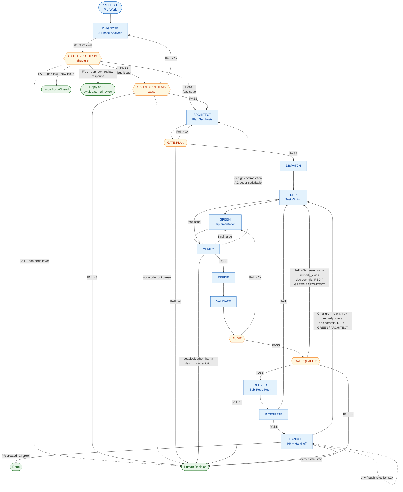

# AutoFlow Guide — Phase-by-Phase Development Lifecycle

> AutoFlow is a structured, evaluation-gated development lifecycle for AI-assisted
> software engineering with Claude Code. This guide is the **phase-body source of
> truth**: each phase's step-by-step procedure, scoring rubric, and `[MUST]`/`[DENY]`
> constraints live here. The cross-phase invariants, the router (phase list + Flow
> Control table), the regression / escalation caps, the Execution Principles, and the
> state schema live in [`CLAUDE.md`](../CLAUDE.md); the DIAGNOSE analysis procedure has
> its own playbook at [`phases/analysis.md`](phases/analysis.md).

---

## Overview

AutoFlow defines 16 phases (`PREFLIGHT` → `HANDOFF`) that guide every code change
from issue analysis to PR hand-off. Each phase has explicit entry/exit criteria, and
evaluation gates prevent low-quality work from reaching the PR. Merging is performed
by an external review process; AutoFlow does not merge.

Key principles:

- **No shortcuts** — every phase is executed in order.
- **Multi-agent separation** — distinct roles handle implementation, testing, and evaluation.
- **Bias prevention** — 3-phase independent analysis before coding.
- **Quantified quality** — 10-point evaluation with a defined PASS threshold.
- **Per-phase model selection** — teammate and subagent spawns declare the model the per-phase policy names for that phase. The values live in one machine-readable source, `.claude/autoflow/spawn-policy.json`, resolved by `bash scripts/spawn-policy/spawn-policy.sh model <phase-key>` and never restated in prose; the rule that governs it is [`CLAUDE.md`](../CLAUDE.md) > Spawn Model — Phase-by-Phase.

The phase names generalize upstream's numeric `STEP 0~9` identifiers; the
mapping is preserved 1:1 below.

| upstream | this guide |
|----------|------------|
| STEP 0 | PREFLIGHT |
| STEP 1 | DIAGNOSE |
| STEP 1.5 | GATE:HYPOTHESIS |
| STEP 2 | ARCHITECT |
| STEP 3 | GATE:PLAN |
| STEP 4 | DISPATCH |
| STEP 5a | RED |
| STEP 5b | GREEN |
| STEP 5c | VERIFY |
| STEP 5d | REFINE |
| STEP 5.5 | VALIDATE |
| STEP 5.7 | AUDIT |
| STEP 6 | GATE:QUALITY |
| STEP 7 | DELIVER |
| STEP 8 | INTEGRATE |
| STEP 9 | HANDOFF |

---

## Lifecycle Diagram

The full AutoFlow lifecycle, including regression paths and gate verdicts.
Diamond nodes are evaluation gates; stadium nodes are terminal states.


```mermaid
flowchart TD
    PRE([PREFLIGHT<br/>Pre-Work]):::phase
    DIA[DIAGNOSE<br/>3-Phase Analysis]:::phase
    HYPS{{GATE:HYPOTHESIS<br/>structure}}:::gate
    HYPC{{GATE:HYPOTHESIS<br/>cause}}:::gate
    ARC[ARCHITECT<br/>Plan Synthesis]:::phase
    PLAN{{GATE:PLAN}}:::gate
    DIS[DISPATCH]:::phase
    RED[RED<br/>Test Writing]:::phase
    GREEN[GREEN<br/>Implementation]:::phase
    VER[VERIFY]:::phase
    REF[REFINE]:::phase
    VAL[VALIDATE]:::phase
    AUD{{AUDIT}}:::gate
    QUAL{{GATE:QUALITY}}:::gate
    DEL[DELIVER<br/>Sub-Repo Push]:::phase
    INT[INTEGRATE]:::phase
    HAND[HANDOFF<br/>PR + Hand-off]:::phase
    CLOSE([Issue Auto-Closed]):::terminal
    REVW([Reply on PR<br/>await external review]):::terminal
    DONE([Done]):::terminal
    HUMAN([Human Decision]):::terminal

    PRE --> DIA
    DIA -->|structure eval| HYPS
    HYPS -->|FAIL · gap-low · new-issue| CLOSE
    HYPS -->|FAIL · gap-low · review-response| REVW
    HYPS -.->|FAIL · non-code lever| HUMAN
    HYPS -->|PASS<br/>feat issue| ARC
    HYPS -->|PASS<br/>bug issue| HYPC
    HYPC -->|PASS| ARC
    HYPC -->|FAIL ≤2×| DIA
    HYPC -->|FAIL ×3| HUMAN
    HYPC -.->|non-code root cause| HUMAN
    ARC --> PLAN
    PLAN -->|PASS| DIS
    PLAN -->|FAIL ≤3×| ARC
    PLAN -->|FAIL ×4| HUMAN
    DIS --> RED
    RED --> GREEN
    GREEN --> VER
    VER -->|test issue| RED
    VER -->|impl issue| GREEN
    VER -->|deadlock other than a design contradiction| HUMAN
    VER -.->|design contradiction<br/>AC set unsatisfiable| ARC
    VER -->|PASS| REF
    REF --> VAL
    VAL --> AUD
    AUD -->|FAIL ≤2×| GREEN
    AUD -->|FAIL ×3| HUMAN
    AUD -->|PASS| QUAL
    QUAL -->|PASS| DEL
    QUAL -->|FAIL ≤3× · re-entry by remedy_class<br/>doc commit / RED / GREEN / ARCHITECT| RED
    QUAL -->|FAIL ×4| HUMAN
    DEL --> INT
    INT -->|FAIL| RED
    INT -->|PASS| HAND
    HAND -.->|env / push rejection ≤2×| HAND
    HAND -->|CI failure · re-entry by remedy_class<br/>doc commit / RED / GREEN / ARCHITECT| RED
    HAND -->|retry exhausted| HUMAN
    HAND -->|PR created, CI green| DONE

    classDef phase fill:#e3f2fd,stroke:#1565c0,color:#0d47a1
    classDef gate fill:#fff8e1,stroke:#f57f17,color:#bf360c
    classDef terminal fill:#e8f5e9,stroke:#2e7d32,color:#1b5e20
```

The same diagram in plain text, for environments without mermaid rendering:

```
PREFLIGHT
    │
    ▼
DIAGNOSE ─── structure eval ──► [FAIL]
                ├─ gap-item low (already satisfied) ─► new-issue: Issue Auto-Closed │ review-response: Reply on PR + await review
                └─ gap real, non-code lever ────────► report to user + pause
    │
    ▼
GATE:HYPOTHESIS (cause, bug only) ◄── retry ≤2×
    │
    ▼
ARCHITECT ◄── retry ≤3×
    │
    ▼
GATE:PLAN
    │
    ▼
DISPATCH → RED → GREEN ⇄ VERIFY (≤3 round-trips) → REFINE
                          └─ design contradiction (AC set unsatisfiable) ─► ARCHITECT (≤3×) → GATE:PLAN → RED
                                                       │
                                                       ▼
                                                   VALIDATE
                                                       │
                                                       ▼
                                                    AUDIT  ◄── retry ≤2×
                                                       │
                                                       ▼
                                                GATE:QUALITY ◄── retry ≤3× → by remedy_class (doc commit / RED / GREEN / ARCHITECT)
                                                       │
                                                       ▼
                                                    DELIVER
                                                       │
                                                       ▼
                                                   INTEGRATE → [FAIL] → GREEN (impl)
                                                       │
                                                       ▼
                                                   HANDOFF ◄── retry ≤2×
                                                       │
                                                       ▼
                                          PR open — external review merges
```

---

## PREFLIGHT — Pre-Work

**Goal**: ensure a clean Git state before any analysis or coding begins.

| Step | Action |
|------|--------|
| 1 | Prior-cycle resolution — reconcile every `.autoflow/issue-*.json` against its GitHub PR: merged or closed → delete its dev branch (local + origin), sync main, **and archive the issue's `.autoflow/issue-{N}*` files** — they are moved out to the external archive at `$AUTOFLOW_ARCHIVE_ROOT/<repo-key>/issue-{N}-<date>/`, outside the repo tree (never delete; the move fires only on an observed merged/closed PR) (re-filing a rejected issue is a separate, external decision); requested issue with open PR + `active:false` → review-response mode (checkout dev branch; set `mode:review-response`; increment `cycle`); **requested issue's own state `active:true` → resume the in-progress cycle per the Resume procedure below (this is distinct from *another* issue's `active:true`, which is "report and hold")**; another issue `active:true` → report and hold (one-issue-at-a-time); other `active:false` (PR in external review) → cleared, proceed; **any issue `active:false` with `phase:"awaiting-user"` and no PR yet (a pre-PR human-decision pause — DIAGNOSE intake-triage FAIL, structure-gate non-code lever, or GATE:HYPOTHESIS non-code root cause) → preserve its `.autoflow/issue-{N}*` files **in place** and report the pending decision; do NOT archive (the archive move requires an observed merged/closed PR, which this state has never reached).** |
| 1a | **Target-declared local checks** — `bash scripts/preflight/local-checks.sh --ledger .autoflow/issue-{N}-ledger.md --cycle <C>` (the paragraph below). Runs **here**, after prior-cycle resolution and **before** Step 2, so anything a declared check or repair leaves in the worktree is what Step 2 sees and Step 4 disposes of; and **before** Step 5, so a failing check never leaves an `active:true` state file behind — the next entry starts PREFLIGHT again rather than the Resume procedure. Exit 1 (a check failed) → hard stop; exit 3 (checks passed, tree dirty afterwards) → Step 4, then re-run 1a; exit 2 (unreadable declaration) → fix the scaffold, re-run 1a. `<C>` is the cycle the state file will carry once created — `1` on a new issue, the incremented value on review-response entry |
| 2 | `git status` — confirm no uncommitted changes or untracked files in the working area |
| 3 | `git fetch origin` — sync with remote |
| 4 | Resolve any dirty state (stash, commit, or discard with user approval) |
| 5 | `git checkout -b dev/YYYY-MM-DD-issue-N main` — create a dev branch (new-issue mode); the branch name carries the issue number so `#N`'s dev branch is derivable by convention (`dev/<date>-issue-<N>`) — this convention is what the Resume procedure and the review-response setup below resolve the branch from, since the state schema has no `branch` field; the state file is created from the template with `mode: "new-issue"`, `phase: "in-progress"`; add the `status:in-progress` label to the issue: `gh issue edit #N --add-label "status:in-progress"` |

**Git Clean Check** (procedural detail → [`git-workflow.md`](git-workflow.md) > Git Clean Check): working tree clean; new-issue mode → main synced with origin; review-response mode → existing dev branch fast-forwarded from origin (`git fetch && git pull --ff-only`). The Merged / Closed-unmerged resolution paths above also start the next cycle from a fresh state-file template, so a re-filed issue never inherits a stale `mode`.

**Review-response mode setup** (requested issue has an open PR + `active:false`): `git checkout dev/<existing-branch>` (the issue's dev branch per the Step-5 naming convention `dev/<date>-issue-{target}`, located with `git branch --list 'dev/*-issue-{target}'`); run Step 1a on that branch with `--cycle` set to the incremented cycle number, and only once it exits 0 set `mode: "review-response"`, `active: true`, `phase: "in-progress"`; identify the triggering reviewer comment/thread (the DIAGNOSE review-response target); increment the state file's `cycle` field and reset `phases` to the empty Creation template (preserving the `verdict` rule); add the `status:in-progress` label: `gh issue edit #N --add-label "status:in-progress"`. Skip dev-branch creation (step 5 is new-issue mode only).

**[MUST] Preserve the previous cycle's artifacts** (issue #135): before any phase of the new cycle writes, rename every `.autoflow/issue-{N}-<artifact>.md` of the previous cycle to `.autoflow/issue-{N}-c{C}-<artifact>.md`, where `C` is the previous cycle number — except the ledger, the state file, `issue-{N}-review-findings.md` and the cycle-layer store `issue-{N}-local/`, which are cycle-spanning (ADR-0024 D2: a `delivery-check`'s subject is the PR's cumulative landed diff, so the store's retained set is reviewed and re-authored at RED entry and re-executed at the new cycle's VERIFY step 1; a check that did not execute is `not-run`, never `passed`). Without this the new cycle's Phase A/B/3, REFINE and AUDIT overwrite the flat names, and the bounded path below has nothing to reuse.

**Scope-bounded entry** (issue #135): when `.autoflow/issue-{N}-review-findings.md` carries `scope-bounded: true` (written by HANDOFF step 6.5 from `scripts/review/scope-bounded.sh triage`), the cycle takes the **bounded path**: DIAGNOSE Phase A is not re-authored (the previous cycle's `issue-{N}-c{C}-phase-a.md` is its input — the dev branch HEAD is the PR head at entry, so the structure it describes is unchanged), ARCHITECT runs the same workflow with its brief stating the bounded scope — the Medium+ finding and the PR diff file set (ARCHITECT > *Re-discussion*), and AUDIT takes the previous cycle's Low list as input (AUDIT above). Phase B, Phase 3, the loop check, GATE:PLAN, RED, GREEN, VERIFY, REFINE, VALIDATE, GATE:QUALITY, CI and the reviewer re-review are unchanged — those are the independent checks, and the bounded path removes re-derivation, not verification. After GREEN the orchestrator runs `scripts/review/scope-bounded.sh check-fix --base <PR head at entry> --head HEAD`; if the fix added a file (a new mechanism), the bounded path is left from that point: ARCHITECT is re-discussed on the full topic (this re-entry is a path change, not a GATE:PLAN FAIL, and consumes no ARCHITECT re-entry budget) and Phase A is re-authored before it. `scope-bounded: false` or an absent line is the full path.

**Resume procedure** (requested issue's own state file reads `active:true` — a mid-cycle session resumed after an abnormal end): resume deterministically, do not restart from PREFLIGHT.
1. **Read the last confirmed point** from the state file: the highest phase whose gate `scores` are recorded in `phases` (or `verdict` set for `gate_hypothesis_cause`) is the last *passed* gate; `phase` gives the coarse marker.
2. **Verify the resume prerequisites** before continuing: the issue's dev branch exists and is checked out, the `.autoflow/issue-{N}-*.md` artifacts the next phase consumes are present, and the **last** `### preflight-local-checks | cycle: <C>` record for the **current** cycle in the ledger reads `none declared` or `PASS … worktree=clean` — exactly the two lines an exit-0 run writes; a resume re-enters mid-cycle without repeating PREFLIGHT, so this record is what carries the Step 1a guarantee across the session boundary. Any other state — no record for this cycle, a last record reading `FAIL …` (exit 1), or one reading `DIRTY …` (exit 3: the checks passed but the tree they left is what a session ended on, between Step 4 and the re-run) — means Step 1a runs now, with the same exit handling (1 → stop and report, 3 → Step 4 then re-run, 2 → fix the scaffold), before any phase is re-entered. The branch is identified by the **documented dev-branch naming convention** (PREFLIGHT Step 5): the issue-scoped dev branch for `#N` is `dev/<date>-issue-<N>`, located with `git branch --list 'dev/*-issue-<N>'`. If it is missing, or matches ambiguously, or a required artifact is absent, treat the cycle as unrecoverable and report to the user (do not fabricate the missing artifact).

   *Note (branch-source):* the state schema (`CLAUDE.md` > AutoFlow State Tracking) carries **no `branch` field**, so the issue→branch mapping cannot be read from the state file. Rather than add a schema field (a data-model change out of family with this spec-consistency fix), the branch is made derivable by the documented Step-5 convention (`dev/<date>-issue-<N>`, aligned to live practice), so step 2 resolves the branch deterministically against a documented rule — not against undocumented live practice or a non-existent state field.
3. **Re-enter at the phase immediately after the last passed gate.** If the last confirmed point is indeterminate (no recorded gate `scores`, or artifacts inconsistent), fall back conservatively to **re-running from the phase that follows the most recent gate whose `scores` are present** — never skip a gate that has no recorded PASS. A gate is re-run, not assumed passed, whenever its `scores` are absent.
4. Resume does **not** increment `cycle` and does **not** reset `phases` (contrast review-response entry, which does both) — it is a continuation of the same cycle, not a new one.

**Bundle drift (fail-closed stop condition, issue #167).** Before DIAGNOSE, on a target that carries an installed manifest (`.claude/autoflow/manifest.json` — every thin-root target; the framework repository itself carries none and skips this step), PREFLIGHT runs `sh .claude/autoflow/drift-check.sh`. It asserts the installed files match the installed manifest (D1), the manifest version matches the installed plugin (D2), state never resolves from the plugin root (D3), the installed bundle matches the **marketplace clone** per artifact by sha256 (D4 — a self-consistent bundle that is older than what the clone would stamp, with or without a version bump, is drift), the installed plugin matches the clone's plugin source (D5), and the target-owned `.claude/autoflow/spawn-policy.json` scaffold agrees with the agent definitions the session loads (D6, issue #185 — `scripts/spawn-policy/spawn-policy.sh check` over the scaffold, plus its row set against the clone's sample: a `phases` / `workflow_sites` row the current version requires and the scaffold lacks, or a `phases` row whose `agent_type` changed, is named here rather than at the fail-closed readout in ARCHITECT), and — on a target that opted into AutoFlow's suite plane (`.claude/autoflow.local.json` > `tests.suite_plane: true`, ADR-0024 D3; the opt-in-keyed arm ships with S4, until which the leg fires on every stamped target) — every executable spec under the target's `tests/**` declares the usable `# ci-subject:` header the shipped selector requires (D7, issue #213 — the selector's own `--check-headers` stage). The plugin and the clone are resolved from the harness's local registries by the shipped `scripts/lib/plugin-root.sh`, not from the hook-only `CLAUDE_PLUGIN_ROOT`, so the check is the same from this shell as from a hook; a side that is not locally resolvable reports `SKIP`, never a failure. A non-zero exit is a **fail-closed** hard PREFLIGHT stop: D1/D3 → repair the file; D2/D4 → re-stamp (`/autoflow:install`, or `<clone>/setup/init.sh --target <root> --force`; refresh the clone first with `/plugin marketplace update` if it is the side that is behind); D5 → `/plugin update`; D6 → edit the scaffold by hand (a re-stamp never overwrites it): set each named row to the loaded definition's values and add each missing row from `<clone>/.claude/autoflow/spawn-policy.json` — model values and `workflow_sites` effort are the target's own and are never findings; D7 → back-fill each named suite's header per RED > Header contract > *Adopting the contract over existing suites* (the suites are target-owned; a re-stamp never touches `tests/**`). A `WARN` (a changed scaffold sample, an artifact upstream no longer ships) does not stop the cycle; the orchestrator reports it. See `setup/SETUP-GUIDE.md` > *Self-verify with the drift detector*.

**Reviewer-backend availability (fail-closed stop condition).** Before DIAGNOSE, PREFLIGHT confirms the configured HANDOFF step-6 review **backend** is **available** by running `scripts/preflight/check-review-backend.sh` — it reads the backend from `.claude/autoflow.local.json` (`.review.backend`, default `codex`; absent ⇒ codex) and probes the CLI presence-only (`command -v codex` / `command -v claude`; auth is not probed — a present-but-unauthenticated backend passes here and surfaces its auth failure at HANDOFF step 6). A non-zero exit is a **fail-closed** hard PREFLIGHT stop (mirrors `drift-check.sh`): the cycle does not begin until the configured backend's CLI is installed or the backend is switched in `.claude/autoflow.local.json`. This moves the former codex hard-requirement from HANDOFF-end to PREFLIGHT-entry. See [`reviewer-backend.md`](reviewer-backend.md).

**Target-declared local checks (fail-closed stop condition, issue #181 — Step 1a above).** PREFLIGHT runs the target repository's **own** readiness procedure by executing `scripts/preflight/local-checks.sh --ledger .autoflow/issue-{N}-ledger.md --cycle <C>` at Step 1a — after prior-cycle resolution, before the Git clean check and before the state file is created. The target declares that procedure in the target-owned scaffold `.claude/autoflow.local.json` under `preflight.local_checks[]` — one entry per step, each `{ "name", "check", "repair"? }`, where `check` is the command PREFLIGHT runs (exit 0 = ready) and the optional `repair` is run once on a failed `check`, followed by a re-check whose exit is the verdict. A target whose docs name a per-clone setup step (a commit-hook installer, a generated config, a toolchain probe — the class that let llmroute #279 start with its commit hooks unwired, so six teammate commits skipped the target's lint chain until VALIDATE step 7) declares it here; the framework knows **no specific tool** — it runs what is declared and reads only the exit status. **Absent declaration ⇒ no-op**: the script exits 0 and records the single line `PREFLIGHT local checks: none declared`. A declared check that does not pass (after repair, when one is declared) is a **fail-closed** hard PREFLIGHT stop (exit 1, mirrors `check-review-backend.sh`): run the declared repair, or fix the declaration, then re-run. A declaration the script cannot read as declared (malformed JSON, wrong types, an entry without a string `check`) is exit 2 and also stops — never a silent no-op. Because a declared command is arbitrary target shell and a `repair` changes local state by design, a passing run additionally asserts `git status --porcelain` is empty afterwards: a dirty tree is exit 3 with the paths on stderr — not a failed check, but the Step 2 condition already broken, so the orchestrator disposes of those paths under Step 4 and re-runs Step 1a; Step 2 then confirms the clean tree on its own. The outcome is written **only** as a ledger record — a level-3 heading `### preflight-local-checks | cycle: <C>` with one `- result:` line whose leading token is the terminal verdict (`none declared`; `PASS <name>=PASS[(repaired)] … worktree=clean` for exit 0; `DIRTY <name>=PASS[(repaired)] … worktree=dirty(<n>)` for exit 3; `FAIL <name>=FAIL[(…)] … worktree=n/a` for exit 1 — `PASS` is written only on exit 0, so no reader has to combine the verdict with the worktree field) — in the same identifier-free record class as `verify-detection`; the state file is untouched and the gate hook, which reads the ledger advisorily only, is unchanged. The commit-time lint-chain obligation (`submodule-common-rules.md` > *Lint chain on the staged surface*) stays as it is — this call site is what lets a target make its lint chain *installed* before the first teammate commit, not a replacement for running it.

**Hard stop**: if the Git state is not clean after resolution attempts (e.g. `--ff-only` fails), **stop and report to the user**. Do NOT proceed to DIAGNOSE.

---

## DIAGNOSE — Issue Analysis

→ **Phase playbook (single source of truth): [`phases/analysis.md`](phases/analysis.md).**
Read it on entering DIAGNOSE. It carries the full procedure: the **intake readiness triage**
(`mode=new-issue` only, run ahead of the structure fan-out — a planning/design/ADR pre-req
filter that pauses for the user on FAIL, no auto issue creation), the 3-Phase independent
structure analysis (Phase A structure-only, Phase B issue-only, Phase 3 necessity scoring),
**the per-role document injection whitelist (three distinct roles — Phase A = current-state
area excerpts only; intake triage = issue body + readiness/work-type docs; Phase B = issue
body only)**, the issue-type classification (Type 1 code / Type 2 docs), the per-type scoring rubric and
PASS/FAIL thresholds (Type 1: each ≥ 7, two items; Type 2: each ≥ 7 and avg ≥ 7.5, three
items), the FAIL disposition by failing item and cycle `mode` (gap-low → new-issue close /
review-response reply on PR; non-code lever → report to user + pause), the review-response loop check (trigger repeats the prior cycle's complaint class with a new witness case → reply on PR + pause for the user), cause hypotheses
(≥ 3, "not a code bug" must be one), lightweight verification, hypothesis verdict notes,
task decomposition, affected-docs identification, and the structure- and confirmation-bias
safeguards.

---

## GATE:HYPOTHESIS — Hypothesis Evaluation (bug/incident issues only)

Feat issues skip this gate.

**Evaluator**: independent Evaluation AI, fresh-spawned per call.
**Input**: hypothesis list + lightweight-verification results + verdict notes.

### Scoring (3 items × 10 points)

| Item | Criterion |
|------|-----------|
| Hypothesis diversity | Are non-code causes (data, environment, already-fixed) sufficiently considered? |
| Verification sufficiency | Was lightweight verification actually performed? Are unverified items justified? |
| Verdict evidence | Is the conclusion (code change required / not required) logically supported? |

- **PASS** → ARCHITECT.
- **FAIL** → DIAGNOSE (max 2×). Third FAIL → human decision.
- **Non-code root cause confirmed** → report to user (situation-first — [`CLAUDE.md`](../CLAUDE.md) > Execution Principles > Human-decision presentation), pause AutoFlow.

---

## ARCHITECT — Plan Synthesis (Developer AI + Test AI)

Both perspectives participate. The discussion is a **relay the orchestrator runs between two
persistent participants** — the Developer AI and the Test AI, each spawned once for the discussion
and woken by agent ID for each of its turns (ADR-0023 D2; issue #179) — and its whole record is one
file, `.autoflow/issue-{N}-architect-transcript.md`, which every turn is appended to. The three
phases of issue #166 are kept: **Discuss** and **Report** are the relay; **Record** is the
`Workflow` named `architect-deliberation`, which reads the transcript file and writes the artifacts.
The orchestrator relays but does not deliberate: it reads one line per turn and the transcript's
decidable state, never a turn body (Deliberation Isolation).

**Discuss** is the relay. The Developer AI opens with a design proposal, the Test AI answers it, and
the two alternate. Each participant holds one fixed prompt for its role
(`.claude/agents/autoflow-planner.md` > *ARCHITECT relay participant*) and reads the topic once from
the transcript file's `## Topic` section; its context is its memory across turns, and the file is
the record the other side reads. The design documents are written after the discussion, so nobody
edits one while it runs. Each turn's heading carries whether the author has anything further to
raise (`[further: yes|none]`), and the discussion ends when two consecutive turns both say
`none` — the participants' own conclusion ends it; `scripts/architect/relay-state.sh state`
computes that condition and the next side, and the orchestrator obeys it. The Discussion
Protocol's VERIFY step applies over the transcript (ADR-0023 D1): a fact the transcript cites with
a `path:line` (read at the cycle's commit) or a document's section and quoted sentence is verified for both participants, and a participant reads a file to ground a claim
of its own or to dispute a cited one.

**Report** is one more wake per participant: each appends its reading of the discussion to the
transcript under `## Report — <side>` — the design conclusions both accepted, and each point it
considers worth raising to the orchestrator, with both positions and why it is worth raising.
**Record** is the `Workflow`: one scribe reads the transcript file — topic, turns, any brief, both
reports — and writes the feature design, the verification design and the report from those
conclusions, followed by a ledger call that appends the agreed conclusions under the authority
`ARCHITECT agreed`. Invocation: `Workflow({ name: "architect-deliberation", args: { issue: "N" } })`.

The run returns `{ report: { agreed, unagreed[] }, artifacts, transcript, ledger, summary, stopped }`.
The orchestrator receives that object and routes it (*Report routing* below); it does not receive
the turns or the reports' bodies. It **verifies** what the report rests on by spot-checking targeted
artifact excerpts against re-derived facts — the full read-and-score is GATE:PLAN's. Rationale:
[`CLAUDE.md`](../CLAUDE.md#deliberation-isolation-delegated-facilitation) > Deliberation Isolation;
contract: [`teammate-contracts.md`](teammate-contracts.md) > Facilitator; decision:
[`adr/0023-deliberation-participant-lifetime.md`](adr/0023-deliberation-participant-lifetime.md).

#### Relay procedure (orchestrator)

Every spawn below declares `subagent_type: autoflow-planner` and the model the readout names
(`bash scripts/spawn-policy/spawn-policy.sh model architect-dev-participant` /
`… architect-test-participant`), and every wait is a **turn end** ([`CLAUDE.md`](../CLAUDE.md) >
Execution Principles > *Wait discipline*): the participant's one-line answer arrives as the task
notification of that resumed spawn, and nothing is polled.

1. **Transcript.** `bash scripts/architect/relay-state.sh init .autoflow/issue-{N}-architect-transcript.md {N} ["<brief>"]`
   writes the header — the topic stated once, naming the issue's inputs and the ledger's settled
   authorities; a brief given here is carried into the topic. The file is append-only from this
   point: `init` refuses an existing file.
2. **Spawn the Developer AI** (`Agent`, anonymous, no `name`) with a prompt that names it *the
   Developer AI participant of the ARCHITECT relay for issue #{N}*, the transcript path, and
   *write Turn 1*. Keep the agent ID the spawn result returns. End the turn.
3. **On the notification**, read only the one line it carries, then run
   `bash scripts/architect/relay-state.sh state <transcript>` and act on `next`:
   `test` → spawn the Test AI the same way on its first turn (*write Turn 2*; keep its ID) or, on a
   later turn, `SendMessage` to its ID with *write Turn n*; `dev` → `SendMessage` to the Developer
   AI's ID with *write Turn n*; end the turn after each wake. A `state` exit 1 (a malformed heading,
   a mis-numbered turn) is a transcript defect: re-wake the author with the cause and *re-append
   Turn n correctly*. A wake whose notification arrives with `turns` unchanged is a **missing
   turn**: re-wake that side once with *your Turn n was not appended*; a second miss is the
   infrastructure state `participant missing` — repair (a fresh spawn of that side, pointed at the
   transcript) and continue, since the file is the memory.
4. **`next=report`.** Wake both participants (in one turn) with *the discussion has ended — append
   your report*; end the turn; when both notifications are in, run `state` again. A side named in
   `reports_missing` is re-woken once; if it is still missing, continue — the scribe records that
   side's positions from its turns.
5. **`next=record`.** Invoke the Record workflow. On its return, run the artifact-existence check
   below and route the report (*Report routing*).
6. **Isolation and lifetime.** The participants are not woken again after the Record workflow
   returns, except for a re-discussion (*Re-discussion* below). The orchestrator never reads the
   transcript's turn bodies.

**Artifact-existence check (orchestrator-side).** Before GATE:PLAN the orchestrator confirms the
three artifacts the scribe writes exist and are non-empty — `.autoflow/issue-{N}-feature-design.md`,
`.autoflow/issue-{N}-verification-design.md` and `.autoflow/issue-{N}-architect-report.md` — and
treats a missing or empty one as an infrastructure cause to repair and re-run, rather than
proceeding. The workflow script cannot perform this check itself: the hosted Workflow runtime
injects no filesystem access and rejects `import(` at parse time, so the capability lives at the
layer that has a shell.

**Document injection (ARCHITECT onward).** Past DIAGNOSE the Phase A ↔ Phase B isolation no longer applies — the Developer-AI and Test-AI both work from code and design together. Injection is still **role-minimal and routed via `docs/INDEX.md`**, never wholesale: the spawn prompt names each participant only the documents its design task needs (e.g. the relevant `docs/adr/*`, `docs/design-rationale.md`), and the participant reads them once — its context carries them across turns. **Deliberation Isolation is unchanged** — the turns live in the transcript file and only the Record workflow's report returns to the orchestrator.

**Roles**:
- **Developer AI**: feature design (changed files, API interface, data structures).
- **Test AI**: verification design (acceptance criteria → verification method, testability assessment).

### Output artifacts

1. **Feature Design Document** (Developer-AI-led) — `.autoflow/issue-{N}-feature-design.md`, the
   **architecture decision layer** and nothing below it (issue #192): the decisions, the constraints
   they hold under, and the alternatives considered and rejected with the ground for each rejection.
   It cites the verification design's `Failure mode` column (below) for the failure mode each
   verification exists to catch, rather than stating it. The deliberation stops here. Rationale:
   [`design-rationale.md`](design-rationale.md) > Decision 15.

   **[DENY]** The document does not carry a change table of files, a per-suite disposition, or an
   oracle's condition clause. Those are **derived at RED/GREEN entry** by the execution roles — from
   the change delta, run through the target's declared test command ([`CLAUDE.md`](../CLAUDE.md) >
   Rule Scope > *Local verification*; on an opted-in target the selector answers which committed
   suites the delta reaches), and from the files those roles open to change anyway. The dividing line is one question: **would this
   sentence being wrong mean the design has to be revisited, or would it just be fixed where it is
   found?** The first belongs to the deliberation; the second does not. A derivation RED produces
   under this clause is not acceptance-criterion drift — GATE:QUALITY's Completeness check states
   that exemption explicitly.

2. **Verification Design Document** (Test-AI-led) — the `Issue AC` join key is **not** reduced by
   the layer split above: an unverified acceptance criterion is the one class of defect execution
   does not surface (the suite passes green), so the per-criterion disposition stays a deliberation
   output. What the split removes from it is depth, not rows: `Method` names the **kind** of oracle
   a row gets, and the condition clause that implements it is RED's.

| Issue AC | Acceptance criterion | Type | Kind | Method | Failure mode | Reason |
|----------|----------------------|------|------|--------|--------------|--------|
| AC1 | (criterion 1) | automated | driving | pytest / API test / etc. | the defect only this test fails on | — |
| AC2 | (criterion 2) | existing-coverage | — | the schema check that already rejects this shape | a value of the shape this criterion forbids | the check runs on every build |
| AC3 | (criterion 3) | manual | — | scenario doc (delegated to user) | the behavior the scenario observes breaking | no automatable oracle; the behavior is observed by a person |
| AC4 | (criterion 4) | none | — | — | — | absence costs nothing: the value is read from a sample file the user edits |
| — | (criterion 5) | environment-dependent | — | introduce mock or propose design change (except where the composition-oracle clause applies) | the failure the mock itself can catch (`—` on a design-change request) | — |

- **`Type` is the per-criterion verification disposition**, one of
  `automated` / `existing-coverage` / `delivery-check` / `manual` / `environment-dependent` /
  `none`, and the same cell carries the row's **layer** (ADR-0024 D1): an `automated` or `manual`
  row is `cycle` by default — executed once, uncommitted, its run recorded — and is `standing`
  (committed; CI-registered where the target opted in) only when the cell names one of D1's closed
  tokens in the form `automated / standing: <token>` (`manual / standing: <token>`). The token list
  is ADR-0024 D1's and is not copied here; a token outside it is a layer violation (GATE:QUALITY >
  *Test quality — layer violation*). `Kind` applies to `automated` rows only (`driving` /
  `regression` / `characterization`). Both vocabularies, and when each disposition is the right
  answer, are defined once at *Test necessity* below.
- **`Issue AC` is the join key.** Each row's value is either an `AC id` from the
  `## Acceptance criteria` table in `.autoflow/issue-{N}-phase-b.md`, or `—` for a criterion this
  verification design added on its own. **[MUST]** Every AC id in that table gets a row, and a
  criterion the design verifies by anything other than an automated test keeps its row, states that
  disposition, and states its `Reason` in one line — the row is never deleted. A design-added
  criterion (`—`) is never a finding and owes no reason. This is what turns "was an acceptance
  criterion dropped?" into a key join rather than a reading of prose, which is what lets the
  orchestrator and the two gates put such a change in front of the operator (*Report routing*
  below).
- **`Failure mode` holds each verification's unique failure mode**, and this bullet is the only
  place that obligation is defined. The cell names the defect that makes the row's verification
  fail and that no other verification catches. On an `existing-coverage` row it names what the
  named mechanism fails on, and `Reason` says why no new layer is owed without restating that
  failure. On an `environment-dependent` row resolved to a mock, it names the failure the mock
  itself can catch, not the environment behavior the mock stands in for. On a composition-oracle
  row, it names the composition-time behavior at the traced identifier that the mock-boundary check
  does not catch (*Composition oracle* below).
  - **Row grain** — one row per verification: a criterion verified more than one way carries one
    row per verification under the same `Issue AC`, and every other criterion keeps its one row. A
    verification that spans rows carries the same label in `Method` on each of them.
  - **Compared against** — every other distinct verification in the design, and every existing
    mechanism that fails on the same defect: an existing test, a lint rule, a schema, a compiler or
    type check, a build or packaging check. Naming such a mechanism is the `existing-coverage`
    disposition (*Test necessity* below).
  - **[MUST] Owed** on `automated`, `existing-coverage`, `delivery-check` and `manual` rows, on
    `environment-dependent` rows resolved to a mock or a manual delegation, and on composition-oracle
    rows. `none` and design-change-request rows carry `—`.
  - **A cell that cannot be filled** — the verification names no defect that another verification
    or mechanism does not already catch — removes that verification from the agreement rather than
    being argued down: undiversified duplication is over-verification, which GATE:PLAN's `Scope`
    criterion scores as over-engineering. A composition oracle is a floor and is never removed on
    this ground.
  - **Effective from** — binds verification designs authored after issue #198 lands; an earlier
    design's per-layer depth statement is not read as an empty column.

- For untestable items: state the reason and the alternative (design change / manual delegation (except where the composition-oracle clause applies) / mock (same exception)).
- Design-change request: parts of the feature design that should be revised so they become testable.
- Committed-surface allow-list: a manifest-registered source in the change surface pulls
  `setup/manifest.json` in as a derived member of the allow-list (Change Surface Rules > Derived
  artifacts). Under the layer split above this is **derived at GREEN**, from the actual staged
  surface, not predicted here — but it is still derived *before* the commit, never left to a
  test/CI failure to admit (#800 `607720e`).

3. **Deliberation report** (scribe-written): `.autoflow/issue-{N}-architect-report.md`, under the
   headings `## Agreed` — one line per conclusion both participants accepted — and `## Unagreed` —
   per point, the point, the Developer AI's position, the Test AI's position, and why it was
   raised. This is the artifact the orchestrator routes (*Report routing* below).

#### Record

The scribe writes the three artifacts after the discussion, from the transcript file and the two
reports of its last round (a re-discussion opens a new round with a `### Brief` block and ends with
its own two reports; the earlier round's reports stay on the record). The two design documents state the design and the conclusions the participants
reached, in the form each is defined above; the report states what was agreed and what was not.

**[MUST] A re-discussion's Record is a delta, never a rewrite** (issue #192; [`design-rationale.md`](design-rationale.md) > Decision 15). On the **first**
Record of a cycle the scribe writes the documents whole. On every Record after that it reads the
existing documents plus **only the turns appended since the previous Record** and both reports of
this round — not the accumulated transcript — and **appends** a delta section rather than
re-authoring the body:

```
## Delta — round <n> (<brief origin: GATE:PLAN FAIL | un-agreed re-discussion | VERIFY design contradiction>)

- <what changed>: <the decision as it now stands> — supersedes <the section or decision it replaces>
- <what was added>: <the decision> — <ground>
```

Text a round did not change is **left exactly as it stands**. The grounds are cost and stability
together: the transcript is append-only and each Record re-read it whole (llmroute #280 — 6,529
lines by the last round, the round-6 scribe alone 8.2M tokens, the feature design growing
376 → 775 lines across six rewrites), and a fresh scribe re-authoring settled text each round lets
wording drift where no decision moved. The delta section is also GATE:PLAN's narrowed input on
re-entry (GATE:PLAN > *Re-entry re-score*), so what the scribe writes and what the evaluator reads
are the same object.
The transcript file is the discussion's own record and is read only by the participants and the
scribe; the Record workflow's report is what reaches the orchestrator. See
[`teammate-contracts.md`](teammate-contracts.md) > Facilitator > Return Contract.

#### Test necessity

A test exists only when it is needed. The burden of proof lies on the test, never on its absence:
not writing a test needs no justification, and a proposed test that cannot answer both judgments
below is not written. This clause decides **existence** only — whether a criterion is verified at
all. Whether a verification **stays in the repository** is decided by ADR-0024 D1's closed
`standing` list and by nothing else: a stated reason, however good, does not move a row out of the
`cycle` layer (ADR-0024 > *Test necessity — what D1 replaces and what it retains*). This clause is
the policy body; every other document references it rather than restating it.

- **[MUST]** Each proposed verification answers two judgments, in the row that carries it:
  1. **Required behavior** — is this a behavior or contract a consumer actually requires, as
     opposed to an imagined failure mode?
  2. **Cost of absence** — if no verification exists and this breaks after merge, who loses what,
     concretely?
- **[MUST]** When the two judgments cannot both be answered, the disposition is `none`. The
  default is deliberate: the cost of an unneeded test is paid three times (authoring, checking,
  maintaining) and has already been paid in a prior cycle, while the cost of the missing test on
  such subjects was nil.
- Necessity is a **judgment**, not a classification: no subject is exempt by category and none is
  obligated by category. The two guidance notes below are that judgment applied to the two areas
  where it is commonly wrong — they are not separate rules.

**Verification disposition** (the `Type` of each acceptance-criteria row):

| Disposition | Meaning |
|---|---|
| `automated` | an executable test — `cycle` by default (run once from `.autoflow/issue-{N}-local/`, its run recorded), `standing` only with a D1 token in the cell |
| `existing-coverage` | already detected by an existing test, lint rule, schema, compiler/type check, build or packaging check — the row names which |
| `delivery-check` | a one-shot check that the change was wired / generated / delivered — a `cycle` artifact under `.autoflow/issue-{N}-local/`, never committed; RED/GREEN semantics do not apply to it |
| `manual` | a scenario a person executes; the row names the checklist — a `cycle` artifact unless the cell carries a D1 token |
| `environment-dependent` | verifiable only against an environment this cycle cannot drive (except where the composition-oracle clause applies) |
| `none` | no persistent verification has positive value — the row states why absence costs nothing |

- **[MUST]** Every disposition other than `automated` on an **issue** AC row carries a one-line
  `Reason`. A row for a design-added criterion (`Issue AC` = `—`) is never a finding and needs no
  reason.

**Test kind** (the `Kind` of each `automated` row, and the RED expectation for it):

| Kind | Meaning | RED |
|---|---|---|
| `driving` | a required behavior not yet implemented | must FAIL before GREEN |
| `regression` | reproduces a known defect | must FAIL before the fix |
| `characterization` | records existing behavior the change must preserve | may PASS from the start |

**Configuration and data.** A value is not a required behavior; the behavior that consumes it is.
Asserting a literal that already lives in a config or sample file duplicates a fact and protects
nothing, and a user-editable sample loses its verification subject at the first edit. Whether
"production config boots the app" or "every reference resolves" deserves a test is decided by the
two judgments above, not by the subject being data.

**Implementation internals.** A helper name, call order, private branch or internal representation
is not a required behavior. A test that pins these becomes a copy of the implementation and blocks
refactoring. Production code gains no interface, indirection or dependency injection solely to fit
a test shape.

- **Effective from** — the obligation binds verification designs authored after this clause lands;
  a cycle already past ARCHITECT is not retroactively deficient. The dispositions and reasons are
  the Test AI's to author, and the ARCHITECT facilitator may record them on the Test AI's behalf
  when it writes the verification design.

#### Verification depth

- **[MUST]** The verification design opens with a **risk line** — one line naming
  who is harmed and how if this change is wrong.
  Depth is justified against that risk, and this clause sets a justification form, never a quantity
  cap: no layer count, file count, or line budget, because a proxy metric invites the distortion it
  is meant to prevent (blocking a needed layer, or merging layers to dodge a count).
- **Per-verification failure mode** — carried by the acceptance-criteria table's `Failure mode`
  column. The column's bullet under *Output artifacts* above defines what the cell names, what it
  is compared against and what a cell that cannot be filled means.
- **Amendment** — a risk discovered mid-deliberation may raise depth, provided the reason is
  stated in the discussion and carried into the verification design. Depth is revisable, not
  capped, and the amendment adds no artifact (*Record* above).
- **[MUST]** State the determination once in the verification design, and restate no
  verification's failure mode anywhere outside the `Failure mode` column; narrative that states no
  per-layer failure mode (a layer removed, depth added) may stay. The obligation is
  unconditional — every verification design has at least one layer — so an absent statement is a
  missing obligation, not a "not applicable".
- **Effective from** — the obligation binds verification designs authored after this clause lands;
  a cycle already past ARCHITECT is not retroactively deficient. The determination is the Test AI's
  to author, and the ARCHITECT facilitator may record it on the Test AI's behalf when it writes the
  verification design.

#### Composition oracle

- **[MUST]** When the design's change surface names shared state that a **settled decision** also
  names, the verification design must assign at least one oracle that drives that contact point
  through the **real execution environment** — no mock, stub, fake, or simulation may stand in for the shared state.
- **Trigger** — a set intersection, not a judgment. Let `T` be the set of shared-state identifiers named by the design's change surface,
  and `S` the set of shared-state identifiers referenced by the governing settled decisions; the clause
  fires when `T ∩ S ≠ ∅`. One oracle is owed **per element** of `T ∩ S`. A single oracle may discharge
  several elements, provided every element is traced by some oracle — each oracle's row carries the
  intersecting identifier(s) as its trace.
- **Settled decision** — an accepted or proposed ADR under `docs/adr/`, a prior issue's agreed
  design, or an entry in this issue's decision ledger (`.autoflow/issue-{N}-ledger.md`).
- **Shared state** — state that outlives a single call and that more than one decision reads or
  writes. The obligation binds to no concrete realization; the following are examples only, and
  deleting them leaves the trigger fully computable: e.g. a datastore collection or field and the
  query layer over it, a hardware register or firmware setting, a file-format field, a
  wire-protocol field, a shared memory region.
- **[MUST]** Record the determination once in the verification design, as one `composition-oracle`
  block, and attach the output of `scripts/architect/composition-oracle.sh` run over the written
  file — its stdout and its exit status, both exactly as the shell produced them, never re-typed
  (issue #206). The Test AI identifies `T` and `S`; the scribe records the block at Record, runs the
  script over the verification design it has just written, and runs it again in a delta round that
  restates the block. This clause is the grammar's only definition — the script and the Record
  prompt cite it:

  ```composition-oracle
  T:
  - <identifier> | <source>
  S: none | <one-line ground>
  ```

  - **Lists** — the label `T:` once and `S:` once, each followed by its entries, one per line:
    `- <identifier> | <source>`. The identifier is one whitespace-free token and matches exactly —
    whether two spellings name one item is the author's call, made by using one identifier for it in
    both lists. A `T` entry's source is the design decision that names the shared state; an `S`
    entry's source is the settled decision, as an ADR path, a prior issue id or a ledger entry id.
  - **An empty list is declared, never implied** — `T: none | <one-line ground>`. A label with
    neither entries nor that declaration, a declaration without its ground, and a declaration
    together with entries each leave the list unestablished.
  - **Delta rounds** — a round that changes `T` or `S` restates the whole block as the payload of
    one `supersedes` bullet in its delta section (*Record* above). The script evaluates the
    **latest** block in document order, never falls back to an earlier one, and names the block it
    evaluated: `evaluated: base`, or `evaluated: round <n>` for the delta round the block sits in.
  - **Outcomes** — `intersection`: exit status `10` with `result: intersection`, the intersecting
    identifiers (the traces the oracle rows carry) on the `intersecting:` line; `empty`: exit
    status `11` with `result: empty`; and `unknown/error` with its `cause:`. An outcome holds only
    when the exit status and the `result:` line agree — any other status, a missing `result:` line,
    or a line and status that disagree is `unknown/error`. An absent or unreadable file, a missing
    block or list, an unestablished list, an entry without an identifier or a source, and a
    malformed latest block are `unknown/error`, never `empty`.
  - **Reading** — an absent statement is not read as "not triggered", and neither is an absent
    output, an `unknown/error` output, or an attached `result:` line and exit status that disagree:
    each is a missing determination. When a delta round attaches a new output, the latest attached
    output governs; an earlier attachment stays as settled text and no longer reproduces on a
    re-run. `empty` establishes that the recorded sets do not meet, not that the lists are complete.
  - **Residual** — two cases rest on the reader alone. No layer verifies that a reader applies the
    rule above to a disagreeing line and status. And a restated block whose fence or delta heading
    the script does not recognise leaves an earlier block evaluated with no error: a stale `empty`
    is then visible only as an `evaluated:` field naming an earlier block than the round that
    restated it, so the reader compares the two.
- When no such oracle can be built, that is a **design-change request** (the bullet above), not a
  manual-scenario fallback and not a mock. This clause narrows the untestable-items bullet and the
  table's environment-dependent row above for triggered composition contact points; both keep
  offering mock or manual delegation for every other untestable item.
- **Complements, does not replace, the VERIFY mock-boundary check.** Step 4's
  `Mock-boundary fidelity check (Test AI)` compares a double's *shape* against the real interface;
  this clause covers **composition-time behavior** — what the change does when it meets the real
  state a settled decision contracted over. The two axes are independent; neither subsumes the
  other. The reactive counterpart is the VERIFY → ARCHITECT design-contradiction route, which
  catches the same class after implementation.
- **Effective from** — the obligation binds verification designs authored after this clause lands;
  a cycle already past ARCHITECT is not retroactively deficient. The determination is the Test AI's
  to author, and the ARCHITECT facilitator may record it on the Test AI's behalf when it writes the
  verification design. The block-and-output form binds verification designs written after
  issue #206 lands: an earlier prose determination is not re-read, and the script classifying one
  `unknown/error` is not a finding.

### Testability-driven design

When the Test AI flags an item as "not automatable", the team discusses whether a feature-design change makes it testable. If not, the item stays as a manual scenario with a stated reason (except where the composition-oracle clause applies).

### Report routing

The orchestrator receives the report and routes it. The discussion itself runs under the Discussion
Protocol ([`teammate-common-rules.md`](teammate-common-rules.md) > Discussion Protocol), whose
first-exchange devil's advocate carries ADR conformance as one of its axes: the resolution is
checked against any governing ADR. That is the first, non-gated approach check, and GATE:PLAN is
the gated one.

- **`stopped` is non-null.** The record could not be carried out — the scribe was missing, or the
  spawn policy would not load. Repair the cause and re-run the Record workflow (the transcript is
  intact). This is infrastructure state, never a design outcome, and it consumes no counter; its
  relay-side counterpart is a participant that appends no turn after one re-wake (*Relay
  procedure* step 3).
- **No un-agreed point.** The design is the participants' joint conclusion. Run the
  artifact-existence check, then GATE:PLAN (a fresh Evaluation AI on the 5-item rubric below). A
  GATE:PLAN FAIL re-enters the deliberation with a brief (*Re-discussion* below); that is the
  existing `GATE:PLAN FAIL → ARCHITECT (max 3×)` re-entry.
- **An un-agreed point.** One judgment, and it is the orchestrator's: discuss further, or stop.
  - **Discuss further** — prepare what the next discussion needs and append it as the `brief`
    (*Re-discussion* below). A preparation may carry the un-agreed points as a narrowed topic, a
    fact the orchestrator verified in the meantime (`path:line` at a commit SHA, command output), the prior
    report's path, or a different perspective for a participant to take. Record the judgment as an
    `O` ledger entry — decision and grounds, authority `orchestrator judgment`. A re-discussion
    after an un-agreed report is not a GATE:PLAN re-entry and consumes no re-entry counter.
  - **Stop** — report situation-first ([`CLAUDE.md`](../CLAUDE.md) > Execution Principles >
    Human-decision presentation), set `active: false`, `phase: "awaiting-user"`. The user's
    decision drives re-entry.
- **An agreed conclusion changes an acceptance criterion's content.** Excluding, revising or
  splitting an issue acceptance criterion is the operator's authority. Report situation-first
  naming the affected criteria and what the design proposes for each, set `active: false`,
  `phase: "awaiting-user"`, and do not spawn GATE:PLAN. Record the answer as one `[ac-decision]`
  ledger entry per decided AC in the grammar at [`CLAUDE.md`](../CLAUDE.md) > Decision Ledger >
  *Acceptance-criterion decisions*; on `revised` or `split`, edit the Phase B acceptance-criterion
  table to match; then continue to GATE:PLAN. The pause is a human authority checkpoint inside the
  deliberation already counted, so it consumes no ARCHITECT re-entry budget.

**What the operator is asked, and what they are not.** A reduction in *verification method* — an AC
verified by an existing mechanism, a manual scenario, a delivery check, or by nothing at all — is a
verification-method choice, not a change to the criterion. It passes three tiers, and only the third
is the operator:

1. **Deliberation (ARCHITECT).** The deliberation chooses any disposition in the *Test necessity*
   vocabulary for an issue AC, **with its reason stated in that row**. A weak reason is argued down
   here and never leaves the deliberation.
2. **External reviewer (HANDOFF).** Every reduced disposition and its reason is carried into the host
   PR body (HANDOFF step 4), so the reviewer judges each one on its stated reason. A doubtful
   judgment is caught here.
3. **Operator.** Asked when the AC's **content** must change. The options offered are exactly the
   three: exclude the criterion, revise it in the proposed form, or split it into a separate issue.

Whether a row verifies the property its AC states is not a tier-3 question — that judgment belongs
to GATE:PLAN `Test plan` and to GATE:QUALITY's assertion-claim alignment (issue #160). Those two
gate checks, together with GATE:PLAN's AC-authority check, are the scored backstops behind the
routing above (issue #166).

### Re-discussion

A re-discussion continues the same transcript: the orchestrator appends its preparation with
`bash scripts/architect/relay-state.sh brief <transcript> "<preparation>"` — a `### Brief` block,
which re-opens the end condition and starts a new round (`relay-state.sh state` reports `round`,
and counts report sections per round) — and resumes the relay at step 3 of the *Relay procedure*:
the turn numbering and the alternation continue, and the participants answer the brief as they
would a turn. The brief may follow the previous round's two report sections: a GATE:PLAN FAIL
re-entry and an un-agreed re-discussion both continue the same file after a Record. When the participants are still resumable (the same session), they are re-woken by their IDs
and keep everything they read; when they are not (a session restart), each side is spawned fresh
with the transcript path — the file is the memory — and the relay continues from there. The Record
workflow is invoked again at the end, and the scribe reads the brief where it sits.

A brief carries what the next discussion needs — for instance a narrowed topic, facts the
orchestrator verified since the prior run, the prior report's path, a perspective for a participant
to take, or an evaluation to answer. On a GATE:PLAN FAIL re-entry the brief names the two design
documents and the evaluation's failed items, so the discussion answers the evaluation instead of
restarting from the issue. On a scope-bounded review-response cycle (PREFLIGHT > *Scope-bounded
entry*) the brief is given at `init` (it enters the topic) and states the bounded scope: the Medium+
finding and the PR diff file set; a fix that adds a file leaves the bounded path, and the
re-discussion runs on the full topic. A new cycle starts a new transcript (the previous cycle's is
preserved as `issue-{N}-c{C}-architect-transcript.md` at PREFLIGHT with the other artifacts).

Neither the relay scripts nor the workflow read or write the `.autoflow/issue-{N}.json` state file,
so the ARCHITECT re-entry counter is the orchestrator's own accounting (Regressions,
[`CLAUDE.md`](../CLAUDE.md) > Development Lifecycle).

---

## GATE:PLAN — Plan Evaluation

**Evaluator**: fresh-spawned Evaluation AI.
**Input**: the architecture decision document + verification design from ARCHITECT, the issue's
acceptance-criterion list (`.autoflow/issue-{N}-phase-b.md` > `## Acceptance criteria`), and the
issue decision ledger (`.autoflow/issue-{N}-ledger.md`).

### Scoring (4 items × 10 points)

| Item | Criterion |
|------|-----------|
| Feasibility   | Can this plan be implemented with the current structure? (grounded in the actual mechanisms, not a misread — a verification design that types a row `automated` on a target that declares no test command is not grounded, ADR-0024 D3) |
| Scope         | Appropriate — not too broad, not missing requirements? (no redundant new mechanism where an extension suffices — over-engineering fails here) |
| Security      | Any security implications introduced? |
| Test plan     | Are acceptance criteria testable? — and does each verification-design row verify the property the AC it names states, not a weaker or different proposition? (issue #160) |

**Affected files and side effects are not scored here** (issue #192). The gate scores the
*decision* layer; which files a change touches and which tests it requires are **derived**, not
predicted — by the execution roles at RED/GREEN entry, from the change delta and the target's
declared test command, and from the files they open anyway. A prediction the gate scores is a prediction a FAIL
sends back through a full re-deliberation; the same fact costs one suite run where execution meets
it. The measurement is issue #192 (llmroute #280: four consecutive GATE:PLAN FAILs, all on this one
item, all on facts RED met on first execution, all absorbed at RED/GREEN after an operator
override). Removing the item does not remove the check — it moves it to the layer that derives it
deterministically; a real dependency miss surfaces at RED, VERIFY step 1 or HANDOFF's CI and routes by
the existing class rules, consuming no ARCHITECT re-entry.

`Feasibility` and `Scope` absorb the structural-fit concern that the DIAGNOSE structure gate deliberately does not score: a plan not grounded in the actual structure fails Feasibility; a plan **or its verification design** that duplicates an existing mechanism or over-engineers a new one where an extension suffices fails Scope — the over-engineering half applies symmetrically to both, so a verification that carries no unique failure mode fails Scope on the same clause. On a row that owes the `Failure mode` cell (ARCHITECT > Output artifacts, the column's bullet), the cell fails Scope when it is empty — `—` on such a row counts as empty — or when it cannot be told apart from the cell of another distinct verification anywhere in the design, or from a named existing mechanism; rows that share a `Method` label are one verification and are not compared with each other. The deduction rides this clause and adds no scored item, cap or `scores` key. This is where an actual design exists to judge it — DIAGNOSE only decides *whether* a code change is needed, GATE:PLAN judges *whether the plan fits*. By design this defers wrong-approach detection (e.g. a resolution targeting the wrong subsystem) past ARCHITECT: that judgment needs a design, so ARCHITECT's devil's-advocate is the first approach check and GATE:PLAN the gated one — DIAGNOSE cannot make it without re-introducing the altitude error of scoring feasibility before a design exists.

### ADR-conformance check (scored within Feasibility / Scope)

This named check makes the ADR-conformance concern explicit inside the two items that already absorb structural fit — it adds **no scored item** and changes **no PASS threshold**; a violation caps the named item at 6, failing via the each-item ≥ 7 rule (identical mechanism to the GATE:QUALITY "Known blind-spot checks" below). A **governing ADR** for the change surface is an ADR in `docs/adr/` with status `Accepted`/`Proposed` whose Decision scope intersects the change surface, **or** a change hitting a `docs/adr/README.md:16-23` "When to Create an ADR" trigger area.

- **Trigger → cap**: divergence from a governing ADR, **or** an architecture-impacting change with no governing ADR/owner decision → cap.
- **Per-item cap distribution**: `Feasibility` caps on a structural-grounding divergence (the plan is not grounded in the ADR's decided structure); `Scope` caps on a redundant-mechanism / boundary divergence **or** the undocumented-ADR trigger; **both** cap when both defects are present. One divergence never leaves both items uncapped.
- **N/A by default**: no governing ADR's Decision scope intersects **and** no trigger area is hit → the check does not apply, no cap, the item scores normally.

Precedent: the GATE:QUALITY "Known blind-spot checks" below. Authority: [`docs/adr/0016-adr-conformance-gate-scoring.md`](adr/0016-adr-conformance-gate-scoring.md).

### AC-authority check (scored within Scope)

Same mechanism as the ADR-conformance check above: **no added scored item, no threshold change**; a
violation caps `Scope` at 6, which fails the gate through the each-item ≥ 7 rule. Authority:
[`docs/adr/0020-acceptance-criterion-authority.md`](adr/0020-acceptance-criterion-authority.md).

- **The comparison** is a key join, both sides keyed: every `AC id` in the issue's
  `## Acceptance criteria` table against the `Issue AC` column of the verification design's
  acceptance-criteria table. A **difference** is one of exactly two states, the set the ARCHITECT
  Reconcile check derived until issue #166 retired it: the design carries no row for the criterion
  (`dropped`); or it carries the
  criterion with a disposition other than `automated` and states no reason (`unreasoned`). A row
  whose proposition differs from the issue's is **not** a difference here — that is a semantic
  reading, scored under `Test plan` (issue #160). A reduced disposition **with**
  a stated reason is not a difference — it is a verification-method choice the deliberation is
  authorized to make (ARCHITECT > *Report routing*), and its **reason quality** is
  scored by `Scope` under the existing verification-depth clause above, adding no scored item.
- **Trigger → cap**: any difference **not** covered by a `[ac-decision]`-marked ledger entry whose
  `- AC:` line names that same id caps `Scope` at 6. The marker is what the gate matches on;
  `operator decision` is that entry's authority **value** and is not itself the match key.
- **An unresolvable check also caps.** An absent, empty or unparseable `## Acceptance criteria`
  table caps `Scope` at 6: the gate cannot establish authority, and an unresolvable check that
  scores normally is the same hole under a different name.
- **N/A by default** applies only to the difference set, never to the source: no difference and a
  readable AC table → no cap, the item scores normally.
- **Effective from** — the check binds evaluations of cycles whose DIAGNOSE authored an AC table
  under this clause, the same *Effective from* convention the composition-oracle and
  verification-depth clauses use. A cycle already past DIAGNOSE is not retroactively deficient.

- **PASS** (avg ≥ 7.5, each ≥ 7) → DISPATCH.
- **FAIL** → ARCHITECT (max 3×).

### Re-entry re-score

A re-deliberation's re-score is a **fresh spawn with a narrowed input**, on the same rule
GATE:QUALITY's re-entry re-score states (issue #192 — until then GATE:PLAN was the only late gate
re-scoring its whole input every pass, at llmroute #280 growing 7.2M → 25.6M across six passes).
The evaluator reads the decision document's **delta section** for this round (ARCHITECT > *Record*)
plus every previously-passing item whose anchor the delta touched, and re-scores exactly those; the
remaining items inherit their prior score by citation. The report states the re-scored item list
and the inheritance source (the prior report's path) in its `rescore` field
([`evaluation-system.md`](evaluation-system.md) > Evaluation Output Format). The state file still
receives all four scores — the hook computes avg / min over the full set — inherited ones copied
verbatim from the cited report. An inherited item whose anchor the delta touched and which is
missing from the re-scored list is a report defect: reject and re-spawn.

A first evaluation of a cycle (no prior report to inherit from) scores the whole decision document;
the narrowing binds re-entries only.

---

## DISPATCH — Task Assignment (Developer AI + Test AI)

`TaskCreate` for **both roles**, each then carried into its phase by a direct spawn whose prompt states the task:

- **Role spawn**: ARCHITECT ran as a self-contained `Workflow` that already returned. At DISPATCH entry the orchestrator spawns fresh agents for RED/GREEN — anonymous direct spawns (`subagent_type`), one per phase entry; see [`CLAUDE.md`](../CLAUDE.md) > Cost Control. Spawn prompts pass `.autoflow/*` paths only; discussion history is not carried over.
- **Test AI**: verification-design "automated" items → test-writing tasks.
- **Developer AI**: feature-design implementation tasks (**starts after RED is complete**). The spawn prompt names the target's declared test command and the cycle-layer store `.autoflow/issue-{N}-local/` ([`CLAUDE.md`](../CLAUDE.md) > Rule Scope > *Local verification*).
- Both receive: acceptance criteria + verification design + affected docs.

---

## RED — Test Writing (Test First)

The Test AI writes test code from the verification design.

**Derivation on entry** (issue #192). ARCHITECT hands down decisions, not a change table: the file
rows, the per-suite disposition and each oracle's condition clause are **derived here**, by the
roles that open those files anyway. Before step 1 the Test AI resolves the target's declared test
command ([`CLAUDE.md`](../CLAUDE.md) > Rule Scope > *Local verification*: `.claude/autoflow.local.json`
> `tests.command`, else the target's `CLAUDE.md` > Development Commands `Test`) and judges which of
the target's tests the change requires, recording the grounds in its report; on an opted-in target
and in this repository `bash scripts/test/select-suites.sh` answers which committed suites the change
delta reaches, and a `BLOCK:` line it prints is carried into the report, never worked around. A
suite the derivation names and the verification design did not anticipate is an ordinary RED input,
**not** a plan defect and **not** acceptance-criterion drift (GATE:QUALITY > *Completeness —
AC-authority check*); a design **decision** the derivation contradicts is the one thing that still
returns to ARCHITECT, through the existing routes.

```
1. Convert acceptance criteria → test code (only rows typed `automated`). A `cycle` row's test is
   written under `.autoflow/issue-{N}-local/`; a `standing` row's (`automated / standing: <token>`)
   is written in the target's test tree.
   - Rows typed `existing-coverage` / `none` produce no test — the verification design already
     states what covers them, or why absence costs nothing.
   - Rows typed `delivery-check` produce a one-shot check under `.autoflow/issue-{N}-local/`, not a
     RED test; RED/GREEN semantics do not apply to them.
2. Run the new tests → every `driving` and `regression` test must FAIL (Red).
   - A `driving` or `regression` test that does not fail means the criterion is already met or the
     test is wrong → investigate.
   - A `characterization` test records existing behavior and may PASS from the start; a passing
     characterization test is the expected outcome, not an investigation trigger.
3. For rows typed `manual` (and `environment-dependent` rows resolved to a manual scenario) → write
   a manual verification scenario document under `.autoflow/issue-{N}-local/` (a `standing`
   scenario, `manual / standing: <token>`, is committed instead).
4. Hand the test code + scenario document to the Developer AI.
```

**Header contract** (opted-in targets and this repository — ADR-0024 D3, D5): every executable spec under `tests/**` declares, in a column-1 comment header, what it is and what it costs — at creation, not retroactively. The grammar's single definition site is `scripts/test/suite-manifest.sh`, and `scripts/test/check-suite-manifest.sh` enforces it.

  ```
  # ci-subject: <path-or-glob> [<path-or-glob> ...]
  # lane: standing
  # budget-secs: <positive integer> | SUITE_BUDGET_CEILING_SECS
  ```

- `ci-subject` — the trigger surface. It is no longer only a coverage declaration: `scripts/test/select-suites.sh` consumes it to decide which suites a change requires, so an under-declared surface is a coverage hole, not a cosmetic gap.
- `lane` — `standing` is the only value a committed suite carries: under ADR-0024 D2 every committed test is standing, and a one-shot check lives uncommitted under `.autoflow/issue-{N}-local/`. The lint still requires the line (and, where it asks for one, `# out-of-tree-inputs: yes`) until S3 retires those fields together with it ([`CLAUDE.md`](../CLAUDE.md) > Rule Scope, principle 4).
- `budget-secs` — the wall-clock ceiling for one run, **derived from the suite's own CI step duration**, never from local wall-clock. A suite with no CI-measured duration yet declares `SUITE_BUDGET_CEILING_SECS` verbatim, so a guessed budget is not a representable state. The workflow step's `timeout-minutes` must equal `ceil(budget-secs / 60)`.

**Adopting the contract over existing suites** (issue #213). *At creation, not retroactively* fixes what a **cycle** owes: no cycle is deficient for a suite it did not create. It does not exempt a suite from selection — `scripts/test/select-suites.sh` BLOCKs every selection while any enumerated suite lacks a usable `ci-subject` header — so a target that opted into the suite plane and whose `tests/**` held suites before it did migrates them once, as target-owned work outside any cycle, before its first RED. drift-check D7 names each one at install and at PREFLIGHT, and `bash scripts/test/select-suites.sh --check-headers` lists them on demand. For each listed file:

1. **Suite or helper** — every `*.sh` / `*.bats` under `tests/**` is enumerated, and the runner executes it. A file other suites source is not a spec: it moves under `tests/lib/`, the one exclusion (`suite_is_excluded`), and needs no header.
2. **`ci-subject`** — every path whose change can move the suite's verdict: the scripts it executes, the files it reads or greps, the configuration it parses. The suite's own path is matched without being listed. An under-declared surface is a coverage hole and an over-declared one costs only runs, so an uncertain subject takes a directory token (`scripts/`) or a glob (`src/**`) rather than a guess at single files; `**` selects the suite on every change.
3. **`budget-secs`** — `ceil(measured CI step duration × SUITE_BUDGET_HEADROOM_PERCENT / 100)` when the suite already has a CI step duration, otherwise `SUITE_BUDGET_CEILING_SECS` verbatim; a local wall-clock figure is never the source.
4. **CI steps** — where the target's CI runs these suites, `check-suite-manifest.sh` requires one step per suite behind a `select` step that runs `select-suites.sh`, each carrying `id: s-<basename>`, the guard `if: contains(format(' {0} ', steps.select.outputs.suites), ' tests/<file> ')` and `timeout-minutes` equal to `ceil(budget-secs / 60)`. A step that runs several suites is split into one step per suite.

The fields go in the file's leading comment block at column 1, before its first non-comment line. The migration is complete when `select-suites.sh --check-headers` exits `0`, `check-suite-manifest.sh` reports OK and drift-check reports `PASS: D7`.

**Naming**: a committed test is subject-named; an issue number does not belong in its file name. A one-shot check is not a committed file (ADR-0024 D2), so no naming rule reaches it.

**Leaf rule**: a suite executes its subject, not another suite. A sibling's regression is caught by that sibling's own CI step, under its own name; re-running it here is duplicate execution. Enforced by `scripts/test/check-suite-leaf.sh`.

**Admission**: before creating a suite file at all, answer these two questions. They are the leaf rule and ADR-0024 D1 applied *before* the file exists rather than after, and each one that answers "yes" removes a file this tree would otherwise have to maintain.

- Does an existing standing lint already hold the property tree-wide? If so the check is that lint's, not a new arm's.
- Does the defect the check catches surface only *before* deployment — one local run settles it, or it is pinned to this cycle's landed diff? Then it is a `cycle` artifact under `.autoflow/issue-{N}-local/` (a `delivery-check`, or a default `automated` row), not a suite file (ADR-0024 D1, D2).

**Completion**: every `driving` / `regression` test Red (a `characterization` test may be green) + every new committed spec conforming to the header contract above (opted-in targets and this repository) + manual scenarios written.

---

## GREEN — Implementation

The Developer AI implements the issue acceptance criteria within the agreed scope — the feature
design plus the verification design. Automated tests are one form of evidence for that scope, not
its definition: an issue AC whose disposition is `manual`, `existing-coverage`, `delivery-check`,
`environment-dependent` or `none` (ARCHITECT > Output artifacts > *Test necessity*) is still
implemented; only its evidence differs.

```
1. Read the verification design's acceptance-criteria table and the test code authored by the Test AI.
2. Write the minimum code that satisfies every issue AC in scope and passes the `automated` tests.
   - [MUST] Do NOT implement behavior outside the agreed scope (feature design + verification design's issue ACs). A required AC without an automated test is in scope; a behavior no AC requires is not, whether or not a test could be written for it.
   - [MUST] Stay on the change surface defined in the plan — see [`submodule-common-rules.md`](submodule-common-rules.md) > Change Surface Rules.
   - [MUST] Tests verify correctness; they do not define the solution. Implement the actual logic that solves the problem for all valid inputs — never hard-code to the test inputs, special-case the assertions, or add workaround/helper scripts just to turn a test green. "Minimum code" means the smallest *general* implementation that satisfies the AC, not the narrowest path that satisfies the assertions. If a test looks wrong or infeasible, raise it as a VERIFY cause-branch rather than coding around it.
   - [MUST] Run locally what the change requires and nothing more: this cycle's `automated` tests and the tests you judge the change reaches, through the target's declared test command, recording the command and its summary line. There is no local whole-tree run — none scheduled, none held in reserve ([`CLAUDE.md`](../CLAUDE.md) > Rule Scope > *Local verification*).
   - [MUST] If the acceptance criteria are themselves mutually unsatisfiable — no implementation can satisfy them all — implement the satisfiable subset, record the contradiction in `.autoflow/issue-{N}-*-green-blocker.md` (the conflicting AC IDs, the measurement that reproduces the conflict, and `path:line` anchors at the cycle's commit), and proceed to VERIFY; the residual failure is what the arbitration adjudicates.
3. Before committing, if this change touched a manifest-registered source, run
   the manifest regen and stage the result in the same commit.
   - [MUST] If `git diff --name-only <base>...HEAD` intersects
     `jq -r '.artifacts[].source' setup/manifest.json` on any path other than
     `setup/manifest.json` itself, run `setup/gen-manifest-hashes.sh` and stage
     the regenerated `setup/manifest.json` in this commit — the check is
     mechanical set-intersection, not a judgment call. See
     [`submodule-common-rules.md`](submodule-common-rules.md) > Change Surface
     Rules > Derived artifacts.
4. Commit (feat/fix branch). The report's Evidence anchor is the step-2 run's summary line with
   the command that produced it (Reporting Format item 5); the orchestrator re-derives it by
   re-running that command ([`CLAUDE.md`](../CLAUDE.md) > Execution Principles > *Verify teammate
   claims*).
```

---

## VERIFY — Test Run + Verification

Run the tests; on failure, branch by cause.

```
1. [MUST] Local run, once: execute the cycle's local run set — every `automated` row this cycle
   authored or changed plus every `delivery-check` row (ADR-0024 M) — through the target's declared
   test command, and record the command and its summary line ([`CLAUDE.md`](../CLAUDE.md) > Rule
   Scope > *Local verification*). A `cycle`-layer asset runs from `.autoflow/issue-{N}-local/`; a
   check that did not execute is `not-run`, never `passed`. Nothing is inherited and no whole-tree
   run happens here — regression verification is HANDOFF step 5's CI.
2. Branch on result:
   All PASS → step 3.
   Some FAIL → cause branching (run under delegated facilitation — the `verify-cause-branch` workflow returns a single
   next_action — RED | GREEN | SEQUENTIAL_FIX | EVALUATION_AI — and the orchestrator
   routes on it; it never sees the round-by-round exchange; see [`CLAUDE.md`](../CLAUDE.md) > Deliberation Isolation):
     The workflow hands the failure log + test code + implementation code to both AIs.
     Test AI:      "Does my test accurately reflect the acceptance criterion?" — self-check.
     Developer AI: "Does my implementation meet the acceptance criterion?"     — self-check.
       ├─ fix_test + no_problem → RED            → fix test → re-confirm Red → re-enter GREEN
       ├─ no_problem + fix_impl → GREEN          → fix implementation → re-run VERIFY
       ├─ fix_test + fix_impl   → SEQUENTIAL_FIX → fix test first → Red → fix impl → Green
       ├─ no_problem + no_problem → EVALUATION_AI → deadlock: Evaluation AI judges against acceptance criteria — except on a design contradiction (see Deadlock resolution below)
       └─ a missing/errored self-check → EVALUATION_AI (recorded as "missing", never as no_problem)
3. Minimal-implementation check (Test AI):
   diff analysis: does the implementation introduce observable behavior or contract
   outside the agreed scope (feature design + verification design)?
     ├─ Everything the diff does is in scope → PASS
     ├─ Out-of-scope observable behavior → ask the Developer AI to remove it; if it is in fact
     │  required, raise it as a scope question (ARCHITECT), never by silently adding a test
     └─ A helper, private branch or internal abstraction whose required behavior is already
        protected at a higher level does not owe its own direct test — that is in scope, not a gap
4. Mock-boundary fidelity check (Test AI):
   for every test double (mock / stub / fake) standing in for a real interface,
   re-derive the real interface at HEAD (signature, argument count, return shape,
   error path) and confirm the double matches — cite the real implementation's
   file:line, at the commit the report is keyed to, in the report.
     ├─ All doubles match → PASS
     └─ A double diverges → masked failure, not a Green → branch by cause as in step 2
        (a test built on a wrong double → RED; the impl wrong against the real interface → GREEN)
```

**Mock-boundary fidelity rationale**: a passing suite whose doubles diverge from the real
interface is a masked failure — issue #309 shipped three mock-masked integration gaps
through every internal gate; only external review caught them. The check is a sampled
re-derivation against HEAD, not a re-read of the test's own claims.

**Detection record**: the outcomes of steps 3 and 4 are recorded on the per-issue decision ledger
`.autoflow/issue-{N}-ledger.md` as a fixed-field entry whose heading carries a `verify-detection` marker,
the cycle, and the VERIFY pass. The Test AI reports the outcomes; the ledger is host-owned, so
**the orchestrator appends the record** — written **at VERIFY exit**, on every VERIFY pass that reached
step 3, before the phase transition is taken (to REFINE on a pass, or to RED / GREEN / SEQUENTIAL_FIX /
Evaluation-AI arbitration on a branch). Entry fields: `step-3 minimal-implementation` and
`step-4 mock-boundary fidelity`, each one of `detected` / `clean` / `not-run`; `iteration set` — the
doubles by name with the real interface each stands for, or `none`; `grounds` — the Test AI report's
Evidence anchor; `authority` — `VERIFY step 3/4 record`.

- **Vocabulary**: `detected` = the check found out-of-scope observable behavior or a diverging double;
  `clean` = the check ran and found none; `not-run` = the check did not execute. A check that did not
  execute is recorded as `not-run` and **never** as `clean` — the same truthfulness rule step 2 applies
  to a missing self-check.
- **Non-interference with HANDOFF's auto-resolution cap**: a `verify-detection` entry is a **record, not
  a decision** — its marker is distinct from `review-autofix`, it is not an auto-resolution attempt, and it
  neither increments nor resets that cap's count window (step 6.5).
- **Non-interference with the ARCHITECT ledger seed**: the entry's `authority` is `VERIFY step 3/4 record`,
  outside the settled-decision set the seed rule selects (`ARCHITECT agreed` / `ARCHITECT mutual ACCEPT` / `ARCHITECT rejected`),
  so a detection record is never seeded into a later deliberation as a settled decision. The ledger's
  no-re-litigation rule binds decisions, so a later cycle's detection outcome neither supersedes nor is
  blocked by an earlier one.

**Deadlock resolution**: Evaluation AI judges against the acceptance criteria as the objective baseline — except on a design contradiction, where that oracle is the contradicted artifact and the verdict is ARCHITECT re-deliberation. Its verdict is one of four:

- the test misreads an acceptance criterion → RED;
- the implementation misses an acceptance criterion → GREEN;
- **design contradiction** — implementation and test are each faithful to the design and the
  acceptance criteria are mutually unsatisfiable, reproduced by measurement → **ARCHITECT
  re-deliberation**. The Developer AI has already recorded the contradiction in
  `.autoflow/issue-{N}-*-green-blocker.md` at GREEN (see GREEN step 2): the conflicting AC IDs,
  the measurement that reproduces the conflict, and `path:line` anchors at the cycle's commit. The re-deliberation
  returns through GATE:PLAN and re-enters RED, and consumes the existing GATE:PLAN → ARCHITECT cap
  (max 3× per cycle; the 4th → human);
- undecidable → human.

**Max round-trips**: GREEN ↔ VERIFY max 3. After 3 unresolved → human.

**Foreground execution note**: a short re-verification (a suite re-run) is a foreground command — the assigned Developer AI runs it foreground and reports, or the orchestrator runs it directly foreground — never a background spawn-and-wait (`docs/teammate-common-rules.md` > Bash Execution Mode).

---

## REFINE — Refactor (Green maintained)

```
1. Developer AI: run /simplify
   - Three parallel agents (reuse / quality / efficiency).
   - Apply suggested fixes (no behavior change — tests must pass without modification).
   - If /simplify finds nothing, proceed to step 2 (do NOT skip).
2. [MUST] Confirm Green after the refactor: when step 1 changed a file, re-run the cycle's local run
   set (VERIFY step 1's command) once and record the command and its summary line; when step 1
   changed nothing, the VERIFY step-1 record stands and nothing re-runs.
   - On FAIL → revert /simplify changes → Developer AI fixes (max 2×).
3. Commit (refactor type; skip if step 1 made no changes).
```

**Why /simplify?** Removes the AI's "nothing to clean up" skip bias by mechanically analysing the code.
**Max retries**: 2; on second failure, abandon refactor and proceed to VALIDATE
with the Green state from VERIFY.

### REFINE report (`.autoflow/issue-{N}-refine-report.md`)

The Developer AI writes one report per REFINE pass, with three sections in this order — the report
is an input to GATE:QUALITY, so every section is present and a section with nothing to say states
`none` explicitly (an omitted section is a VALIDATE step-4 failure, not a silence):

1. `## Applied` — each /simplify suggestion applied, one line each.
2. `## Rejected / deferred` — each suggestion not applied, with the reason (`behavior-changing`,
   `out of scope`, `disagree`, …).
3. `## Out-of-scope observations — guard / boundary logic touched` — the subset of the rejected
   list whose reason is *behavior-changing* **and** whose subject is validation, a guard, path /
   root resolution, input or output boundary handling, or error handling. These are the suggestions
   REFINE is right to refuse (REFINE preserves behavior) and that nevertheless describe a possible
   defect in the shipped change. Each entry names the suggestion, the `path:line` (at the report's commit) it points at,
   and what behavior would change. The section is the defect signal issue #135 found missing: in
   #130 cycle 1 a /simplify agent proposed exactly the fix the external reviewer later filed as
   Medium, REFINE correctly rejected it as behavior-changing, and no phase read the rejection.

GATE:QUALITY reads section 3 as scoring input for `Quality` and `Impact scope` (below) and cites
what it read. Writing the section is the Developer AI's duty; judging it is the fresh evaluator's —
the author's "this is fine" is not the disposition.

**Foreground execution note**: the step-2 re-run is a short foreground command — the assigned Developer AI runs it foreground and reports, or the orchestrator runs it directly foreground — never a background spawn-and-wait (`docs/teammate-common-rules.md` > Bash Execution Mode).

---

## VALIDATE — Verification Done

```
1. Automated tests: the cycle's local run record — VERIFY step 1's (or REFINE step 2's) command and
   summary line — reproduces when re-run and covers every `automated` and `delivery-check` row of
   the verification design. Regression verification is HANDOFF step 5's CI; no whole-tree run
   happens here ([`CLAUDE.md`](../CLAUDE.md) > Rule Scope > *Local verification*).
2. Minimal-implementation check: PASS confirmed (achieved in VERIFY step 3).
3. Manual checklist: list the manual scenarios from the Test AI (mark "delegated to user").
4. Maintained-docs check: confirm impacted docs are updated, and that the REFINE report
   (`.autoflow/issue-{N}-refine-report.md`) exists with its three sections present — an empty
   section says `none`; an omitted section fails this step (REFINE > REFINE report).
5. Manifest coherence check: if the diff touched a manifest-registered source
   (Change Surface Rules > Derived artifacts), confirm `setup/manifest.json` was
   regenerated in the same change — re-run the set-intersection check locally so
   a missed GREEN regen is caught here, before HANDOFF/CI, not at AC2e.
6. Deploy/CI-path verification check: if the diff matched the INTEGRATE
   deploy/CI-path condition (### Deploy/CI-path conditional verification),
   confirm the INTEGRATE deploy/CI-path bundle (a)/(b)/(c) ran and passed
   (against a target service repo, per tests/manual/issue-847-manual-scenarios.md)
   — re-state the matched paths so a silently-skipped INTEGRATE step is caught
   here, before HANDOFF. (Or diff touched no deploy/CI-path surface.)
7. Lint-chain check: if the diff touched files the target repo's lint chain
   covers (Change Surface Rules > Lint chain on the staged surface), confirm the
   lint chain ran clean on them at commit time — re-derive it from the committing
   role's per-chain lint-outcome anchor, so a skipped pre-commit lint is caught
   here, before HANDOFF/CI, not at external review. A discovered chain covering a
   staged file clears only on a confirmed execution — locally at commit time, or
   by a named pull-request CI job that HANDOFF's CI-green confirmation requires;
   a stated reason alone never clears it. The clearing outcomes are `clean`,
   `fixed-and-staged`, `not-applicable` or `not-run (ci-deferred)` whose
   covering-job evidence re-derives (Change Surface Rules > `not-run` reason
   classes), and the deferral is discharged at HANDOFF step 5.
   `not-run (unexecuted)` does not clear this step: the committing role runs the
   chain over the staged surface and re-reports the outcome for re-evaluation,
   or — if the chain is genuinely not executable in this checkout and no covering
   job can be named — the cycle pauses for the user (`active:false`,
   `phase:"awaiting-user"`), presented situation-first per host CLAUDE.md >
   Execution Principles > Human-decision presentation.
```

**Verdict**: automated tests all PASS + minimal-implementation PASS + manual scenarios listed + manifest coherence confirmed (or diff touched no manifest source) + deploy/CI-path verification confirmed (or diff touched no deploy/CI-path surface) + lint outcome confirmed per discovered chain, with no `unexecuted` chain outstanding (or diff touched no lint-covered file). Manual items marked "delegated to user" do not block VALIDATE.

---

## AUDIT — Security Audit (independent evaluation)

After VALIDATE, run a project-specific security audit on the change. Complements
GATE:QUALITY's `Security` item with 5 dedicated, project-specific items.

**Evaluator**: fresh-spawned Evaluation AI.
**Input**: change diff + the project-specific security checklist
(`docs/security-checklist.md`). In a **review-response cycle**, additionally the previous cycle's
AUDIT report (`.autoflow/issue-{N}-c{C-1}-audit.md`, preserved at PREFLIGHT) — its `## Low findings`
list is the re-score's starting set.

**Report file**: the evaluator's report is written to `.autoflow/issue-{N}-audit.md` and carries a
`## Low findings` section (each Low item with `path:line` at the audited commit and a one-line claim; `none` when empty),
so that a later cycle can take it as input. The state file keeps only the scores.

**Review-response re-score** (issue #135): the fresh evaluator does not re-derive the whole audit.
It re-scores **the change surface of this cycle** (the review-response diff) against the checklist,
re-checks each prior Low finding only where that diff touches its file, and inherits the rest by
citation — the same narrowed-input rule as GATE:QUALITY's re-entry re-score, using the same
`rescore` output field. Fresh spawn is unchanged; the input is.

### Scoring (5 items × 10 points)

Items adapt to the project's threat surface; defaults below.

| Item | Criterion |
|------|-----------|
| Authn/Authz       | Are auth flows on changed endpoints complete? |
| Input validation  | Are external inputs (queries, parameters, payloads) validated/escaped? |
| Data exposure     | Are tokens / passwords / PII kept out of logs and responses? |
| Infra isolation   | Are internal ports/services not exposed externally? |
| Dependencies      | No known vulnerabilities in changed external dependencies? |

- **PASS** (avg ≥ 7.5, each ≥ 7, security ≤ 3 → immediate block) → GATE:QUALITY.
- **FAIL** → fix, re-evaluate (max 2×). Third FAIL → human.

GATE:QUALITY's `Security` item references the AUDIT result to avoid duplicate work.

---

## GATE:QUALITY — Completion Evaluation

**Evaluator**: fresh-spawned Evaluation AI.
**Input**: full change set + test results + AUDIT result, plus the issue's acceptance-criterion list
(`.autoflow/issue-{N}-phase-b.md` > `## Acceptance criteria`), the verification design,
the issue decision ledger (`.autoflow/issue-{N}-ledger.md`), and the REFINE report
(`.autoflow/issue-{N}-refine-report.md`, section `## Out-of-scope observations — guard / boundary
logic touched`).

**[MUST] REFINE observations are scoring input** (issue #135): the evaluator reads the REFINE
report's out-of-scope-observations section, dispositions every entry (`defect — scored` /
`not a defect — reason`), and records the dispositions in the `refine_observations` output field
([`evaluation-system.md`](evaluation-system.md) > Evaluation Output Format). An entry dispositioned
`defect` is scored under `Quality` or `Impact scope` like any other finding. An absent
`refine_observations` field, or one that does not account for every entry in the section, is a
report defect: reject and re-spawn, as for a missing `fail_hypothesis`.

### Scoring (10 items × 10 points)

Completeness, Quality, Test coverage, Test quality, Security (references AUDIT),
Fit, Impact scope, Minimal implementation, Commit conventions, Doc updates.

The `Minimal implementation` item is scored against [`submodule-common-rules.md`](submodule-common-rules.md) > Change Surface Rules > GATE:QUALITY linkage, which holds the criterion body and the positive criteria the item is scored by.
Guiding rule: prefer the smallest sufficient change that resolves the confirmed problem within the diagnosed scope.
A hunk tracing to neither an AC nor the confirmed cause fails this item regardless of code quality, and so does a change too narrow to resolve the confirmed cause.

### Known blind-spot checks (scored within existing items)

Several defect patterns repeatedly passed every internal gate and were caught only by
external (Codex) review — #309 (mock-masked integration gaps), #120 (a test asserting a
weaker proxy than its AC, plus a fabricated log cited as evidence), #222 (relocation
regressions: stale inbound references and a false-RED doc harness) — plus one
**proactively-added** check mandated by `ADR-0016` (conformance to a governing ADR), which
is not a past Codex catch but a policy the gate now enforces. The evaluator applies
these checks **inside the existing 10 items** — they add no scored items and change no
PASS threshold. Each violation caps the named item at 6, which fails the gate via the
each-item ≥ 7 criterion:

- **Test quality — mock-boundary fidelity**: sample the suite's test doubles and verify
  each against the real interface at HEAD (signature, argument count, return shape).
  A double that diverges from the real interface caps `Test quality` at 6.
- **Test quality / Completeness — assertion-claim alignment**: for each AC, confirm the
  test asserts the behavior the AC states, not a weaker proxy (e.g. "the function was
  called" where the AC requires a result shape) and not a different property than the
  one the AC it names states (issue #160). Confirm every cited evidence line
  (test summary, log excerpt) reproduces by re-running the cited command — evidence that
  was authored but never produced by a run caps the citing item at 6.
- **Impact scope / Doc updates — reference integrity on moves**: when the diff relocates
  or renames files, sections, or identifiers, require evidence of a repo-wide
  inbound-reference sweep (direct references, test-harness expectations, paraphrased
  mentions). A dangling reference caps the affected item at 6.
- **Test quality — layer violation** (ADR-0024 D1, D2): for each verification-design row, the
  asset matches the layer its `Type` cell declares — a `cycle` row (no `standing:` token) has no
  committed test file; a `standing` row has its committed file, CI-registered where the target
  opted in; and every `standing:` token is one of ADR-0024 D1's closed list. A committed asset on a
  `cycle` row, an uncommitted asset on a `standing` row, or a token outside the list caps
  `Test quality` at 6.
- **Test coverage — layer-partitioned subject** (ADR-0024 Area 2): the item's subject is not a CI
  result (none exists before push). For each `cycle` `automated` / `delivery-check` row it is the
  recorded local run — the command and summary line reproduce; for each `standing` row it is the
  committed asset's realisability — the file exists, runs, and is CI-registered where the target
  opted in (`not-applicable` on a non-opted-in target, which is not clean).
- **Fit — ADR conformance** (proactively-added per `ADR-0016`, not a past Codex catch): on
  the final change set, re-confirm the shipped change conforms to any governing ADR (same
  governing-ADR / trigger-area / N/A definition as the GATE:PLAN ADR-conformance check). A
  divergence from a governing ADR, or an architecture-impacting change with no governing
  ADR/owner decision, caps Fit at 6. Regression backstop for the GATE:PLAN check.
- **Completeness — AC-authority check** (proactively-added per `ADR-0020`, not a past Codex catch):
  the backstop for acceptance-criterion drift introduced **after** ARCHITECT — a VERIFY → RED test
  edit, or the satisfiable-subset GREEN implementation the GREEN playbook explicitly permits.
  **This is not the GATE:PLAN key join, and the difference is deliberate**: there only one side is
  keyed — the verification design carries `Issue AC`, while test assertions and implementation sites
  carry no AC id and this policy adds one to neither. The check is therefore a **name-the-site
  obligation**: for each verification-design row whose `Issue AC` is not `—`, the evaluator names
  the test file and assertion, or the implementation site, that discharges it. A row for which no
  site can be named, and which no `[ac-decision]`-marked ledger entry covers, caps `Completeness`
  at 6. The guarantee is correspondingly **weaker** than GATE:PLAN's — an evaluator judgment over a
  keyed checklist rather than a mechanical diff — because the alternative is an AC id annotation on
  every test and source file, maintained by the same agents the check exists to witness against.
  Neither gate subsumes the other: the ARCHITECT-side check cannot see post-ARCHITECT drift, and
  this one runs only after the cycle's work is done. **Effective from** — as with the GATE:PLAN
  half, this binds cycles whose DIAGNOSE authored an AC table under the clause.
  **Derivation is not drift** (issue #192): a file row, suite disposition or oracle condition clause
  RED or GREEN derived under the ARCHITECT layer split (ARCHITECT > *Output artifacts* item 1;
  RED > *Derivation on entry*) is the designed division of labour, never a post-ARCHITECT AC change.
  The check binds what it always bound — a verification-design row whose `Issue AC` is not `—` and
  for which no discharging site can be named. Deriving *how* a named row is implemented never
  removes the row, so it can never trip this check; only dropping or silently re-dispositioning a
  criterion can.

- **PASS** (avg ≥ 7.5, each ≥ 7, security ≤ 3 → block) → DELIVER.
- **FAIL** → routed by `remedy_class` (below; max 3× — the cap counts FAILs, not the distance re-entered).

### FAIL routing (`remedy_class`)

A FAIL does not route to RED by default. The evaluator tags **every failed item** (score < 7) with a
`remedy_class` — the kind of change that clears it — and the orchestrator re-enters the cycle at the
nearest phase that can make that change. The evaluator is the classifying authority (the same
principle as VERIFY deadlock arbitration): the Developer AI / Test AI do not re-classify.

| `remedy_class` | Meaning | Re-entry |
|---|---|---|
| `doc` | the item clears by editing documentation / comments with no behavior change | orchestrator doc commit → the local run the doc diff requires → GATE:QUALITY re-score |
| `test` | the item clears by changing test assets | RED (current path) |
| `impl` | the item clears by changing implementation | GREEN → VERIFY step 1 → REFINE → VALIDATE |
| `design` | the item clears only by revisiting the agreed design | ARCHITECT (consumes the ARCHITECT re-entry counter, as the VERIFY design-contradiction row does) |
| `operator` | the evaluator cannot classify with confidence | report situation-first, `active:false`, `phase:"awaiting-user"`; the operator's answer fixes the class |

- **Default class per item** — the evaluator's starting point, overridable with a stated reason:
  `Doc updates` → `doc`; `Test coverage`, `Test quality` → `test`; `Fit` → `design`; every other
  item → `impl` (`scripts/gate/remedy-route.sh default-class <item>`). A `Doc updates` cap caused
  by text that executes — a prompt string inside a workflow script, a hook message — is `impl`, not
  `doc`. When the evaluator is not confident, it writes `operator` rather than guessing: an
  unclassifiable item is never carried along a route chosen for its neighbours.
- **Mixed classes go to the farthest point**: `design` > `impl` > `test` > `doc`; `operator` anywhere
  pauses. `scripts/gate/remedy-route.sh route <class>...` is the single owner of this rule; the
  orchestrator records the routed class as `phases.gate_quality.remedy_class` in the state file
  ([`CLAUDE.md`](../CLAUDE.md) > AutoFlow State Tracking > Remedy class recording).
- **[MUST]** A FAIL report with a failed item lacking `remedy_class` is a contract violation: reject
  it and re-spawn a fresh Evaluation AI, exactly as for a missing `fail_hypothesis`
  ([`teammate-contracts.md`](teammate-contracts.md) > Evaluation AI > Remedy class).
- **Caps are unchanged**: `max 3×` and the escalation on the 4th FAIL stand. What changes is the
  distance a re-entry travels, not the number of re-entries permitted.

#### `doc` re-entry — class-level remedy

The `doc` route skips RED / GREEN / VERIFY, so its remedy must be **class-level, not site-level**: the
#138 cycle fixed the evaluator's listed sites twice and was failed twice more on residual sites of
the same kind. The fix anchors on a **repo-wide sweep for the pattern the evaluator named**, not on
the list of sites it happened to find.

1. Write `.autoflow/issue-{N}-remedy-sweep.md` with two sections: `## Command` — the repo-wide
   command(s) that enumerate the pattern — and `## Output` — their output, the full hit list. The
   remedy fixes every hit (or records why a hit is legitimately exempt).
2. Commit the doc remedy (orchestrator authority: [`CLAUDE.md`](../CLAUDE.md) > Team Structure /
   Commit Ownership). **The hook denies `git commit` while `remedy_class` is `doc` until the sweep
   record exists with both sections non-empty** — it checks the record file, never the wording of an
   instruction. On a second `doc` FAIL of the same class, the response is a wider sweep predicate,
   not a standing doc-phrase suite (none are kept after #141).
3. Run, once, the tests the doc diff requires ([`CLAUDE.md`](../CLAUDE.md) > Rule Scope > *Local
   verification*) — often none for a doc-only diff; on an opted-in target the selector names any
   suite whose `ci-subject` reaches an edited doc — and record the command and its summary line.
4. Re-score (below).

### Re-entry re-score

After any class's re-entry, GATE:QUALITY runs again as a **fresh spawn with a narrowed input**: it
re-scores the items that failed plus every previously-passing item whose anchor files the re-entry
diff touched; the remaining items inherit their prior score by citation. The report states the
re-scored item list and the inheritance source (the prior report's path) in its `rescore` field
([`evaluation-system.md`](evaluation-system.md) > Evaluation Output Format). The state file still
receives all ten scores — the hook computes avg / min over the full set — inherited ones copied
verbatim from the cited report. An inherited item whose anchor file appears in the re-entry diff
and is missing from the re-scored list is a report defect: reject and re-spawn.

---

## DELIVER — Sub-Repo Push

DELIVER pushes the cycle's completed work to its remote branch(es) and shuts down the implementation teammates.

In a single-repo deployment (target-centric — the post-reversal default; zero submodules, see [`CLAUDE.md`](../CLAUDE.md) > Deployment Topology), DELIVER is a single `git push -u origin <branch>` and the Developer AI shuts down. There is no fork distinction.

*Secondary (multi-repo):* In a multi-repo deployment (one or more submodules), DELIVER fans out across the sub-repo forks:

- Each Submodule AI pushes its branch to its fork (`git push origin <branch>`).
- Teammate shutdown — Submodule AIs report completion and stop.
- The host's dev branch is NOT pushed yet (that happens at HANDOFF, when the host PR is created). By the time the host PR is created, the host dev branch's `services` gitlink (the submodule pointer) must point to this cycle's sub-repo PR head. The commit that bumps that pointer is the **orchestrator's** — the host `services` gitlink is a host-file change (see [`CLAUDE.md`](../CLAUDE.md) > Commit Ownership), and it is committed at HANDOFF step 4b, the single source of the pointer-bump commit format (DELIVER names the actor and target only; it does not restate the format).

---

## INTEGRATE — Integration Verification

In a single-repo deployment (target-centric — the default), INTEGRATE runs the project-level integration test suite (or a smoke test). A project with no integration layer reports "INTEGRATE: no-op (single-repo / no integration suite)" in the completion notes — this is a registry-driven no-op, not a discretionary skip.

In a multi-repo deployment (one or more submodules), INTEGRATE builds the system in the dev environment and verifies cross-sub-repo behavior:

```
1. Build all affected sub-repos in dev (e.g., docker compose -f docker-compose.dev.yml up -d --build <services>).
2. Health checks pass for each service.
3. Functional integration tests pass.
4. Cross-cutting concerns (auth, network ingress, etc.) verified.
```

**Failure**: INTEGRATE FAIL → GREEN — fixed `impl` class (an integration or bundle failure is by nature an implementation-side remedy) → VERIFY step 1 → REFINE → VALIDATE; existing GREEN↔VERIFY round-trip rules apply.

### Deploy/CI-path conditional verification

Some integration-breaking changes never touch the dev-compose surface the steps above build: deploy scripts, CI-config files, submodule layout, and env / build-arg wiring pass the dev-compose run clean and the breakage surfaces only after merge (the #774 / #776 / #778 / #781 class from the single #773 restructure — each a priority:high post-merge regression that consumed a full separate cycle). This check adds a **diff-path-conditional** gate keyed on the class of surface being integrated. It is topology-independent — it lives outside the single-repo / multi-repo branch above and applies in both: CI-config and build-wiring diffs occur in single-repo targets too, while the submodule / deploy classes resolve to a defined no-op there.

**Trigger predicate (deterministic).** Let the diff be `git diff --name-only <base>...HEAD` (base = `git merge-base HEAD main`). The condition **fires** iff any changed path matches the trigger glob set:

| Class | Glob(s) | Regression witness |
|---|---|---|
| Submodule layout | `.gitmodules` | #778 (nested container path) |
| CI config | `.github/workflows/**`, `**/Jenkinsfile`, `Jenkinsfile` | #776 (Jenkinsfile Validate-Compose) |
| Deploy scripts | `deploy-*.sh`, `**/deploy-*.sh` | #774 (deploy-librechat.sh submodule not updated) |
| Env / build-arg | `.env`, `.env.*`, `**/.env`, `**/.env.*` | #776 (nested `services/.env`), #781 (build wiring) |

Stated as an enforceable one-liner (the frozen predicate — mirrors the manifest `comm` / `grep` idiom in [`submodule-common-rules.md`](submodule-common-rules.md) > Change Surface Rules > Derived artifacts):

```
git diff --name-only <base>...HEAD \
  | grep -E '(^|/)\.gitmodules$|(^|/)\.github/workflows/|(^|/)Jenkinsfile$|(^|/)deploy-[^/]*\.sh$|(^|/)\.env(\.[^/]*)?$'
```

Non-empty ⇒ the verification bundle below is a **mandatory PASS/FAIL gate** for this cycle. Empty ⇒ record `INTEGRATE deploy/CI-path: no-op (diff touched no deploy/CI-path surface)` — a defined no-op, not a discretionary skip.

**Verification bundle** (runs only when the trigger is non-empty; each item is itself a defined no-op when the target ships no such surface):

- **(a) Deploy-script dry-run, incl. recursive submodule init** — run the target's `deploy-*.sh` in dry-run (`--dry-run` / read-only) with `git submodule update --init --recursive`, confirming the deploy path resolves the current submodule pointers. Catches the #774 / #778 class (deploy / container-path breakage). *No-op* when the target ships no deploy script.
- **(b) CI-config static validation** — lint / schema-check the changed CI file itself (`.github/workflows/*` via `actionlint` / YAML-schema; `Jenkinsfile` via the target's `jenkins declarative-linter` or equivalent). Catches the #776 class. *No-op* when no CI file changed.
- **(c) Landing/host routing smoke check** — a smoke request against the built host / landing route (health / routing reachability), catching production build-wiring breakage. Catches the #781 class. *No-op* when the target exposes no host / landing route.

The bundle commands exercise a *target service repo's* surfaces; their live effectiveness against a real target repo is walked in `tests/manual/issue-847-manual-scenarios.md` (this single-repo framework repo owns none of these surfaces, so its own cycles hit the defined no-op).

**Failure**: a bundle item that fails is an **INTEGRATE FAIL → GREEN** (`impl` class; existing GREEN↔VERIFY round-trip rules apply; no new regression cap is introduced).

---

## HANDOFF — PR Creation + Hand-off

AutoFlow's mission ends by handing off an open PR — after PR creation, CI, the configured-reviewer review, and resolved review triage (step 6.5). Merging, issue close, and deployment are outside AutoFlow's authority, performed entirely by an external review process that AutoFlow does not define or perform.

```
1. Change summary (changed files, commit hashes; per-sub-repo if applicable).
2. Test results report.
3. Push the dev branch: `git push -u origin dev/<branch>` (in review-response mode the branch is already tracked; the push updates the existing PR).
   - **[MUST]** *Secondary (multi-repo), review-response mode*: once the sub-repo fix has landed and that sub-repo PR's `blocked-by-review` label has cleared (the AC4 propagation-batching condition — see step 6.5), and **before** this push updates the host PR, re-bump the host `services` pointer to that sub-repo PR's new head **once**, then confirm `git ls-tree HEAD services | awk '{print $3}'` equals that head. This manual pointer-equality check is the **only remaining** defense against a stale pointer now that the machine verification is retired (#795 / ADR-0015 D3); it fires once at the clean point, not for a fix push in isolation.
4. Create PR(s) (skipped in review-response mode — step 3's push updates the existing PR):
   - PR title follows the [`title-guide.md`](title-guide.md) convention (`[type · epic-slice · #N] description`).
   - PR body follows the [`pr-body-guide.md`](pr-body-guide.md) principles.
   - **[MUST]** The host PR body carries a `## Verification dispositions` list: every **issue**
     acceptance criterion whose verification design row is typed anything other than `automated`,
     with its disposition and its one-line reason, copied from that row. This is the reviewer tier
     of the three-tier acceptance-criterion guard (ARCHITECT > *Report routing*) — the
     reviewer judges each stated reason, so a reduction the reviewer never sees is a tier that did
     not run. Form: [`pr-body-guide.md`](pr-body-guide.md) > *Verification dispositions*. When every
     issue AC is `automated`, the section says so in one line rather than being omitted. The same
     section carries, for every `cycle`-layer `automated` row, the row's **run record** — the
     command and summary line of VERIFY step 1's run — since the check's code is not in the PR and
     the record is what the reviewer can re-run (ADR-0024 D1, D2).
   - Host-only change (target-centric — the default): create the host PR via `scripts/handoff/create-host-pr.sh --issue N --title "..." --body-file <path> --no-subrepo-dep`. The script still passes `--draft` (uniform pre-review marker) and still applies the `blocked-by-review` gate label, but does not apply the `blocked-by-subrepo` label — a host-only PR carries no merge-order gate (see Merge Sequencing > host-only case).
   - *Secondary (multi-repo):* Sub-repo changes present:
     a. Create each sub-repo PR (fork → upstream) **with `--label "blocked-by-review"`**, body `Part of Munsik-Park/autoflow#N` (no close keyword). The review gate is **per-PR**: **every** PR created for this cycle — the host PR *and* each sub-repo PR — carries `blocked-by-review` and is reviewed on its **own diff** in step 6 (so the review scope is each repo's actual code, not "the host only"). The `blocked-by-review` label must exist in each sub-repo (one-time operator setup — see [`external-review-sequencing.md`](external-review-sequencing.md)). `blocked-by-subrepo` is a separate, host-only merge-order gate (step 4b), not a review gate.
     b. Create the host PR. **Before** creating it, the **orchestrator** aligns the host dev branch's `services` gitlink to this cycle's sub-repo PR head — this is the **single source** of the pointer-bump commit format: run `git -C services checkout <sub-repo-PR-head>`, then `git add services`, then commit with the message `chore(#N): bump services pointer to <short-sha>` (the same `chore(#N): …` convention as the `git-workflow.md` reconcile snippet; DELIVER and the review-response re-bump in step 3 forward-ref this format rather than restating it). Then create the host PR via `scripts/handoff/create-host-pr.sh --issue N --title "..." --body-file <path>`. The script always passes `--draft`, applies the `blocked-by-review` gate label (cleared by the configured-reviewer review in step 6 when clean), and applies the `blocked-by-subrepo` label. The body file is the template-rendered host PR body (see `.github/pull_request_template.md` and PR Issue Auto-Close in [`git-workflow.md`](git-workflow.md)).
5. Confirm CI is green on the created PR(s). **[MUST]** Step 5 confirms CI by running `scripts/handoff/confirm-ci-green.sh --pr <N> [--repo <owner/name>]` — the orchestrator does **not** hand-write a poll loop (the same named-invocation enforcement step 4 has via `create-host-pr.sh`). The script reads `gh pr view <N> --json mergeable,mergeStateStatus` **first** and early-exits before any poll only on a **confirmed** not-mergeable read, then runs a finite, deadline-bounded poll on every other read — an undetermined or still-computing (`UNKNOWN`) mergeability, like a degraded read, falls through to that poll instead of early-exiting — never reading a clean-but-empty status as green. This confirmation is a **topology-independent invariant** (single- and multi-repo identical); only the exit-`10` *resolution* is topology-branched. The script judges the checks the host CI publishes on the PR head — any check, by count and conclusion, never by name (verified on a consuming target whose host CI moved to GitHub Actions: the script judged the new checks unmodified — issue #161). A `CONFLICTING` / `mergeStateStatus: DIRTY` PR may receive **no check at all** — a CI that builds the merge revision has nothing to build — so the status stays 0-count and a naive "wait for green" loop hangs forever; do **not** misread the empty status as a webhook miss (webhook deliveries are 200 OK in this case — see #570). Exit-code contract (`scripts/handoff/confirm-ci-green.sh`):
   - `0` — CI green: `scripts/handoff/confirm-ci-green.sh` saw ≥1 check present and every element green.
   - confirmed mergeable requires both a `MERGEABLE` value and a settled (non-`UNKNOWN`) `mergeStateStatus` — either field still computing withholds the verdict and keeps the run in the bounded poll.
   - `10` — not mergeable (a **confirmed** `CONFLICTING` / `DIRTY` value) at precheck **or** on a mid-poll flip — **only on a JSON-confirmed read**; a failed / timed-out / empty / non-JSON read — at the precheck **or** on a mid-poll re-read — is **not** treated as a conflict, it **falls through** (the precheck to the bounded poll; a mid-poll degraded read to a retry within the budget) (never `10`). Mergeability is a tri-state, so a still-computing (`UNKNOWN`) mergeable value falls through to the bounded poll, never `10` — the verdict is taken from the settled value, and a mergeability that never settles inside the bound lands on `14`. The stderr carries the reserved `HANDOFF-INTERNAL-RETRY` token. Do **not** wait on CI; branch by cause — a concurrent cycle advancing `main`'s `services` gitlink → resolve via [`external-review-sequencing.md`](external-review-sequencing.md) > Reconcile preflight; any other merge conflict → resolve against `origin/main` (rebase / merge) and re-push (HANDOFF internal retry).
   - `11` — `MERGEABLE` but no check ever published within the bound (`CI_POLL_TIMEOUT_SECS`, default 900); confirm the CI trigger configuration (webhook delivery, workflow trigger conditions) or force a `synchronize` event by re-pushing before escalating to the operator — NOT green.
   - `12` — a check concluded failure (red CI) → *CI-failure re-entry* below, by `remedy_class`.
   - `13` — checks present but no green verdict at the deadline → inconclusive. Two cases land here: checks still pending (slow CI), and the confirmed-then-undetermined case — mergeability was confirmed once, the rollup is all-green, but mergeability never re-settled by the deadline, so exit `0` (contracted as "green on a PR whose mergeable state was confirmed") is withheld. Raise `CI_POLL_TIMEOUT_SECS` / re-run (env retry, max 2), or escalate.
   - `14` — could not confirm the PR mergeable state within the bound: gh transport / auth / network / parse failure, or a merge state that never settled — an `UNKNOWN` `mergeable`, or an `UNKNOWN` `mergeStateStatus` — through the deadline, suspected (**not** a merge conflict). The precheck is bounded and a degraded or still-computing read falls through, so a run where neither the precheck nor any poll iteration ever confirms `mergeable` lands here; the stderr carries the reserved `HANDOFF-INTERNAL-RETRY` token → treat as an environment/transport error → HANDOFF internal retry (max 2), then escalate. Check `gh auth` / connectivity and re-run — NOT green.
   - `64` — usage / bad-arg / bad-env-int (caller fixes the invocation).
6. Post-PR reviewer review (the configured reviewer backend — `codex` default, `claude` opt-in; see [`reviewer-backend.md`](reviewer-backend.md)) (**per-PR**): run `scripts/review/codex-review-pr.sh --pr <N> --expected-head <branch> [--repo <owner/name>]` on **every** PR created in step 4 — the host PR (omit `--repo` → current repo) **and each sub-repo PR** (`--repo <sub-repo>`), each reviewed against **its own diff** (passing `--expected-head` — the PR's own head branch — lets the wrapper confirm it is reviewing the intended OPEN PR, so a clipped `--pr` value lands on a clear stop rather than a review of the wrong PR). Each spawns an independent reviewer session (per [`reviewer-backend.md`](reviewer-backend.md); its model / effort are the target's `.claude/autoflow.local.json` `.review.<backend>` pins when set, else the CLI's own defaults — [`reviewer-backend.md`](reviewer-backend.md) > *Model and effort*) that reviews against the shared `.codex/review.md` instruction body and posts a Korean review comment to that PR (with `--repo`, the sub-repo PR under review; severity-ranked findings). Per `.codex/review.md`, the configured reviewer removes the `blocked-by-review` gate label from the PR when the review finds zero `Critical`/`High`/`Medium` findings, and leaves it in place otherwise — gate-label clearing runs inside the isolated reviewer session. The review output is the PR comment itself, not a session response, so a later session or the operator reads it from GitHub. Each PR's `blocked-by-review` is cleared by its **own** review (with `--repo`, the clear targets that sub-repo PR). A sub-repo PR review is **required**, not optional — for a multi-repo change the host PR's diff is only the `services` submodule-pointer bump (pointing to llmroute), so reviewing the host alone never covers the sub-repo code. It does not approve/request-changes, merge, or close. In review-response mode (re-review) it re-runs per-PR against each PR of this cycle whose head this cycle advanced — the host PR updated by step 3's push and each sub-repo PR updated by its DELIVER push, identified by the commit hashes step 1's change summary records for this cycle (`gh pr view <N> --json headRefOid`) — independent of the PR's `blocked-by-review` label state; the reviewer recognises the re-review and updates accordingly. Per `.codex/review.md`, the reviewer also **attaches** the label to a PR whose review confirms a `Critical`/`High`/`Medium` finding while the label is absent, so a Low-only round that legitimately cleared the gate does not leave a later Medium+ finding unsignalled.

   **Start confirmation.** Each review runs in the background, and several run at once (the host PR plus each sub-repo PR), so confirm each one began with a signal scoped to its own PR. The wrapper passes the PR number into the codex prompt, so the same `pull request #<N>` string appears in both the `codex exec` argv and the rollout: `pgrep -f "pull request #<N>"` matches only this PR's session, and a fresh `~/.codex/sessions/<date>/rollout-*.jsonl` carrying `task_started` whose prompt names `pull request #<N>` attributes that rollout to this PR (add the `--repo` owner/name to the pattern when a host and a sub-repo PR happen to share a number). Either PR-scoped signal proves this review began its task. The wrapper's `[codex-review] starting codex … (model=… effort=…)` marker in this invocation's own captured output is a supporting signal that the wrapper reached the launch point, and records which explicitly configured model / effort the review ran with (`inherit` = the CLI's own default). A confirmed start with an advancing rollout `mtime` means the review is healthy, so let it finish on its own clock, however long that takes. When the window (~30s) passes with this PR's process and rollout both absent — even after the marker printed — treat the launch as not started: run it again once, and hand to the operator on a second miss. The codex branch closes `codex exec` stdin (`< /dev/null`) so an inherited parent stdin cannot hold the background review open, and prints `[review] codex completed for PR #<N> (exit=…)` when the subprocess returns; a non-zero exit means the review run itself failed. This keeps each PR's start judged on its own session, lets a slow-but-healthy review run to completion, and surfaces a launch that never started within the first half-minute. **This start-confirmation oracle is per-backend (issue #979).** The `~/.codex/sessions` rollout / `pgrep` / advancing-`mtime` signals above are the **codex** backend's start/health oracle; the completion marker is the codex finish signal. The **claude** backend instead runs `claude -p` synchronously and prints a wrapper **completion marker** `[review] claude completed for PR #<N> (exit=…)` when the subprocess returns — that marker (not a codex rollout probe) is the claude start/finish signal; a non-zero exit in the marker means the review run itself failed. See [`reviewer-backend.md`](reviewer-backend.md).
6.5. Review triage (per-PR; after step 6, before termination). For each PR, read two signals: the `blocked-by-review` label state (`gh pr view <N> --json labels`) and the review verdict. The orchestrator does **not** read the reviewer comment body itself (Cost Control); an anonymous direct subagent — on the model the policy names for `handoff-review-triage` — ingests it (`gh pr view <N> --comments`), writes severity-classified findings to `.autoflow/issue-{N}-review-findings.md`, and returns `{max_severity, findings, low_confidence_items}` + the label state. The **verdict (`max_severity`) is the primary signal; the label is a derived, fail-open-prone signal** — the two can disagree because `.codex/review.md` lets a clean review still leave the label on if `--remove-label` fails. Branch on the pair:
   - **[MUST] Findings-file `max_severity` contract.** The ingesting subagent **always** writes exactly one `max_severity: <None|Low|Medium|High|Critical>` line to `.autoflow/issue-{N}-review-findings.md`, using **colon** notation as the canonical form — presence is mandatory, including on a **clean review**, which emits `max_severity: None` (never an omitted line). The consumer additionally tolerates `=` and whitespace separators, but colon is the contract the producer emits.
   - **Propagation batching (multi-repo).** When a sub-repo fix would bump the host `services` pointer, **defer** the host pointer bump until that sub-repo PR's `blocked-by-review` label has cleared (its reviewer re-review is clean); at that clean point bump **once** — the same re-bump point as step 3's `[MUST]`. This holds for the general parent-pointer / sub-repo-PR relation, independent of how many repos deep the change sits. If an intervening host-CI check makes an exceptional interim bump unavoidable, record the reason in the commit message (`chore(#N): interim services bump: <reason>`). This step 6.5 block is the source of truth for the batching norm; [`external-review-sequencing.md`](external-review-sequencing.md) carries a one-line cross-ref for reviewers.
   - **[MUST] `scope-bounded` line** (issue #135). On every `max_severity ≥ Medium` verdict the orchestrator runs `bash scripts/review/scope-bounded.sh triage --findings .autoflow/issue-{N}-review-findings.md --pr <host PR>` and appends its three output lines (`scope-bounded:`, `scope-bounded-finding-files:`, `scope-bounded-grounds:`) to the findings file. The judgment is a set relation — every Medium+ finding names a file and those files are a subset of the PR's diff file set — never an agent's estimate of size. The artifact records the finding file set; the PR diff file set is not copied into it — it is re-derived from the anchor the triage context already holds (`gh pr diff <host PR> --name-only`), per the re-derivable-value rule in [`CLAUDE.md`](../CLAUDE.md) > Execution Principles > *Verify teammate claims*. The line selects the review-response cycle's path at PREFLIGHT (> PREFLIGHT > Scope-bounded entry).
   - **[MUST] `remedy_class` per Medium+ finding** (issue #192). The ingesting subagent tags **every** `Critical`/`High`/`Medium` finding with a `remedy_class` from the same vocabulary the late-gate evaluator uses (`doc` / `test` / `impl` / `design` / `operator`, defined at GATE:QUALITY > *FAIL routing*) and writes it into `.autoflow/issue-{N}-review-findings.md` next to that finding. The classifying question is **not** how large the fix is: it is **does clearing this finding discard or change a decision the deliberation settled?** Yes → `design`. No → the class of change that clears it. Not classifiable with confidence → `operator`, never a guess. A Medium+ finding with no `remedy_class` is a report defect: reject and re-spawn the ingesting subagent, the same disposition a missing `fail_hypothesis` gets.

   - **`max_severity ≥ Medium`** (the reviewer confirmed `Critical`/`High`/`Medium`; the label is present as expected) — do **not** end. Route by `bash scripts/gate/remedy-route.sh route <class>...` over the Medium+ findings' classes (mixed → farthest; `operator` anywhere pauses), which is the same single owner of the mapping the late gates use:

     | Route | What the orchestrator runs | Re-review |
     |---|---|---|
     | `ARCHITECT` (from `design`) | the **full** review-response cycle below — the decision moved, so the deliberation owns it | step 6, per-PR |
     | `GREEN` (from `impl`) | Developer AI fixes on the finding's own surface → VERIFY step 1 → REFINE → VALIDATE | step 6, per-PR |
     | `RED` (from `test`) | Test AI fixes the test asset → re-Red → GREEN → VERIFY step 1 → REFINE → VALIDATE | step 6, per-PR |
     | `DOC_COMMIT` (from `doc`) | orchestrator doc commit → the local run the doc diff requires | step 6, per-PR |
     | `PAUSE` (from `operator`) | `active:false`, `phase:"awaiting-user"` | — |

     Only the `ARCHITECT` route runs the **full** cycle: auto-enter a review-response cycle in-session with the reviewer comment as the DIAGNOSE trigger target — the same setup PREFLIGHT performs for a user-initiated review-response (set `mode:"review-response"`, increment `cycle`, reset `phases`, run the DIAGNOSE review-response loop check), flowing DIAGNOSE → … → HANDOFF. The other three routes are **thin**: one owning role, execution verification, a delta recorded in the ledger, and the same step-6 re-review — no DIAGNOSE, no ARCHITECT, no GATE:PLAN, no fresh evaluator re-read. What the thin path removes is re-deliberation of a decision nothing moved; **every independent check is retained** — the label is cleared **only** by the reviewer re-review, the orchestrator never removes it (hook deny), and CI still gates. This is the same class-routed proportionality the late gates have had since issue #140 ([`design-rationale.md`](design-rationale.md) > Decision 11), extended to the one entry point that still re-entered unconditionally (Decision 15) (llmroute #280: a five-line production fix took a full cycle at ≈ $128).

     **[MUST] The loop check runs on every route, before the routed work starts.** The thin routes skip DIAGNOSE, and the review-response loop check has its other call site there ([`phases/analysis.md`](phases/analysis.md) > *Review-response loop check*) — so on a thin route the orchestrator runs that contract's **steps 1 and 2 here**: append this attempt's observation to the ledger (complaint class, witness case, prior-change shape, cycle), then compare it against the immediately-prior review-response observation, with the same suppression rule and the same situation-first pause on a match. Both halves are load-bearing and neither substitutes for the other: without the comparison a class whose witness case merely changes is patched case by case until the attempt cap, which is the pathology the check exists to stop; without the **unconditional record** a later full cycle has no baseline to compare against. The `review-autofix` count is an attempt tally, not a class comparison. Step 3 (re-enter after the user answers) applies unchanged when the check pauses. The contract's single documentary home stays `phases/analysis.md`; this is a second call site for the entry path that has no DIAGNOSE, the same shape as `scope-bounded.sh`'s `triage` and `check-fix` call sites.

     Either route is recorded in `.autoflow/issue-{N}-ledger.md` with a `review-autofix` marker, and the entry names the routed class — so the attempt cap below counts thin and full entries alike, and a later reader can see which route each attempt took. The four user-pause criteria below take precedence over any route; criterion (d) is evaluable on every route because of the `[MUST]` above.

     `scope-bounded:` is still written on every Medium+ verdict (the `[MUST]` above): it selects the path **within** the full cycle, and on a thin route it is the record of why the finding stayed on the PR's own surface.
     - **Pause for the user** (`AskUserQuestion`, with the question and option descriptions written situation-first per [`CLAUDE.md`](../CLAUDE.md) > Execution Principles > Human-decision presentation; `active:false`, `phase:"awaiting-user"`) when the attempt hits **any** of: (a) the fix needs a contract / acceptance-criterion change, (b) the fix direction is ambiguous, (c) the finding is a `Low Confidence` item, (d) the review-response loop check matches (same complaint class, new witness). The user's answer is appended to the ledger and selects re-entry.
     - **Attempt cap = 7.** Count the *consecutive `review-autofix`-marked ledger entries since the last user re-entry decision (reset by that decision; if none yet this cycle, since the first auto-entry)* — the number of auto-resolution attempts not yet checked with the user. A marked entry is a level-2 heading of the form `## O<n> — <title> (cycle <C>, HANDOFF) [review-autofix]` (see [`CLAUDE.md`](../CLAUDE.md) > Decision Ledger > *Entry identifier*): the allocated identifier sits at the front of the heading and the marker stays at the end, so the count predicate reads the marker exactly as it did before identifiers were introduced — it is unaffected by the `O<n>` prefix. On the 7th such entry without the `blocked-by-review` label clearing, stop auto-resolving and pause for the user (`active:false`, `phase:"awaiting-user"`). A user re-entry decision (the user approving continuation at a pause) **resets** this window to zero — the next auto-entry starts a fresh budget of 7. The reset anchor is the user re-entry decision only.
     - **Durable record (host PR).** Post a one-line comment on the **host PR** — the always-present cycle anchor carrying `Closes #N` — via `gh pr comment <hostPR> --body "[autoflow:review-autofix] …"` for two events: (i) when the cap fired — the 7th consecutive attempt paused for the user — and (ii) when a user **re-entry decision** approved continuation (the window-reset event). These GitHub-side records survive the scratch-file cleanup at the next PREFLIGHT prior-cycle resolution, so cap-fire and re-entry stay durably auditable.
   - **`max_severity ≥ Medium` but the label is absent** — the reviewer confirmed a `Critical`/`High`/`Medium` finding on a PR whose gate label a previous clean (Low-only) round legitimately cleared, and the reviewer's own attach did not land. Re-attach it as a backstop, then continue into the **same** auto-resolution path as the branch above (same attempt cap, same user-pause criteria, same `review-autofix` ledger marker): (1) **Primary** — `gh pr edit <N> --add-label blocked-by-review` (sub-repo PR: add `--repo <owner/name>`). (2) **Fallback on primary failure** — `gh issue edit <N> --add-label blocked-by-review` (sub-repo PR: add `--repo <owner/name>`). (3) **Verification** — `gh pr view <N> --json labels` (sub-repo PR: add `--repo <owner/name>`) confirming the label is present; if it is still absent after both surfaces, the label likely does not exist in that repo — report it as an operator setup gap (see [`external-review-sequencing.md`](external-review-sequencing.md) > Operator prerequisites). An attach failure does **not** block the auto-resolution: the verdict is the primary signal and justifies re-entry on its own. If this backstop attaches in error (the verdict was in fact below `Medium`), the recovery route is the branch below — a re-run of the step-6 reviewer review clears the label, and that path consumes no code-resolution attempt.
   - **Label present but `max_severity < Medium` (or no verdict is determinable)** — this is **not** a code finding. The review was clean (or produced no verdict) yet the label stuck — a `--remove-label` / review-infrastructure failure (`.codex/review.md` > label-removal-failure clause). Do **not** start a review-response cycle (there is nothing to fix). Re-run the step-6 reviewer review on that PR so the re-review clears the label; if a re-run still leaves the label on, escalate to the user / operator (`active:false`, `phase:"awaiting-user"`). This path does **not** consume the 7-attempt code-resolution cap (no code change is attempted).
   - **No label and `max_severity = Low`** — the subagent returns the `Low` items + an impact note. The orchestrator decides by **pure agent judgment** (no fixed rule) whether any `Low` finding is worth fixing now: yes → run the same in-session review-response resolution loop for those items (`Low` alone does not trigger a user pause unless one of the 4 criteria above is hit); no → proceed to step 7, optionally leaving a one-line PR note that the `Low` items were reviewed and deferred.
   - **No label and no findings** — proceed directly to step 7.
7. `.autoflow/issue-{N}.json` (only once review triage is resolved — no PR retains `blocked-by-review`): set `active` to `false`, record `phase: "awaiting-external-review"`; remove the `status:in-progress` label from the issue: `gh issue edit #N --remove-label "status:in-progress"`.
8. Report: "PR #N open (draft) — configured-reviewer review posted — handed to external review." AutoFlow ends; the session may terminate.
```

**[MUST]** AutoFlow runs neither `gh pr merge` nor a push to the default branch (`main`). Merging — including, for multi-repo changes, the sub-repo → pointer → host sequencing — is owned entirely by the external review process. Submodule pointer reconciliation defaults to the operator but may be delegated to AutoFlow on explicit request after the sub-repo PR is merged upstream.

**[MUST]** The host PR body uses `Closes #N` so the external merge closes the issue automatically. Sub-repo PR bodies use `Part of Munsik-Park/autoflow#N` and omit `Closes`.

Topology decides which PRs HANDOFF creates (see [`CLAUDE.md`](../CLAUDE.md) > Deployment Topology): in a single-repo deployment (target-centric — the default; zero submodules), HANDOFF creates one host PR with `Closes #N`. In a multi-repo deployment (one or more submodules), HANDOFF creates each affected sub-repo PR plus the host PR; change scope determines which sub-repo PRs exist.

The cleanup that follows an external merge or rejection runs at PREFLIGHT of the next cycle (or in the live session if it observes the decision before terminating) — dev-branch deletion plus archival (move to the external `$AUTOFLOW_ARCHIVE_ROOT/<repo-key>/` store) of the resolved issue's `.autoflow/issue-{N}*` management files; see PREFLIGHT > prior-cycle resolution.

### CI-failure re-entry (step 5, exit `12`)

A CI failure re-enters by `remedy_class` through `scripts/gate/remedy-route.sh route`, never
unconditionally at RED (ADR-0024 D4; [`CLAUDE.md`](../CLAUDE.md) > Flow Control). The orchestrator
does not read the failure log itself (Cost Control): an anonymous direct subagent —
`subagent_type: autoflow-analyzer`, model per policy key `handoff-review-triage` — reads the failing
check's output (`gh run view <run-id> --log-failed`, or the check's own log), writes
`.autoflow/issue-{N}-ci-failure.md` with the failing check, the first failing assertion or error,
**one `remedy_class`** (`doc` / `test` / `impl` / `design` / `operator`) and the grounds for it —
the class of change that clears the failure, `design` when clearing it would discard or change a
decision the deliberation settled — and returns the class plus a one-line summary.
`scripts/gate/remedy-route.sh route <class>` picks the entry point (`DOC_COMMIT` / `RED` / `GREEN` /
`ARCHITECT` / `PAUSE`); the re-entered phase runs forward to HANDOFF again and step 5 re-confirms.
Not classifiable with confidence, or the failure output unobtainable → `operator`, never a guess
([`CLAUDE.md`](../CLAUDE.md) > Rule Scope, principle 3). A failure routed with no recorded class is a
report defect: reject and re-spawn the subagent, as for a missing `fail_hypothesis`. The orchestrator
records the route as an `O` ledger entry naming the check and the class. No new cap: the existing
GREEN ↔ VERIFY round-trip and ARCHITECT re-entry rules bound it, and the environment / transient and
push-rejection branches below are untouched.

### HANDOFF failure → regression

Classify the cause and regress along the matching path.

```
PR creation / CI (steps 3-5) failure:
  CI failure (a check concluded failure, exit 12) → by remedy_class (CI-failure re-entry above)
  CI failure (env / transient) → CI retry, then step 5 retry (max 2)
  PR CONFLICTING (no checks,   → resolve vs origin/main (rebase/merge) + re-push, OR
   build silently skipped)        concurrent-cycle gitlink → Reconcile preflight;
                                  then step 5 retry (max 2) — never wait on CI green
  Push rejected (branch state) → dev branch rebase on main → step 3 retry (max 2)
```

**Max retries**: HANDOFF internal retry max 2. Two failures → human.
**Re-entry regression**: the existing GREEN↔VERIFY round-trip (max 3) and ARCHITECT re-entry (max 3) rules apply.

### Merge Sequencing (external review)

In a single-repo deployment (target-centric — the default; zero submodules), the cycle produces a single host PR and there is no sub-repo merge-order step at all: HANDOFF opens one host PR with no `blocked-by-subrepo` label, and the external reviewer promotes the draft to ready and merges it directly. The merge-order sequence below governs only a multi-repo deployment.

> **Transition note (issue #91 → services nesting; historical, #798-detached)** — **As of #798 (2026-07) `claude-autoflow` carries zero submodules and is single-repo: the `services` submodule was detached, so the wording below is a historical record of the pre-#798 nesting era and applies only to a multi-repo consumer that operates such a host-private fork submodule.** This section was authored with `danny-avila/LibreChat:main` (upstream) as the sub-repo merge target, later revised (issue #91) to the host-operated fork. After the services-nesting refactor (2026-06-27) the host's direct submodule is `services` = **`{{REPO_SERVICE_HOST}}`**: the host-level sub-repo PR that the `blocked-by-subrepo` merge-order gate governs is the **llmroute PR** (merged into `{{REPO_SERVICE_HOST}}:main`). Nested `librechat` (`{{REPO_SUBMODULE}}` fork) and `librechat-deploy` PRs are llmroute's internal concern — merged inside llmroute before the llmroute PR — and are outside host handoff scope. The authoritative procedure is [`external-review-sequencing.md`](external-review-sequencing.md) and [`submodule-common-rules.md`](submodule-common-rules.md) > **Submodule URL & Pointer Policy**.

*Secondary (multi-repo):* AutoFlow opens the host PR as a draft with the `blocked-by-subrepo` label; merging is performed by the external reviewer in this order (see also issue #91 for stale-pointer risk and [`external-review-sequencing.md`](external-review-sequencing.md) for the full reviewer-facing procedure):

1. **Sub-repo (llmroute) PR merged first.** The reviewer merges the host's direct sub-repo PR into `{{REPO_SERVICE_HOST}}:main` (nested `librechat`/`librechat-deploy` PRs are merged inside llmroute first — llmroute's internal concern, outside host handoff scope). The host PR carries the `blocked-by-subrepo` label through this step; the operator removes the label once the sub-repo merge and pointer reconcile are confirmed complete, which clears the host PR for merge (see [`external-review-sequencing.md`](external-review-sequencing.md) > Merge-order clearance).
2. **Pointer reconciliation in the host dev branch.** The reviewer updates the submodule pointer in the host PR's dev branch to the llmroute PR merge commit, then pushes (or asks the original branch owner to push, which may be AutoFlow on explicit request). When delegated to AutoFlow, this step follows the **Reconcile preflight** (concurrent-cycle gitlink guard + post-reconcile mergeable/head-commit check gate) in [`external-review-sequencing.md`](external-review-sequencing.md) > Reconcile preflight — with multiple cycles in external review, a stale-base pointer bump otherwise leaves the PR `CONFLICTING`, on which `confirm-ci-green.sh` exits 10 before waiting on any check.
3. **Operator confirms the sub-repo merge and pointer reconcile.** Before the merge-order gate is cleared, the operator manually verifies that (i) the host PR is open and carries `blocked-by-subrepo`, (ii) the upstream sub-repo (llmroute) PR is `merged`, and (iii) the host PR's `services` submodule pointer equals the llmroute PR's merge commit (nested librechat/deploy pointer reconcile is llmroute's internal concern). This pointer-equality confirmation is the operator's manual check (it was formerly published as a machine status check by an automated workflow, now retired — see [`external-review-sequencing.md`](external-review-sequencing.md) > Merge-order clearance). Once confirmed, the operator removes `blocked-by-subrepo` (a single gate cannot safely serialize N concurrent sub-repo cycles automatically). See [`external-review-sequencing.md`](external-review-sequencing.md) for the full operator + reviewer guide.
4. **Promote the host PR draft → ready.** The reviewer manually clicks "Ready for review" once their internal review checklist is satisfied. AutoFlow does not auto-promote.
5. **Merge the host PR.** With the `blocked-by-subrepo` label removed and the PR ready, the reviewer merges (the operator's step-3 pointer-reconcile confirmation backs the label removal). The host PR body's literal close-keyword line closes the issue.

**Host-only case**: steps 1-3 are skipped — a host-only PR carries no `blocked-by-subrepo` label and no merge-order gate. The reviewer still performs steps 4 and 5 manually.

**[MUST]** AutoFlow does not perform steps 1, 4, or 5. Step 2 may be delegated to AutoFlow on explicit request. AutoFlow only creates the draft PR(s) at HANDOFF step 4. The hook continues to deny `gh pr merge` and pushes to `main` while a state file has `active:true`.

---

## Execution Principles

→ Single source of truth: [`CLAUDE.md`](../CLAUDE.md) > Execution Principles. These are
always-on orchestrator invariants (not phase-local), so they stay resident in the core
file: Safety first, Verify before transition, Every phase is mandatory, Teammate idle
handling, **Verify teammate claims before dispatch** (every report's Evidence anchor is
verified before ACCEPT — an anchor-less report is rejected, not interpreted), and Stop on
error.

---

## See Also

- [`CLAUDE.md`](../CLAUDE.md) — cross-phase invariants, the router (phase list + Flow Control), regression caps, Execution Principles, state schema.
- [`phases/analysis.md`](phases/analysis.md) — DIAGNOSE analysis procedure (3-Phase A/B/3, scoring rubric, bias prevention).
- [`design-rationale.md`](design-rationale.md) — why every rule exists.
- [`evaluation-system.md`](evaluation-system.md) — scoring and PASS thresholds.
- [`submodule-common-rules.md`](submodule-common-rules.md) — Discussion Protocol, sub-repo rules.
- [`repo-boundary-rules.md`](repo-boundary-rules.md) — cross-repo coordination.
- [`git-workflow.md`](git-workflow.md) — bash procedures, branch structure.
