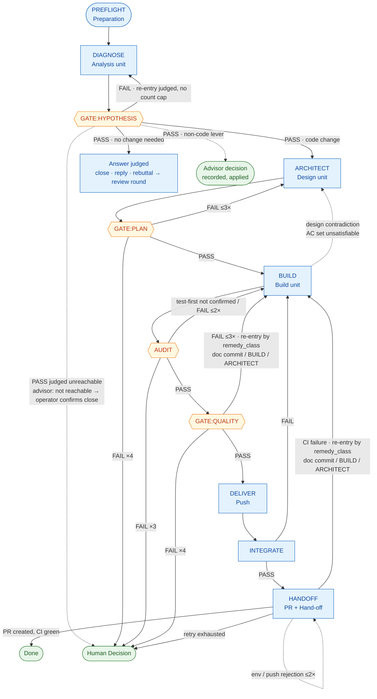

# AutoFlow Guide — Phase-by-Phase Development Lifecycle

> AutoFlow is a structured, evaluation-gated development lifecycle for AI-assisted
> software engineering with Claude Code. This guide is the **index of the unit
> documents**: each functional unit's goal, artifact contract, verification, loop cap,
> cautions and `[MUST]`/`[DENY]` constraints live in that unit's own file under `units/`
> (*Unit Documents* below).
> The cross-unit invariants, the router (unit and phase list + Flow Control table), the
> regression / escalation caps, the Execution Principles, and the state schema live in
> [`CLAUDE.md`](../CLAUDE.md).

---

## Overview

AutoFlow runs eleven phases and gates (`PREFLIGHT` → `HANDOFF`), carried by six functional
units, that guide every code change from issue analysis to PR hand-off. Each phase has explicit
entry/exit criteria. Merging is performed
by an external review process; AutoFlow does not merge.

Key principles:

- **Judged route, fixed checks** — the phases run in the order below; which of them a change passes through, and how deep, is the working AI's judgment recorded with its grounds, while the independent checks — the gates, the push gate, CI, the reviewer review — are never skipped ([`CLAUDE.md`](../CLAUDE.md) > Rule Scope, principles 1–3; > Execution Principles).
- **Multi-agent separation** — distinct roles handle implementation, testing, and evaluation.
- **Quantified quality** — 10-point evaluation with a defined PASS threshold.
- **Per-phase model selection** — every role spawn and subagent spawn declares the model the per-phase policy names for that phase. The values live in one machine-readable source, `.claude/autoflow/spawn-policy.json`, resolved by `bash scripts/spawn-policy/spawn-policy.sh model <phase-key>` and never restated in prose; the rule that governs it is [`CLAUDE.md`](../CLAUDE.md) > Spawn Model — Phase-by-Phase.

The phase names generalize upstream's numeric `STEP 0~9` identifiers; the
mapping is preserved below, with upstream's STEP 4–5.5 merged into one BUILD unit (ADR-0025).

| upstream | this guide |
|----------|------------|
| STEP 0 | PREFLIGHT |
| STEP 1 | DIAGNOSE |
| STEP 1.5 | GATE:HYPOTHESIS |
| STEP 2 | ARCHITECT |
| STEP 3 | GATE:PLAN |
| STEP 4, 5a–5d, 5.5 | BUILD |
| STEP 5.7 | AUDIT |
| STEP 6 | GATE:QUALITY |
| STEP 7 | DELIVER |
| STEP 8 | INTEGRATE |
| STEP 9 | HANDOFF |

---

## Lifecycle Diagram

The full AutoFlow lifecycle, including regression paths and gate verdicts.
Diamond nodes are evaluation gates; stadium nodes are terminal states.


```mermaid
flowchart TD
    PRE([PREFLIGHT<br/>Preparation]):::phase
    DIA[DIAGNOSE<br/>Analysis unit]:::phase
    HYP{{GATE:HYPOTHESIS}}:::gate
    ARC[ARCHITECT<br/>Design unit]:::phase
    PLAN{{GATE:PLAN}}:::gate
    BLD[BUILD<br/>Build unit]:::phase
    AUD{{AUDIT}}:::gate
    QUAL{{GATE:QUALITY}}:::gate
    DEL[DELIVER<br/>Push]:::phase
    INT[INTEGRATE]:::phase
    HAND[HANDOFF<br/>PR + Hand-off]:::phase
    ANS[Answer judged<br/>close · reply · rebuttal → review round]:::phase
    DONE([Done]):::terminal
    HUMAN([Human Decision]):::terminal
    ADV([Advisor decision<br/>recorded, applied]):::terminal

    PRE --> DIA
    DIA --> HYP
    HYP -->|PASS · no change needed| ANS
    HYP -.->|PASS · non-code lever| ADV
    HYP -->|PASS · code change| ARC
    HYP -->|FAIL · re-entry judged, no count cap| DIA
    HYP -.->|PASS judged unreachable<br/>advisor: not reachable → operator confirms close| HUMAN
    ARC --> PLAN
    PLAN -->|PASS| BLD
    PLAN -->|FAIL ≤3×| ARC
    PLAN -->|FAIL ×4| HUMAN
    BLD --> AUD
    BLD -.->|design contradiction<br/>AC set unsatisfiable| ARC
    AUD -->|test-first not confirmed / FAIL ≤2×| BLD
    AUD -->|FAIL ×3| HUMAN
    AUD -->|PASS| QUAL
    QUAL -->|PASS| DEL
    QUAL -->|FAIL ≤3× · re-entry by remedy_class<br/>doc commit / BUILD / ARCHITECT| BLD
    QUAL -->|FAIL ×4| HUMAN
    DEL --> INT
    INT -->|FAIL| BLD
    INT -->|PASS| HAND
    HAND -.->|env / push rejection ≤2×| HAND
    HAND -->|CI failure · re-entry by remedy_class<br/>doc commit / BUILD / ARCHITECT| BLD
    HAND -->|retry exhausted| HUMAN
    HAND -->|PR created, CI green| DONE

    classDef phase fill:#e3f2fd,stroke:#1565c0,color:#0d47a1
    classDef gate fill:#fff8e1,stroke:#f57f17,color:#bf360c
    classDef terminal fill:#e8f5e9,stroke:#2e7d32,color:#1b5e20
```

The same diagram in plain text, for environments without mermaid rendering:

```
PREFLIGHT
    │
    ▼
DIAGNOSE
    │
    ▼
GATE:HYPOTHESIS (one form) ◄── FAIL: re-entry judged, no count cap; PASS judged unreachable → advisor → operator confirms close
    ├─ PASS · no change needed ─► answer judged: Issue Closed (no PR) │ Reply on PR / rebuttal
    ├─ PASS · non-code lever ───► advisor decides (code owed → continue │ non-code → end)
    │  PASS · code change
    │
    ▼
ARCHITECT ◄── retry ≤3×
    │
    ▼
GATE:PLAN
    │
    ▼
BUILD (one unit spawn)
  └─ design contradiction (AC set unsatisfiable) ─► ARCHITECT (≤3×) → GATE:PLAN → BUILD
                                                       │
                                                       ▼
                                                    AUDIT  ◄── retry ≤2× (test-first findings included)
                                                       │
                                                       ▼
                                                GATE:QUALITY ◄── retry ≤3× → by remedy_class (doc commit / BUILD / ARCHITECT)
                                                       │
                                                       ▼
                                                    DELIVER
                                                       │
                                                       ▼
                                                   INTEGRATE → [FAIL] → BUILD (impl)
                                                       │
                                                       ▼
                                                   HANDOFF ◄── retry ≤2×
                                                       │
                                                       ▼
                                          PR open — external review merges
```

---

## Unit Documents

Each functional unit's body lives in its own file
([`ADR-0025`](records/adr/0025-outcome-gated-functional-units.md) D1, D2);
[`CLAUDE.md`](../CLAUDE.md) > Unit Document Loading Contract routes to the same files.

| Unit | Phases | Unit document |
|------|--------|---------------|
| U1 Preparation | PREFLIGHT | [`units/preparation.md`](units/preparation.md) |
| U2 Analysis | DIAGNOSE, GATE:HYPOTHESIS | [`units/analysis.md`](units/analysis.md) |
| U3 Design | ARCHITECT, GATE:PLAN | [`units/design.md`](units/design.md) |
| U4 Build and verify | BUILD, AUDIT | [`units/build.md`](units/build.md) |
| U5 Completion evaluation | GATE:QUALITY | [`units/completion-evaluation.md`](units/completion-evaluation.md) |
| U6 Delivery | DELIVER, INTEGRATE, HANDOFF | [`units/delivery.md`](units/delivery.md) |

The rubrics of all four gates — GATE:HYPOTHESIS, GATE:PLAN, AUDIT and GATE:QUALITY — are the
evaluator's and live in [`evaluation-system.md`](evaluation-system.md) > *Gate rubrics*; the unit
document routes each gate's result.

---

## Execution Principles

→ Single source of truth: [`CLAUDE.md`](../CLAUDE.md) > Execution Principles. These are
always-on orchestrator invariants: Safety first, Verify before transition, The route is the AI's judgment (the independent
checks are not), Role-spawn idle
handling, **Verify role-spawn claims before dispatch** (every report's Evidence anchor is
verified before ACCEPT — an anchor-less report is rejected, not interpreted), and Stop on
error.

---

## See Also

- [`CLAUDE.md`](../CLAUDE.md) — cross-unit invariants, the router (unit and phase list + Flow Control), regression caps, Execution Principles, state schema.
- *Unit Documents* above — the six unit documents.
- [`evaluation-system.md`](evaluation-system.md) — the evaluator's standard, scoring, PASS thresholds and the rubrics of all four gates.
- [`submodule-common-rules.md`](submodule-common-rules.md) — sub-repo rules, verification and reporting.
- [`repo-boundary-rules.md`](repo-boundary-rules.md) — cross-repo coordination.
- [`git-workflow.md`](git-workflow.md) — bash procedures, branch structure.
