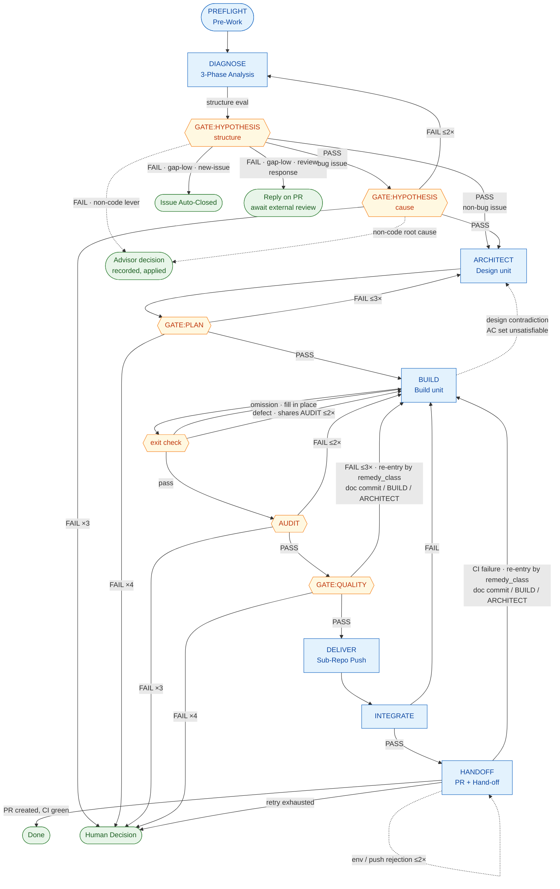

# AutoFlow Guide — Phase-by-Phase Development Lifecycle

> AutoFlow is a structured, evaluation-gated development lifecycle for AI-assisted
> software engineering with Claude Code. This guide is the **index of the phase
> playbooks**: each phase's step-by-step procedure, scoring rubric, and `[MUST]`/`[DENY]`
> constraints live in that phase's own file under `phases/` (*Phase Playbooks* below).
> The cross-phase invariants, the router (phase list + Flow Control table), the
> regression / escalation caps, the Execution Principles, and the state schema live in
> [`CLAUDE.md`](../CLAUDE.md).

---

## Overview

AutoFlow defines 16 phases (`PREFLIGHT` → `HANDOFF`) that guide every code change
from issue analysis to PR hand-off. Each phase has explicit entry/exit criteria. Merging is performed
by an external review process; AutoFlow does not merge.

Key principles:

- **Judged route, fixed checks** — the phases run in the order below; which of them a change passes through, and how deep, is the working AI's judgment recorded with its grounds, while the independent checks — the gates, the push gate, CI, the reviewer review — are never skipped ([`CLAUDE.md`](../CLAUDE.md) > Rule Scope, principles 1–3; > Execution Principles).
- **Multi-agent separation** — distinct roles handle implementation, testing, and evaluation.
- **Quantified quality** — 10-point evaluation with a defined PASS threshold.
- **Per-phase model selection** — every role spawn and subagent spawn declares the model the per-phase policy names for that phase. The values live in one machine-readable source, `.claude/autoflow/spawn-policy.json`, resolved by `bash scripts/spawn-policy/spawn-policy.sh model <phase-key>` and never restated in prose; the rule that governs it is [`CLAUDE.md`](../CLAUDE.md) > Spawn Model — Phase-by-Phase.

The phase names generalize upstream's numeric `STEP 0~9` identifiers; the
mapping is preserved below, with upstream's STEP 4–5.5 merged into one BUILD unit (ADR-0025).

| upstream | this guide |
|----------|------------|
| STEP 0 | PREFLIGHT |
| STEP 1 | DIAGNOSE |
| STEP 1.5 | GATE:HYPOTHESIS |
| STEP 2 | ARCHITECT |
| STEP 3 | GATE:PLAN |
| STEP 4, 5a–5d, 5.5 | BUILD |
| STEP 5.7 | AUDIT |
| STEP 6 | GATE:QUALITY |
| STEP 7 | DELIVER |
| STEP 8 | INTEGRATE |
| STEP 9 | HANDOFF |

---

## Lifecycle Diagram

The full AutoFlow lifecycle, including regression paths and gate verdicts.
Diamond nodes are evaluation gates; stadium nodes are terminal states.


```mermaid
flowchart TD
    PRE([PREFLIGHT<br/>Pre-Work]):::phase
    DIA[DIAGNOSE<br/>3-Phase Analysis]:::phase
    HYPS{{GATE:HYPOTHESIS<br/>structure}}:::gate
    HYPC{{GATE:HYPOTHESIS<br/>cause}}:::gate
    ARC[ARCHITECT<br/>Design unit]:::phase
    PLAN{{GATE:PLAN}}:::gate
    BLD[BUILD<br/>Build unit]:::phase
    EXIT{{exit check}}:::gate
    AUD{{AUDIT}}:::gate
    QUAL{{GATE:QUALITY}}:::gate
    DEL[DELIVER<br/>Sub-Repo Push]:::phase
    INT[INTEGRATE]:::phase
    HAND[HANDOFF<br/>PR + Hand-off]:::phase
    CLOSE([Issue Auto-Closed]):::terminal
    REVW([Reply on PR<br/>await external review]):::terminal
    DONE([Done]):::terminal
    HUMAN([Human Decision]):::terminal
    ADV([Advisor decision<br/>recorded, applied]):::terminal

    PRE --> DIA
    DIA -->|structure eval| HYPS
    HYPS -->|FAIL · gap-low · new-issue| CLOSE
    HYPS -->|FAIL · gap-low · review-response| REVW
    HYPS -.->|FAIL · non-code lever| ADV
    HYPS -->|PASS<br/>non-bug issue| ARC
    HYPS -->|PASS<br/>bug issue| HYPC
    HYPC -->|PASS| ARC
    HYPC -->|FAIL ≤2×| DIA
    HYPC -->|FAIL ×3| HUMAN
    HYPC -.->|non-code root cause| ADV
    ARC --> PLAN
    PLAN -->|PASS| BLD
    PLAN -->|FAIL ≤3×| ARC
    PLAN -->|FAIL ×4| HUMAN
    BLD --> EXIT
    BLD -.->|design contradiction<br/>AC set unsatisfiable| ARC
    EXIT -->|omission · fill in place| BLD
    EXIT -->|defect · shares AUDIT ≤2×| BLD
    EXIT -->|pass| AUD
    AUD -->|FAIL ≤2×| BLD
    AUD -->|FAIL ×3| HUMAN
    AUD -->|PASS| QUAL
    QUAL -->|PASS| DEL
    QUAL -->|FAIL ≤3× · re-entry by remedy_class<br/>doc commit / BUILD / ARCHITECT| BLD
    QUAL -->|FAIL ×4| HUMAN
    DEL --> INT
    INT -->|FAIL| BLD
    INT -->|PASS| HAND
    HAND -.->|env / push rejection ≤2×| HAND
    HAND -->|CI failure · re-entry by remedy_class<br/>doc commit / BUILD / ARCHITECT| BLD
    HAND -->|retry exhausted| HUMAN
    HAND -->|PR created, CI green| DONE

    classDef phase fill:#e3f2fd,stroke:#1565c0,color:#0d47a1
    classDef gate fill:#fff8e1,stroke:#f57f17,color:#bf360c
    classDef terminal fill:#e8f5e9,stroke:#2e7d32,color:#1b5e20
```

The same diagram in plain text, for environments without mermaid rendering:

```
PREFLIGHT
    │
    ▼
DIAGNOSE ─── structure eval ──► [FAIL]
                ├─ gap-item low (already satisfied) ─► new-issue: Issue Auto-Closed │ review-response: Reply on PR + await review
                └─ gap real, non-code lever ────────► advisor decides (code owed → continue │ non-code → end)
    │
    ▼
GATE:HYPOTHESIS (cause, bug only) ◄── retry ≤2×
    │
    ▼
ARCHITECT ◄── retry ≤3×
    │
    ▼
GATE:PLAN
    │
    ▼
BUILD (one unit spawn) → exit check
  └─ design contradiction (AC set unsatisfiable) ─► ARCHITECT (≤3×) → GATE:PLAN → BUILD
                                                       │
                                                       ▼
                                                    AUDIT  ◄── retry ≤2× (shared with exit-check defects)
                                                       │
                                                       ▼
                                                GATE:QUALITY ◄── retry ≤3× → by remedy_class (doc commit / BUILD / ARCHITECT)
                                                       │
                                                       ▼
                                                    DELIVER
                                                       │
                                                       ▼
                                                   INTEGRATE → [FAIL] → BUILD (impl)
                                                       │
                                                       ▼
                                                   HANDOFF ◄── retry ≤2×
                                                       │
                                                       ▼
                                          PR open — external review merges
```

---

## Phase Playbooks

Each phase's procedure lives in its own file; [`CLAUDE.md`](../CLAUDE.md) > Phase Playbook
Loading Contract routes to the same files.

| Phase | Playbook |
|-------|----------|
| PREFLIGHT | [`phases/preflight.md`](phases/preflight.md) |
| DIAGNOSE | [`phases/analysis.md`](phases/analysis.md) |
| GATE:HYPOTHESIS | [`phases/gate-hypothesis.md`](phases/gate-hypothesis.md) |
| ARCHITECT | [`phases/architect.md`](phases/architect.md) |
| GATE:PLAN | [`phases/gate-plan.md`](phases/gate-plan.md) |
| BUILD | [`phases/build.md`](phases/build.md) |
| AUDIT | [`phases/audit.md`](phases/audit.md) |
| GATE:QUALITY | [`phases/gate-quality.md`](phases/gate-quality.md) |
| DELIVER | [`phases/deliver.md`](phases/deliver.md) |
| INTEGRATE | [`phases/integrate.md`](phases/integrate.md) |
| HANDOFF | [`phases/handoff.md`](phases/handoff.md) |

---

## DIAGNOSE — Issue Analysis

→ **Phase playbook (single source of truth): [`phases/analysis.md`](phases/analysis.md).**
Read it on entering DIAGNOSE. It carries the full procedure: the **intake readiness triage**
(`mode=new-issue` only, run ahead of the structure fan-out — a planning/design/ADR pre-req
filter that pauses for the user on FAIL, no auto issue creation), the 3-Phase independent
structure analysis (Phase A structure-only, Phase B issue-only, Phase 3 necessity scoring),
**the per-role document injection whitelist (three distinct roles — Phase A = current-state
area excerpts only; intake triage = issue body + readiness/work-type docs; Phase B = issue
body only, plus the materials the issue itself references, which Phase B opens and records)**, the issue-type classification (Type 1 code / Type 2 docs), the per-type scoring rubric and
PASS/FAIL thresholds (Type 1: each ≥ 7, two items; Type 2: each ≥ 7 and avg ≥ 7.5, three
items), the FAIL disposition by failing item and cycle `mode` (gap-low → new-issue close /
review-response reply on PR; non-code lever → the advisor decides), the review-response loop check (trigger repeats the prior cycle's complaint class with a new witness case → reply on PR + the advisor decides the re-entry), cause hypotheses
(≥ 3, "not a code bug" must be one), lightweight verification, hypothesis verdict notes,
task decomposition with the scope judgments the confirmed cause calls for, affected-docs identification, and the structure- and confirmation-bias
safeguards.

---

## Execution Principles

→ Single source of truth: [`CLAUDE.md`](../CLAUDE.md) > Execution Principles. These are
always-on orchestrator invariants: Safety first, Verify before transition, The route is the AI's judgment (the independent
checks are not), Role-spawn idle
handling, **Verify role-spawn claims before dispatch** (every report's Evidence anchor is
verified before ACCEPT — an anchor-less report is rejected, not interpreted), and Stop on
error.

---

## See Also

- [`CLAUDE.md`](../CLAUDE.md) — cross-phase invariants, the router (phase list + Flow Control), regression caps, Execution Principles, state schema.
- [`phases/analysis.md`](phases/analysis.md) — DIAGNOSE analysis procedure (3-Phase A/B/3, scoring rubric, bias prevention).
- [`evaluation-system.md`](evaluation-system.md) — scoring and PASS thresholds.
- [`submodule-common-rules.md`](submodule-common-rules.md) — sub-repo rules, verification and reporting.
- [`repo-boundary-rules.md`](repo-boundary-rules.md) — cross-repo coordination.
- [`git-workflow.md`](git-workflow.md) — bash procedures, branch structure.
